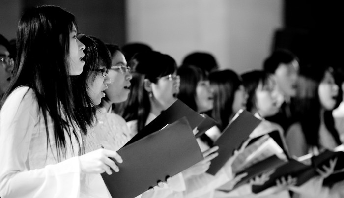

<!--
title: NGHỆ THUẬT HỢP XƯỚNG ĐỐI VỚI CUỘC SỐNG CỘNG ĐỒNG
author: Nguyễn Ngân Hà
status: completed
-->
*Ths. Lê Vinh Hưng P. - Trưởng khoa Sư phạm Âm nhạc Trường ĐHSP Nghệ thuật TW* 

Khi nói đến nghệ thuật hợp xướng, người ta nghĩ ngay đến một loại hình nghệ thuật được thể hiện bằng giọng hát nhiều bè; bằng các hình thức và thủ pháp âm nhạc phong phú/đa dạng. Hợp xướng có thế mạnh nổi trội mà ít thể loại âm nhạc khác sánh kịp trong việc thể hiện những tư tưởng/tình cảm của tập thể và chuyển tải tiếng nói đồng vọng của quần chúng, đặc biệt là trong việc phản ánh bằng âm nhạc đối với những vấn đề lớn lao của xã hội và tình cảm cao siêu của con người với dân tộc, với thời đại.

Nghệ thuật hợp xướng, với tính cách là một thể loại âm nhạc, vừa mang tính bác học chuyên nghiệp đồng thời vừa mang tính phổ cập, dễ hiểu, gần với công chúng hơn so với những thể loại dành cho dàn nhạc giao hưởng. Bản thân hợp xướng là loại hình nghệ thuật thanh nhạc, song có sự thâm nhập của khoa học vào lĩnh vực âm nhạc, thành thử có tầm vóc và giá trị nghệ thuật cao. Cùng với việc biểu diễn các bản hợp xướng của các nhạc sĩ cổ điển cũng như hiện đại, việc chuyển soạn các bài hát dân ca cho hợp xướng là một phương cách đặc biệt nhằm nâng cao giá trị ưu tú của dòng âm nhạc bác học, tạo điều kiện cho sự phát triển thị hiếu âm nhạc đúng đắn của công chúng. Hơn nữa, đây là loại hình nghệ thuật có tính phổ cập cao, dễ tổ chức, nên rất phù hợp cho những hoạt động mang tính cộng đồng. Khi thưởng thức một ly cà phê, người ta thường thích lim dim nghe một ca khúc trữ tình do một ca sĩ nào đó trình bày. Nhưng trong một lễ hội cộng đồng thì hình thức âm nhạc phù hợp hơn cả phải là hình thức sinh hoạt âm nhạc mang tính cộng đồng (trong đó có đồng ca, hợp xướng) thì mới hấp dẫn và chinh phục được công chúng. Có thể so sánh giữa thưởng thức đơn ca, đồng ca và thưởng thức hợp xướng như sau: Đối với đơn ca, người ta thường bị lôi cuốn bằng sự rung cảm đơn tính, đưa đến sự nể phục, khen ngợi trước tài năng cùng sự thăng hoa của người nghệ sĩ, tuy nhiên lại làm cho bản thân người thưởng thức âm nhạc thường “lùi xa” để chiêm ngưỡng. Còn đối với hợp xướng, ngoài sự rung cảm, nể phục thì người nghe còn thấy sự ấm cúng, gần gũi, thậm chí dẫn đến trạng thái muốn bày tỏ, muốn hòa mình vào cùng dàn hợp xướng, muốn trở thành một thành tố của thứ âm nhạc mà mình đang thưởng thức. Hay nói cách khác, hợp xướng chính là chiếc nôi của quá trình âm nhạc hóa con người, âm nhạc hóa đời sống cộng đồng và cộng đồng hóa đời sống âm nhạc. Một thể loại gần gũi với hợp xướng, đồng thời có thể coi như tiền thân của hợp xướng là đồng ca. Xét đến cùng thì đồng ca ra đời cùng với sự ra đời của âm nhạc, có mặt trong đời sống âm nhạc của con người và cộng đồng ngay từ xã hội nguyên thủy. Xã hội càng phát triển, đời sống âm nhạc của con người càng phát triển thì nghệ thuật đồng ca càng được nâng lên những chất lượng mới, song chủ yếu vẫn mang đậm tính chất đại chúng, lấy tính đại thể để chia đều, “cào bằng” âm vực, màu sắc… của mỗi các loại giọng hát. Đặc biệt, khi nghệ thuật âm nhạc của con người đạt đến trình độ nhất định thì hợp xướng ra đời. Và xét kỹ lịch sử ra đời, phát triển của hợp xướng thì có thể thấy nghệ thuật hợp xướng là một trong những thành tố của hình thái ý thức xã hội phản ánh sự phân hóa giai cấp, sự phân công chức năng của mỗi con người, dân tộc, quốc gia … đối với cuộc sống cộng đồng người trên thế giới. Khi trong nền kinh tế và tổ chức xã hội có sự phân tầng xã hội thì cũng chính là lúc trong nghệ thuật âm nhạc có sự phân chia mang tính chuyên hóa: khí nhạc tách khỏi thanh nhạc, các loại giọng hát cũng có tính chất, màu sắc, âm vực khác nhau như: giọng nữ cao (soprano), nữ trung (mezzo alto), nữ trầm (alto), nam cao (tenor), nam trung (baritono), nam trầm (basso)… như thể mang một ý nghĩa sự khác biệt về vị thế xã hội trong âm nhạc. Tuy nhiên, điều quan trọng là ở chỗ, các thành tố chuyên hóa ấy đều phải hòa chung trong một chỉnh thể, sống cùng trong một mái nhà âm nhạc hợp xướng. Sự khác biệt giữa đồng ca so với hợp xướng, theo đó, thể hiện ở chỗ: hợp xướng không mang tính chất “cào bằng” mà đã được chỉnh thể hóa trong việc phát huy bản sắc riêng, tính chất riêng của mỗi loại giọng để làm nên cái chỉnh thể, phản ánh tính đa màu sắc của cuộc sống cộng đồng người… Mối liên hệ hữu cơ giữa hợp xướng với các thể loại thanh nhạc khác không chỉ bộc lộ ở sự so sánh như trên, mà còn thể hiện ở sự tương tác thúc đẩy nhau cùng phát triển, đặc biệt là chuyển hóa lẫn nhau rất nhuần nhuyễn. Chính từ sinh hoạt âm nhạc cộng đồng của hợp xướng mà làm nảy sinh những tinh túy của những giọng hát hay. Ngược lại, một giọng hát hay nếu từng được đứng vững trên nền âm nhạc cộng đồng thì trở nên có giá trị gấp bội. Lịch sử âm nhạc đã chứng kiến rất nhiều nhạc sĩ/nghệ sĩ nổi tiếng thế giới như J.S. Bach, J.S.Haydn, R.Schumann, F.Mendelssohn, H.Berlioz … đã từng tham gia trong các dàn hợp xướng. Nền âm nhạc cộng đồng là mạch nguồn vô tận sản sinh ra những vĩ nhân âm nhạc, và ngược lại, bản thân âm nhạc cộng đồng cũng phải tự nhân lên những tinh túy để tự nâng mình lên. Chính quá trình tương tác, chuyển hóa hữu cơ ấy làm cho nghệ thuật âm nhạc nói chung, nghệ thuật hợp xướng nói riêng, không ngừng phát triển và hoàn thiện về cả phương diện nghệ thuật và phương diện khoa học âm nhạc. Hiện nay, các nước có nền âm nhạc tiên tiến đều lấy nghệ thuật hợp xướng làm một trong những nền tảng quan trọng hàng đầu để phát triển. Hợp xướng đóng vai trò lớn lao trong đời sống xã hội, đặc biệt là phát huy khả năng tiềm tàng to lớn trong giáo dục con người, nhất là hình thành thế giới quan thẩm mỹ, tình cảm thẩm mỹ, năng lực thẩm mỹ. Hợp xướng, bằng cách thức riêng của nó, cũng đóng vai trò quan trọng trong liên kết con người với con người, con người với tập thể, con người với dân tộc và con người với thời đại. Trong giao lưu văn hóa quốc tế, mọi người dù khác nhau về tiếng nói đều có thể giao tiếp thân thiện với nhau nhờ đứng chung trong một dàn hợp xướng. Điều này cũng đã được minh chứng bằng nhiều sự kiện lịch sử diễn ra trên thế giới cũng như ở Việt Nam. Nhạc sĩ người Pháp Francois Joseph Gossec (1733 – 1829) đã viết bản hợp xướng với nội dung ca ngợi những sự kiện lớn lao của nước Pháp trong cách mạng cho hai nghìn người hát. Phong trào cách mạng tháng Bảy năm 1830 ở Pháp đã hướng nhạc sĩ H.Berlioz đến với những người khởi nghĩa từ những cuộc chiến đấu bằng bài ca Marseillaise nổi tiếng – quốc ca Pháp sau này. Bằng tình cảm chiến đấu của người công dân tràn đầy nhiệt huyết cách mạng, H.Berlioz đã chuyển soạn bài Marseillaise cho hai hợp xướng với dàn nhạc, và trên tổng phổ ông viết: “Tặng ai có giọng hát, trái tim và máu trong thân thể của mình”… Ở Việt Nam, ngay trong những năm tháng tiến hành cuộc kháng chiến chống Mỹ cứu nước, hoàn cảnh kinh tế của đất nước gặp nhiều khó khăn nhất nhưng âm nhạc bác học nói chung và nghệ thuật hợp xướng nói riêng vẫn phát triển và tỏ rõ sức sống Việt Nam. Nhiều tác phẩm hợp xướng hay đã ra đời với nội dung đề tài đa dạng như Hò đẵn gỗ của Đỗ Nhuận, Sóng Cửa Tùng của Doãn Nho, Vượt núi của Hoàng Vân, Tiếng hát giữa rừng Pắc Bó của Nguyễn Tài Tuệ (phối âm Đỗ Dũng), Ca ngợi Tổ quốc của Hồ Bắc (phối âm Lưu Cầu), Việt Nam trên đường chiến thắng của Chu Minh, Được mùa của Trọng Bằng, Tiếng hát người chiến sĩ biên thùy của Tô Hải, … Nhiều dàn hợp xướng chuyên nghiệp có qui mô lớn, nhỏ đã biểu diễn trên các sân khấu trong và ngoài nước, gây được tiếng vang trong công luận và thu hút sự quan tâm, hưởng ứng của công chúng như Đoàn Ca –Múa nhân dân Trung ương, Đoàn Ca nhạc Đài Tiếng nói Việt Nam, Dàn nhạc Giao hưởng – Hợp xướng Quốc gia Việt Nam (hơn 120 diễn viên), Dàn hợp xướng Thành đoàn Thanh niên Hà Nội, dàn hợp xướng sinh viên các trường đại học, dàn hợp xướng thiếu nhi các Nhà văn hóa… Tuy nhiên, nghệ thuật hợp xướng ở Việt Nam trong thời gian gần đây vẫn chưa thực sự có tiếng nói mạnh mẽ trong cuộc sống cộng đồng nói chung và hoạt động nghệ thuật âm nhạc nói riêng. Các tác phẩm hợp xướng không dồi dào như trước đây. Nhiều ca sĩ được đào tạo khá bài bản thì lại thờ ơ với hợp xướng, không chỉ bởi ở đây ít sinh lợi mà còn chủ yếu lo rằng khó có điều kiện để tự làm nổi bật cá nhân. Đây thực sự là một nỗi trăn trở lớn: vì sao trong khói lửa chiến tranh ác liệt thì âm nhạc hợp xướng lại phát triển mạnh mẽ, còn trong điều kiện thời bình, ta có những thuận lợi to lớn cả về cơ sở vật chất và trình độ của những người làm công tác âm nhạc, thì dường như hợp xướng lại “ngủ đông”? Việc nghiên cứu để đưa nghệ thuật hợp xướng đến với công chúng, đến cuộc sống cộng đồng cũng chưa phải là vấn đề mà các cơ quan chức năng và những người có tâm huyết với âm nhạc quan tâm thỏa đáng. Thực tế đời sống âm nhạc nước ta gần đây cho thấy: các chương trình liên hoan, hội diễn hợp xướng chưa đảm bảo đúng tiêu chí về mặt học thuật hợp xướng, chưa thấy hết được những giá trị hiện thực của nó, chưa phát huy hết được mọi khả năng tiềm tàng trong việc giáo dục và hình thành thế giới quan thẩm mỹ âm nhạc cho công chúng. Ví dụ như Liên hoan Hợp xướng học sinh – sinh viên “Những bài ca dâng Đảng” tối ngày 10 tháng 1 năm 2010 tại Hà Nội đã cho thấy rõ chất lượng của vấn đề này. Nhiều đơn vị tham gia còn nhầm lẫn giữa hát đồng ca, tốp ca với hát hợp xướng. Một số tiết mục soạn phối nhạc đệm chưa tôn được vẻ đẹp hài hòa của hợp xướng, cách thể hiện theo lối hát hợp xướng chưa được chú trọng, chưa biết cách hòa giọng – thống nhất âm sắc các giọng hát, thậm chí lạm dụng những thủ pháp sân khấu như múa phụ họa, ánh sáng, âm thanh để che bớt những nhược điểm của dàn hợp xướng. Một bản hợp xướng hay, được dàn dựng đủ độ của nó thì không cần đến bất cứ thủ pháp nào tương tự như trên cũng tự khẳng định được giá trị chân chính của nó. Để phát huy khả năng, thế mạnh của nghệ thuật hợp xướng đối với cuộc sống cộng đồng, nâng cao hơn nữa về trình độ âm nhạc đối với công chúng. Tôi xin có một vài đóng góp ý kiến như sau: 

1. Đầu tư cho hợp xướng không dễ dàng như các loại hình âm nhạc giải trí mà cần phải có chiến lược phát triển lâu dài, cần quan tâm đầu tư thích đáng từ khâu sáng tác đến biểu diễn như: tổ chức các cuộc thi sáng tác hợp xướng, quảng bá biểu diễn những tác phẩm hợp xướng có chất lượng, tăng cường biểu diễn hợp xướng thường xuyên ở các thành phố lớn và các trung tâm văn hóa. Tạo điều kiện môi trường cho hoạt động hợp xướng bằng cách chủ động đi tìm công chúng để phục vụ tuyên truyền, đưa chương trình biểu diễn và tìm hiểu về nghệ thuật hợp xướng thường xuyên trên các phương tiện thông tin đại chúng… 

2. Việc đào tạo giáo viên giảng dạy âm nhạc phổ thông cần được trang bị đầy đủ hơn về kiến thức hát hợp xướng, chỉ huy dàn dựng hợp xướng, bởi, chính họ sẽ là người trực tiếp hướng dẫn, giảng dạy cho các thế hệ sau yêu thích loại hình nghệ thuật này. 

3. Nâng cao trình độ, chất lượng giáo dục âm nhạc bằng cách tổ chức rộng rãi hát hợp xướng tại các trường học, công sở,… thông qua các hoạt động biểu diễn của các dàn hợp xướng quần chúng. Giáo dục âm nhạc trong nhà trường phổ thông cần được nuôi dưỡng, duy trì bằng cách dạy hát các bài hợp xướng có 2 hoặc 3 bè từ dễ đến khó. 

4. Tổ chức các chương trình liên hoan, hội diễn hợp xướng cần tham khảo các chuyên gia một cách chi tiết, thậm chí mời họ tham gia trực tiếp dàn dựng cho các đơn vị để nâng cao chất lượng… 

5. Cần khéo léo đáp ứng thị hiếu âm nhạc và định hướng thị hiếu âm nhạc nhưng vẫn đảm bảo giá trị nghệ thuật, giá trị nội dung. Nghệ thuật hợp xướng phải đảm bảo ngôn ngữ dân tộc, bám sát hơi thở của cuộc sống cộng đồng, nâng cao thẩm mỹ âm nhạc cả về cảm tính và lý tính đối với quần chúng. Những vấn đề trên là suy nghĩ của tôi về ***nghệ thuật hợp xướng đối với cuộc sống cộng đồng***. Kính mong được sự đóng góp ý kiến của quí vị. Tôi xin chân thành cảm ơn!

*Ths. Lê Vinh Hưng.P*

***Tham khảo thêm - Les autres articles*** 

[Hop Xuong](/#post/2012-06-17%20%20Hop%20Xuong)

[Vai tro Nghe thuat](/#post/2014-12-20%20%20Vai%20tro%20Nghe%20thuat)      

