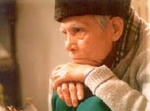

<!--
title: Vĩnh biệt nhà thơ Hoàng Cầm oanh vàng Kinh Bắc
author: Dương Phú Hiệp
status: completed
-->

##  ***Vĩnh biệt nhà thơ Hoàng Cầm oanh vàng Kinh Bắc***

***Vietnam net.***   *Cập nhật lúc 11:59, Thứ Năm, 06/05/2010 (GMT+7)*

**9h12’ sáng nay 6/5/2010, nhà thơ Hoàng Cầm đã trút hơi thở cuối cùng tại bệnh viện Hữu nghị Việt – Xô để đi vào cõi vĩnh hằng.**

***Hoàng Cầm tên thật là Bùi Tằng Việt, sinh ngày 22 tháng 2 năm 1922, tại Phúc Tằng, huyện Việt Yên, tỉnh Bắc Giang; quê gốc xã Song Hồ, huyện Thuận Thành, tỉnh Bắc Ninh. Tên của ông ghép từ 2 địa danh quê hương là Phúc Tằng và Việt Yên.***

***Năm 1940, ông đỗ tú tài toàn phần và bước vào nghề văn, và lấy bút danh là tên một vị thuốc quý: Hoàng Cầm.***

***Năm 1944, do tình hình Chiến tranh thế giới thứ II ngày càng quyết liệt, ông đưa gia đình về lại quê gốc ở Thuận Thành và bắt đầu tham gia hoạt động Thanh niên Cứu quốc của Việt Minh.***

***Tháng 8 năm 1947, ông tham gia Vệ quốc quân ở chiến khu 12. Cuối năm đó, ông thành lập đội Tuyên truyền văn nghệ, đội văn công quân đội đầu tiên. Năm 1952, ông được cử làm Trưởng đoàn văn công Tổng cục Chính trị, hoạt động biểu diễn cho quân dân vùng tự do và phục vụ các chiến dịch.***

***Đầu năm 1955, do đoàn văn công mở rộng thêm nhiều bộ môn, Hoàng Cầm được giao nhiệm vụ trưởng đoàn kịch nói. Cuối năm 1955, ông về công tác ở Hội Văn nghệ Việt Nam, làm công tác xuất bản. Tháng 4 năm 1957, ông tham gia thành lập Hội Nhà văn Việt Nam, trở thành hội viên sáng lập và được bầu vào Ban chấp hành. Sau vụ “Nhân Văn Giai Phẩm”, ông thôi công tác Hội nhà văn vào năm 1958 và tiếp tục sống, sáng tác.
Ông nổi tiếng với nhiều tác phẩm thơ và kịch thơ như Hận Nam Quan, Kiều Loan; các bài thơ Lá diêu bông, Bên kia sông Đuống…***

***Năm 2007, ông được tặng Giải thưởng Nhà nước về Văn học nghệ thuật.
Tuổi cao, người không được khỏe nhưng những khi có thể, ông đều tham gia các sinh hoạt văn học, dù phải ngồi trên xe lăn. Chủ Nhật vừa rồi (2/5/2010) bệnh ông trở nặng, được gia đình đưa vào cấp cứu tại bệnh viện Hữu Nghị Việt – Xô. Nhưng do tuổi cao sức yếu, vào lúc 9h12’ sáng nay (6/5/2010), ông đã trút hơi thở cuối cùng để đi vào cõi vĩnh hằng, hưởng thọ 89 tuổi.***

***Xin vĩnh biệt nhà thơ Hoàng Cầm, một tài năng độc đáo của thơ ca Việt Nam hiện đại. Từ nay con chim oanh vàng Kinh Bắc (chữ của nhà thơ Lê Đạt) đã ngừng hót, nhưng dư âm của Lá Diêu Bông, Mưa Thuận Thành, Bên kia sông Đuống… thì vẫn còn ngân mãi trong lòng các thế hệ yêu thơ!***

***Việt Khôi***
