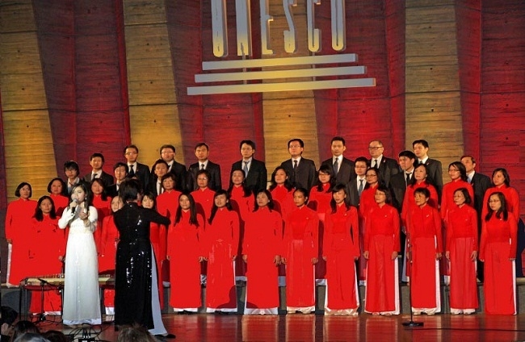

<!--
title: Tết Nhâm Thìn 2012 tại UNESCO
author:  Nguyễn Tích Kỳ
status: completed
-->
*Cùng đón Xuân Nhâm Thìn với HNVNTP . Lần đầu tiên phối hợp một bài kinh điển của Cải Lương mang tên Dạ Cổ Hoài Lang và một làn điệu hò Đồng Tháp cùng với dàn Hợp xướng  HCQH.*
    
  

