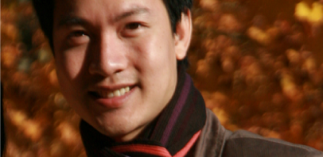

<!--
title: Chia Sẻ
author: tranthehung
status: completed
-->

**Chia Sẻ**

*“Khi ta ở, đất chỉ là nơi ta ở Khi ta đi, đất bỗng hóa tâm hồn”*

Tôi muốn giải thích tại sao tôi lại bắt đầu bằng những câu thơ thân quen này của Chế Lan Viên. Có lẽ đây sẽ là năm cuối cùng của tôi ở Pháp sau 3 năm làm PHD để trở về VN. Nhiều lúc nghĩ đến việc phải chia tay HCQH, trong lòng thật buồn.  Và vì thế, tôi nghĩ ngay đến việc phải viết một cái gì đó để lưu lại những cảm xúc quý giá này. Tôi phải thú nhận ngay rằng không cần đợi đến khi phải rời xa HC, thì HC đã là một phần tâm hồn tôi mất rồi.. Tôi may mắn được đến với HC ngay từ những ngày đầu tiên.  Lúc đó, tôi tham gia hoàn toàn là vì yêu ca hát và nói thật biết rất ít về các bài hát cách mạng VN. Tôi còn nhớ lúc đó chỉ có khoảng hơn chục bạn đang tập bài Người Hà Nội thôi.  Tôi vào hát cùng mà chẳng biết một nốt nhạc nào thâm chí còn không biết bài Người Hà Nội nữa. Và từ đó, cứ chiều thứ 7 hàng tuần, chúng tôi lại tụ tập đều đặn để tập luyện cho đến tận bây giờ, khi mà HCQH của chúng tôi sắp tròn 3 tuổi.

Chắc lúc đó, trong chúng tôi, sẽ chẳng bao giờ hình dung được rằng HC lại có thể lớn mạnh như bây giờ. Tôi cũng sẽ chẳng bao giờ nghĩ mình lại có thể thuộc và trân trọng được nhiều bài hát cách mạng đến thế. Từng lời hát đã ngấm vào tôi, từng giai điệu đã ngấm vào tôi lúc nào không hay và ngay lúc này đây, dường như tôi đã hiểu được ý nghĩa của HCQH hơn bao giờ hết. HCQH của chúng tôi được thành lập ngay trên thủ đô Paris. Có lẽ cái tên Quê Hương đã nói lên tất cả. Các bài hát ca ngợi quê hương VN chính là linh hồn của chúng tôi.

Chúng tôi, những người con Việt Nam xa xứ, cất vang tiếng việt nam ngay tại đây, giữa thu đố Paris tráng lệ,  ngay tại đây nhà thờ Invalide mà tưởng như chỉ dành cho những dàn nhạc giao hưởng. Từ những giai điệu hào hùng: « Ôi tổ quốc giang sơn hùng vĩ… » trong bài Hồi Tưởng, « … đoàn quân Việt Nam đi… » trong bài Người Hà Nội, cho đến những giai điệu thật lãng mạn : « … thu du bến sóng vàng từng nhà mờ biếc chìm một màu khói thu… » trong bài Trường Ca Sông Lô hay « … bóng em ngời sáng, đóa hoa màu trắng, khi trăng chiều lên … »  trong bài Trăng Chiều. Từ âm thanh của tiếng trống cơm thân thuộc « …Tình bằng tính tang tinh tang tình tang tình… » cho đến hình ảnh của một Việt Nam đổi mới « …Sài Gòn hôm nay vươn lên trong muôn ý chí …», tất cả được chúng tôi vang lên say sưa với niềm tự hào dân tộc. Và cho đến khi đón nhận những tràng pháo tay không ngớt của các bạn khán thính giả nước ngoài, cảm xúc của chúng tôi thực sự như muốn vỡ òa. 

Hạnh phúc và tự hào! đó là một cảm giác chung của tất cả chúng tôi. Những giọt nước mắt hạnh phúc, những cái siết tay ấm áp. Chúng tôi nhìn nhau không nói nên lời. Một trải nghiệm thật tuyệt vời. Cám ơn HC đã cho chúng tôi được nói tiếng nói trong trái tim của chúng tôi.  Cám ơn HC đã làm cuộc sống của chúng tôi có ý nghĩa hơn khi có thể góp một phần nhỏ bé trong những lần đi hát từ thiện… Sau ánh đèn sân khấu, sau những phút thăng hoa, được sống trọn vẹn với âm nhạc. Chúng tôi lại trở về với công việc của chính mình. Trở về ngôi nhà hợp ca thân yêu, với những buổi tập vui vẻ. 

Nói về những kỉ niệm với bạn bè trong hợp ca chắc tôi không thể ngừng được mất.  Tôi nhớ nhất những kỉ niệm về chuyến đi biểu diễn ở FIMU vì đây là lần xuất quân đầu tiên của hợp ca. Vẫn nguyên đó cái cảm giác háo hức. Chúng tôi, hơn bốn chục người, nhét đầy một chiếc xe, cứ thế, giống như những chú chim non đầu mùa căng đầy nhựa sống, ríu rít suốt cả chặng đường hơn 5 tiếng từ Paris cho đến Belfort.

Vẫn còn đó, những giây phút khoác tay nhau rồng rắn đến tận bờ sông Sein sau các buổi biểu diễn, cùng nhau nghêu ngao hát đủ các thể loại. Chúng tôi cứ say sưa như vậy mặc những cái nhìn của mọi người.  Rồi những buổi sinh nhật, những lần nói chuyện, tâm sự cho đến những dịp cuối năm đón cái Tết cùng nhau…tất cả dường như vẫn nguyên vẹn trong trí tôi.                                                                                                                                          Có thể nói 3 năm du học ở Pháp là 3 năm tôi gắn bó với hợp ca Quê Hương. Bạn bè thân thiết của tôi ở trong đó. Niềm đam mê của tôi ở trong đó và tâm hồn của tôi cũng thuộc về nơi đó.  3 năm, tôi chứng kiến những bước thăng trầm và phát triển của hợp ca, 3 năm trải nghiệm buồn vui, cùng nhau chứng kiến những cuộc hội ngộ và chia ly đầy quyến luyến. Những người bạn của tôi cũng lần lượt chia tay hợp ca người vì lý do gia đình, người vì đã hoàn thành xong việc học ở đây. Và sẽ có một ngày, tôi cũng thế.  

Tan rồi hợp, hợp rồi tan, dẫu biết rằng đó mãi là qui luật muôn đời mà chúng ta sẽ chẳng bao giờ thay đổi được nhưng giá như, nếu 2 từ này thực sự tồn tại thì  tôi mong rằng, giá như cuộc đời này không còn sự chia ly thì hay biết mấy. Có người nói với tôi rằng, cuộc đời như một chuyến tàu. Ai cũng có cái đích và hành trình của riêng mình. Gặp nhau và đi cùng nhau một đoạn trong cuộc hành trình thực sự đã là một cái duyên rồi.  Nếu quả thực như vậy, thì tôi phải cám ơn cuộc đời đã cho tôi được kết mối duyên này với HCQH, cám ơn đã cho tôi được là một phần của QH!

**Trần Hùng**     