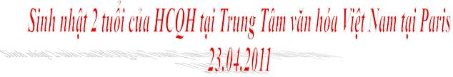
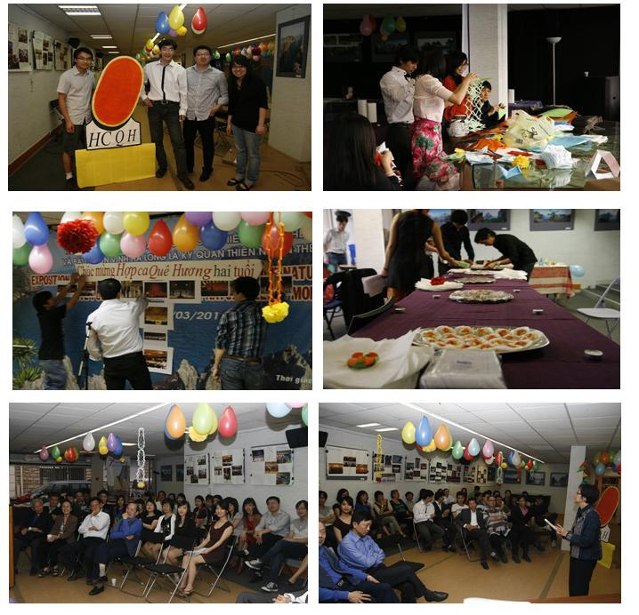
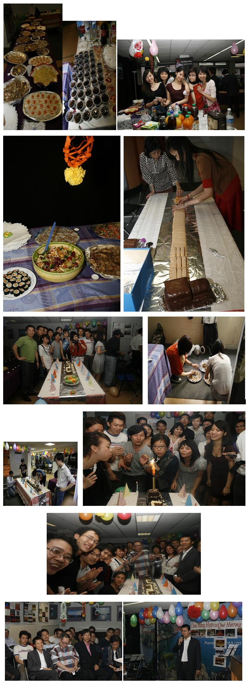
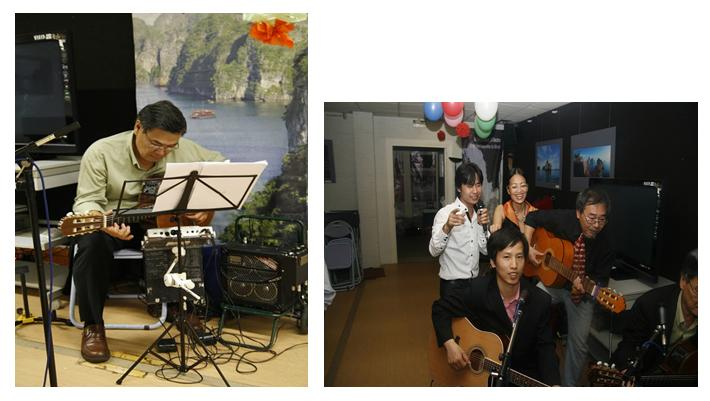
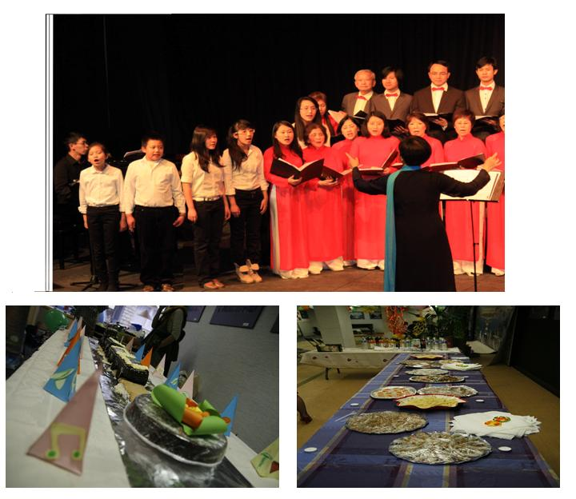
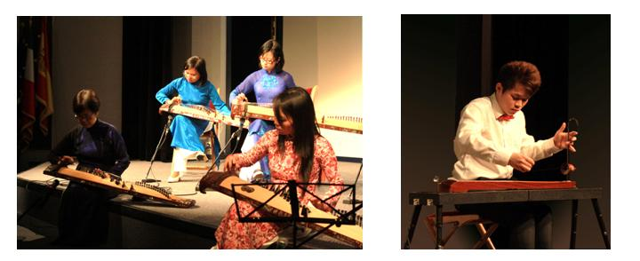
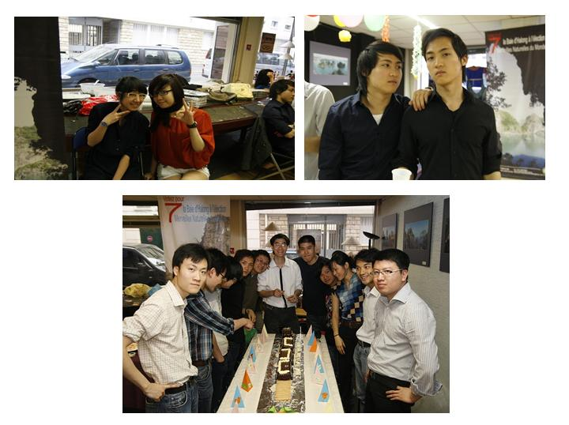
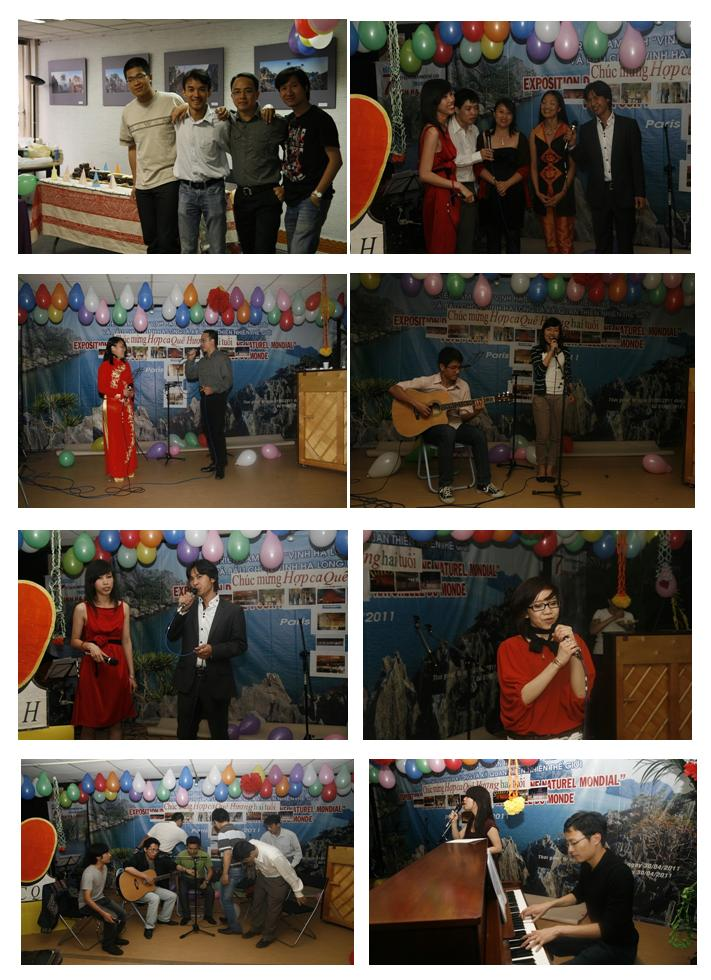
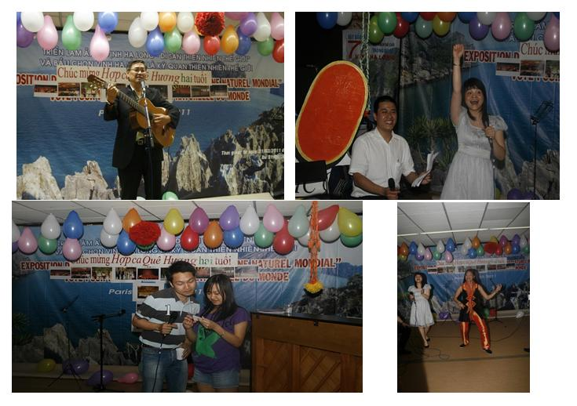
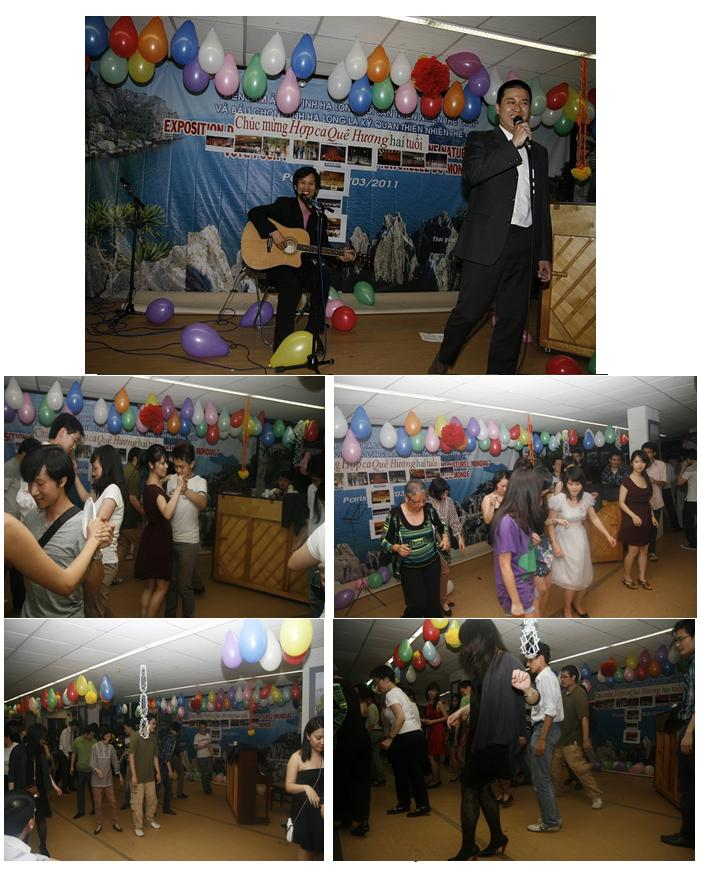

<!--
title: Sinh nhật Hợp Ca Quê Hương hai tuổi
author: Trần Mạnh Hà
status: completed
-->

 

**Thế là được 2 năm tuổi rồi đấy.**

Chặng đường đã qua, thời gian tuy ngắn nhưng rất giàu sự kiện.

Hôm nay, thành viên mới, thành viên từ buổi đầu, thành viên đã có tuổi đời, thành viên mới bước qua ngưỡng cửa cuộc sống, thâm chí có những em mới đặt chân vào đời, về đây quây quần trong ngày sinh nhật 2 tuổi **HCQH**. Âm hưởng giòng nhạc Việt từ xa tiếp tục vọng về từ những sông ngòi, những cánh đồng nặng trĩu phù sa, những xóm làng đang hòa mình với thảm mạ xanh tươi. Dấu ấn của mùa thu tháng tám tiếp tục ánh sáng soi đường cho nhiều thế hệ **HCQH**.

Tất cả về đây, chuẩn bị ngày sinh nhật **HCQH 2 tuổi**.

 

Nào là **tổ ẩm thực, tổ trang trí, tổ chuẩn bị nhạc**, liên lạc thông tin của các em liên tục tràn ngập hộp thư HCQH. Những ý kiến, những chỉ dẫn mách nước, những hội ý bài hát và tìm bạn song ca. Các em như những chiến sĩ âm thầm tải lương vác đạn trên tuyến đầu. Hiệu qủa mà vô tư.

Không có các em, sinh hoạt của HCQH sẽ không còn sục sôi nữa. Cảm ơn các em.

Năm nay còn thêm anh Thanh Dũng một cây cổ thụ của phong trào văn nghệ quần chúng của HNVNTP cũng về tăng cường HCQH, đã cùng « cây guitare vườn nhà » Quốc Việt khuấy động. Chưa nói đến sự xuất hiện bất ngờ của Chánh một guitare bass quen thuộc, của những ngày xa xưa.

Hi vọng rồi đây ban nhạc trẻ này, sẽ mãi song hành với HCQH.

Cảm ơn các em đã bỏ trôi qua một chiều nắng đầu mùa, để về hòa mình cùng HCQH.

Các anh các chị đến từ HNVNTP : Mỹ basse- Oanh – Hương – Hoàng – Cầm – Hoa và  em Tú , cũng như các chị Thu – Hằng đến từ Sứ quán, họ tuy không có thời gian gia nhập tổ chuẩn bị cho ngày vui chung, nhưng cũng đã sắp xếp chuẩn bị một quà gì đó, đem đến chung vui. Chú rất ngạc nhiện và xúc động, khi chị Hằng SQ nói với chú : « Hôm nay cháu nó không được khỏe, nhưng có làm một cái bánh to và nhờ mẹ mang đến cho ngày sinh nhật của HCQH » thật là xúc động, em chỉ mới kết đoàn với HCQH trong đợt chuẩn bị Tết Tân Mão. Chắc chắn là HCQH phải xây dựng một không gian phù hợp cho lớp tuổi thanh thiếu niên này.

HCQH không quên những người bạn của **Ban Nhạc Cổ Truyền** đã không nề hà công sức đồng hành với HCQH trong những đợt giao luu giới thiệu văn hóa Việt.

Trong tương lai gần, hi vọng sẽ có nối tiếp hòa nhập xích gần .

Rất xúc động trước sự đóng góp của vợ chồng anh chị Chi, chia ngọt xẻ bùi với HCQH. Tuy chưa phải là đồng đội, nhưng cũng đã có cùng định hướng.

Không kém xúc động khi các em thế hệ hai-ba  (mà thường được gọi là francophone). Các em gia nhập HCQH với một tấm lòng nặng tải tình đồng hương, tuy chưa biết nói, đọc, và viết tiếng Việt. Thậm chí có những em chưa bao giờ giao tiếp với cộng đồng. Các em đã tìm đến với HCQH, sinh hoạt, với ý tưởng : một ngày nào đó các em sẽ vượt được cái rào chắn ngôn ngữ, để quay trở về lòng Mẹ Việt Nam. Cô Chú và HCQH xin hứa sẽ giúp các em điều này

Tiếp nối, đến với những câu hò tiếng hát chuyển tải từ những bài tình ca của lứa tuổi đôi mươi, đượm thắm tình quê hương đất nước. Tiếng ca của các em « ấm như hơi thở, ai nghe để nhớ suốt đời » Nga – My – Việt – Hà – Mỹ – Cảnh – Hiển – Nhung – Đăng – Liễu – Đức – Huyền – Trang – Hùng – Linh và K.Hiệp (đã từ Singapour cũng đã trở về sum họp ngày sn HCQH)

Chú còn quên ai không nhỉ ? nếu có thì thông cảm nhé.

**Cảm ơn tất cả các em, các em là cột trụ của buổi hôm nay.**

Từ lâu lắm, tôi không được nghe cái giọng trầm trầm của anh Dũng, bình thường anh chỉ đệm cho người khác hát. Trong bầu không khí yên lành như hôm nay anh không ngần ngại « dấn thân » hát.

Cảm ơn Dũng nhé. HCQH rất trân trọng những tài năng « còn luôn trẻ » đấy nhé.

Rồi sang đến những trò chơi tập thể, cảm ơn các em : Thúy –Long – Hùng say sưa và nồng nhiệt, dẫn chương trình một cách trẻ trung, hào hứng. Không khí thật là tưng bừng. Ai đã từng sống những giây phút sinh hoạt sôi động của đoàn thể sinh viên, của thanh niên xung phong và những buổi sinh hoạt cuối tuần của Việt kiều ở đây đó. Đều hào hứng trở lại chung vui với chúng tôi.

Dí dỏm, quen thuộc và chững chạc em Long giới thiệu từng tiết mục rất quy mô và thứ tự. Cảm ơn em, đã hết lòng đóng góp, trong khi luận án của em rất cần sự tập trung và thời gian.

*Ai bảo là HCQH không biết nhảy ?*

« Tiên sinh kiếm phong chưởng môn » và « em trai D… nổi bật của Fimu ngày nào » ơi, các em đã hoàn thành nhiêm vụ hình thành cái logo to đùng trong điều kiện rất đáng ghi công. Chú xém quên chúc mừng « Chưởng môn Kiếm Phong » đã có thêm một ngọn « Núi bác học » kề bên rồi đấy, mồm mép chả kém gì « chưởng » môn đâu nhé. Vậy từ nay môn phái Phong kiếm sẽ như hổ thêm cánh rồi.

Nhìn các em của tổ dọn dẹp, xếp đống những qủa bóng, những cái lồng đèn trước đó đã được chắt chiu cắt gián hàng giờ. Chú trôm nhớ đến những chiến sĩ vô danh trên những chốt đầu chiến lũy. Cần cù, hiệu qủa mà vô tư.

Cảm ơn các em nhiều lắm. Chú nghĩ, trên mảnh đất HCQH này sẽ luôn là nơi tụ điểm của « Đàn chim Việt ».

**Hẹn các em sang mùa sau, với sự hoành tráng ngàn lần hơn.**

***NTK***

*Paris 27.04.2011* 

