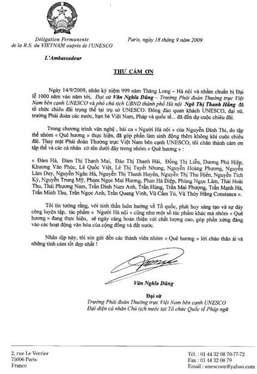

<!--
title: Thư cảm ơn của Đại sứ Việt Nam bên cạnh UNESCO
author: Trần Mạnh Hà
status: completed
-->

*Với sự hoạt động khởi đầu tích cực của Ban hợp ca Quê Hương (BHCQH) tại Cộng hòa Pháp.  Họ – những người sinh viên, thực tập sinh, nghiên cứu sinh, viên chức quốc tế và người Việt đang sinh sống tại nước ngoài – Những con người không chuyên đầy đam mê và nhiệt huyết đau đáu luôn hướng về quê mẹ, đã nhận được nhiều phản hồi tích cực và cổ vũ nhiệt tình của đông đảo khán gỉa tại Pháp. Và sự đóng góp ý kiến của các nghệ sĩ trong và ngoài nước, những nhà phê bình văn nghệ những người am hiểu về nghệ thuật hát Hợp xướng. Nhà báo Trương Quý đã dành cho HCQH một nhận xét rất hàm xúc ” Khi phong trào văn nghệ quần chúng đã phát triển đến như vậy, thì nền văn nghệ Việt Nam sẽ sớm tìm thấy vị trí xứng đáng của nó”
Chúng tôi xin trân trọng đăng tải Thư cảm ơn của Đại sứ Văn Nghĩa Dũng trưởng phái đoàn Việt Nam bên cạnh UNESCO. Đại diện cá nhân Chủ Tịch nước tại tổ chức Pháp ngữ gửi đến Ban hợp ca Quê Hương .*

