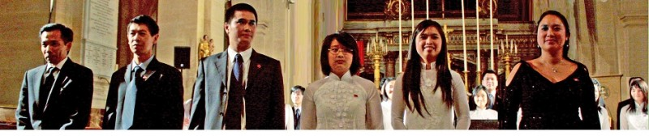
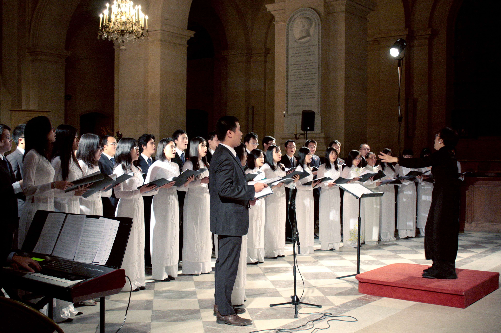
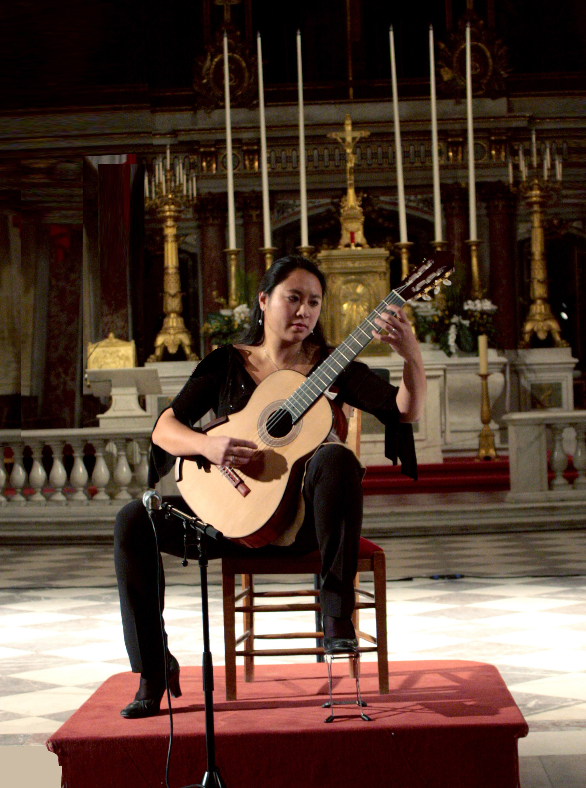

<!--
title: (Français) kỷ niệm 1.000 năm Thăng Long Hà Nội tại nhà thờ St Louis – Les Invalides 18.11.2010
author: Nguyễn Tích Kỳ
status: completed
-->

**NDĐT- Tối 18-11, tại Bảo tàng quân đội Pháp ở thủ đô Paris, trong khuôn khổ kỷ niệm 1.000 năm Thăng Long Hà Nội. Ủy ban vì làng hữu nghị Vân Canh của Pháp phối hợp Phòng ký ức di sản và tài liệu của Bộ Quốc phòng Pháp tổ chức buổi biểu diễn ca nhạc và hòa nhạc ủng hộ các trẻ em của làng hữu nghị Vân Canh. Buổi hòa nhạc tổ chức ở trong nhà thờ Saint Louis bên cạnh điện Invalid, nơi đặt mộ của Hoàng đế Napoleon.**

Dự buổi diễn có ông Rafae Vahé, Chủ tịch Ủy ban vì làng hữu nghị Vân Canh của Pháp, Đại sứ, Trưởng phái đoàn Việt Nam bên cạnh UNESCO Văn Nghĩa Dũng, ông Bùi Lê Thái, Tham tán chính trị Đại sứ quán Việt Nam tại Pháp, đại diện Trung tâm văn hóa Việt Nam tại Pháp, đông đảo hội viên Ủy ban vì làng hữu nghị Vân Canh của Pháp, bạn Pháp và cộng đồng người Việt Nam ở Pháp tham dự.

Mở đầu buổi biểu diễn, hợp ca Quê Hương do các sinh viên, nghiên cứu sinh và người Việt Nam đang sinh sống, làm việc ở Pháp dưới sự chỉ đạo của nhạc trưởng, nghệ sĩ Nguyễn Ngân Hà biểu diễn các tác phẩm Du kích sông Thao, Trống Cơm, trích đoạn Tổ quốc tươi đẹp (lời Việt) trong vở nhạc kịch Nabucco của nhà soạn nhạc Verdi và bài hát Người Hà Nội. Các bài hát có giai điệu tươi vui, hùng tráng được các diễn viên biểu diễn rất chuyên nghiệp được khán giả ủng hộ nhiệt liệt. Hợp ca Quê Hương thành lập từ tháng 4-2009 đã có nhiều buổi diễn thành công, trong đó có các buổi biểu diễn ở trụ sở UNESCO nhân dịp Tết cổ truyền Canh Dần 2010, kỷ niệm 1.000 năm Thăng Long – Hà Nội và đại diện cho Việt Nam tham gia Lễ hội âm nhạc quốc tế của các trường đại học tổ chức ở thành phố Belfort của Pháp năm 2010.

Chương trình biểu diễn phần hai với các tiết mục của Dàn nhạc dây của Dàn nhạc giao hưởng quân đội Pháp dưới sự chỉ huy của nhạc trưởng Francois Boulanger. Đây là dàn nhạc giao hưởng lớn của Pháp đã có nhiều chuyến lưu diễn thành công ở nhiều châu lục trên thế giới.

*HUY THẮNG và KHẢI HOÀN*     
*Pv thường trực báo Nhân Dân  tại Pháp*                                                                                      
*18/11/2010 Photos Tuyết & Đăng & Hải*

