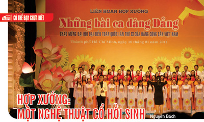

<!--
title: Hợp xướng một nghệ thuật cổ hồi sinh
author: Nguyễn Tích Kỳ
status: completed
-->

**Hợp Xướng ! một nghệ thuật cổ hồi sinh**
  
*Tác giả  **Nguyễn Bách SN5***

Về tên gọi của một tập thể những ngươì cùng hát chung một tác phẩm chúng ta thường thấy có những tên gọi khác nhau: **Tốp ca, Hợp ca và Hợp xướng**.

  
*Hợp Xướng*

Sự phân biệt này căn cứ trên số lượng thành viên, có chỉ huy hay không và có lĩnh xướng hay không. Thật ra, sự  phân biệt như vậy chỉ là thói quen mang tính chủ quan và địa phương tính. Trong các kỳ thi quốc tế về nghệ thuật hợp xướng, không có sự phân biệt thành 3 loại như vậy. Theo định nghĩa mang tính quốc tế, hợp xướng là một nhóm nhạc  (musical ensemble) gồm các ca sĩ trình diễn chung với nhau.         Người ta thường   dùng thuật ngữ choir để gọi một ban hợp xướng (BHX) hát trong nhà thờ (ở Việt Nam thường dùng từ ca đoàn), đối với BHX trình diễn trong các nhà hát (hay  những nơi khác, bên ngoài nhà thờ) người ta gọi là chorus. 

Tuy nhiên hai tên   gọi này cũng không phải là tuyệt đối bởi có những hợp xướng mà hoạt động của   họ diễn ra ở cả hai nơi.

 Hợp xướng có lịch sử rất cổ xưa. Người Hy Lạp   Cổ đại đã biết dùng hợp xướng để hát đệm cho những động tác trình diễn trên   sân khấu. Loại âm nhạc được ký âm đầu tiên của Tây Âu là nhạc Gregorian .   Loại âm nhạc này cùng với một số thể loại ca khúc khác đã thống trị âm nhạc   nhà thờ Công giáo từ đầu thời Trung Đại và người ta đã dùng những bài hát   Bình ca để đệm cho các động tác phụng vụ tôn giáo. Từ đó phát triển nên   truyền thống của một BHX hát loại nhạc không nhạc đệm trong nhà thờ, nên được   gọi là nhạc A cappella. Kiểu hát hợp xướng A cappella kéo dài từ giữa thế kỷ   IV (với Thánh Ambrosio), TK VI (với ĐGH Gregorio I) đến tận cuối thời Trung   Đại. Lúc này xuất hiện một loại hát hợp xướng mới, có nhiều bè giai điệu cách   nhau những khoảng nhất định gọi là hát theo lối “organum”. Sau đó, organum   được phát triển thành clausulae, conductus và motet. Đó là những hình thức   hợp xướng thống trị âm nhạc thời kỳ Phục hưng . Trong thời kỳ này nhạc hợp   xướng là chủ đạo trong Thánh ca phụng vụ của các nhà thờ ở Tây Âu. Nhiều nhà   soạn nhạc vĩ đại đã viết hàng trăm, hàng ngàn những Bộ lễ (mass), Motet cùng   các thể loại khác cho hợp xướng, đa phần là không nhạc đệm. Những tên tuổ đem   lại hào quang cho âm nhạc hợp xướng đa âm Phục Hưng như: Guillaume de   Machaut, Josquin des Prez, Giovanni da Palestrina, Orlando di Lasso, Tomás   Luis da Vittoria, và William Byrd.

Đến thời Baroque (1600 – 1750), một trong những   nhà soạn nhạc lớn đầu tiên viết cho hợp xướng là Claudio Monteverdi . Cùng   với Heinrich Schuetz ông đã cho thấy âm nhạc có thể hỗ trợ và tăng cường cho   các thông điệp của ca từ, công việc mà Palestrina đã làm ở nhiều thế hệ   trước. Cả hai nhà soạn nhạc này đều có khối lượng sáng tác lớn cho hợp xướng   a cappella cũng như có nhạc đệm. Gần một thế kỷ sau, Johann Sebastian Bach đã   xuất hiện như một nhà soạn nhạc ưu tú đã sáng tác một khối lượng đồ sộ các   tác phẩm hợp xướng thánh nhạc thuộc các thể loại cantata, motet và passion   cũng như các thể loại nhạc khác. Ông còn nổi tiếng với các bản hợp xướng mang   hình thức chorale, qua đó,ảnh hưởng của ông rất mạnh mẽ đến việc phát triển   hòa âm cổ điển. Có thể nói đến lúc này, âm nhạc hợp xướng đã bước vào thời   hoàng kim.

Các nhà soạn nhạc thời kỳ Kinh điển (Classic)   cuối TK. XVIII bắt đầu say mê với những khả năng diễn đạt mới của âm nhạc   giao hưởng và khí nhạc khác, nên phần đông đều quay lưng lại với âm nhạc hợp   xướng. Haydn chỉ tìm thấy hứng thú với nhạc hợp xướng trong những năm cuối   đời sau khi đã bị các oratorio của Haendel chinh phục để có các oratorio “Các   mùa” (Seasons), “Sự Sáng thế” (Creation) Nhạc hợp xướng đã không là một đặc   trưng của âm nhạc Mozart, trừ một vài tác phẩm ngoại lệ như Bộ Lễ “Lớn” giọng   Đô thứ và bộ Lễ “Cầu Hồn” (Requiem). Beethoven chỉ viết có hai bộ Lễ và phần   hợp xướng cho giao hưởng số 9. Ông đã được coi là người tiên phong trong việc   dùng hợp xướng vào nhạc giao hưởng.

Sang Tk. XIX, thánh nhạc chạy ra khỏi nhà thờ   để xuất hiện trên các sân khấu thế tục. Có những tác phẩm hợp xướng lớn (với   phần dàn nhạc lớn) mang nội dung tôn giáo nhưng lại không thích hợp cho việc   biểu diễn ở nhà thờ như “Ngài là Thiên Chúa” (Te Deum) và “Bộ Lễ Cầu hồn”   (Requiem) của Berlioz, Bộ “Lễ Cầu hồn Đức” (Ein deutsches Requiem) của   Brahms, “Mẹ đứng đó” (Stabat Mater) của Rossini, các bộ Lễ của Shubert và   Verdi. Cũng có một số tác giả phát triển loại nhạc hợp xướng a cappella theo   một hướng mới như Mendelssohn, Brahms và Bruckner.

Đến Tk. XX có thể nói âm nhạc hợp xướng tiếp   tục thoái trào. Trong khi chỉ một vài tác giả lớn hướng vào nhạc hợp xướng   thì đa số các nhà soạn nhạc tiêu biểu đều nghiêng về khí nhạc. Ngoại trừ một   số ít tác phẩm hợp xướng nổi tiếng như Bộ “Lễ Cầu Hồn Chiến Tranh” (War   Requiem) của Benjamin Britten, Các motets Giáng sinh và bộ Lễ giọng Sol   trưởng của Francis Poulenc, Carmina Burana của Carl Off (đã trình diễn tại Hà   Nội năm tháng 10/2003 do dàn hợp xướng Frankfurt của Đức thực hiện).

**Nếu phân chia theo loại giọng hát, chúng ta có các loại hợp xướng:**

***Hợp xướng hỗn hợp***

Còn gọi là hợp xướng dị giọng với sự có mặt   của các giọng nam và nữ. Đây có lẽ là loại hợp xướng thường gặp nhất với 4 bè   giọng căn bản: Soprano , Alto, Tenor và Bass, ký hiệu: SATB. Có khi, bè Bass   được chia thành loại âm vực cao và thấp. Lúc đó bè Bass âm vực cao được gọi   là giọng Baritone, ký hiệu: Bar. Hoặc có khi người ta chọn ra một số giọng   nam đặc biệt để lúc thì đảm nhiệm bè Tenor, lúc thì bè Bass. Loại giọng này   cũng được gọi là Baritone.

***Hợp xướng giọng Nam***

Không có nghĩa là hợp xướng chỉ có 2 bè:   Tenore và Basso. Có thể hợp xướng này vẫn dùng các tác phẩm cho 4 bè SATB,   nhưng trong đó các giọng Nam (thiếu niên, con trai) sẽ hát bè Nữ cao – người   ta gọi là giọng treble hay giọng soprano thiếu niên và giọng Nam hát bè Nữ   trầm – được gọi là giọng countertenor. Nếu hợp xướng này chỉ gồm 2 giọng   Tenor và Bass, người ta ký hiệu: TB hoặc TTBB.

***Hợp xướng giọng Nữ***

Thường gồm 2 loại giọng: soprano và alto. Có thể mỗi giọng chia thành 2 bè, ký hiệu: SSAA. Nếu dựa trên tiêu chuẩn loại âm nhạc mà hợp   xướng chọn để biểu diễn, chúng ta có các loại hợp xướng như sau:

***Hợp xướng giao hưởng:***

Là loại hợp xướng có nhiều hơn 3 bè và trình   diễn những tác phẩm có nhiều chương. Hợp xướng giao hưởng có thể được đệm   bằng dàn nhạc đầy đủ hoặc không có nhạc đệm. Với những yêu cầu nghệ thuật của   tổng phổ loại nhạc này nên các thành viên hợp xướng thường phải có chất lượng   giọng đạt tiêu chuẩn, có khả năng thị xướng tổng phổ, giọng của họ phải hòa   với nhau thành một một khối (một điều ít gặp được trong các hợp xướng không   chuyên hoặc các hợp xướng được hình thành từ các ca sĩ đơn lẻ). Không phải vô   lý khi có người cho rằng hợp xướng mà các thành viên là những “ngôi sao” ca   nhạc thường là một hợp xướng kém.

***Hợp xướng jazz***

***Hợp xướng thính phòng***

Trong âm nhạc thính phòng, người ta có thể sử   dụng các nhóm nhạc công hay các nhóm ca sĩ. Lúc đó, chúng ta có loại hợp   xướng thính phòng. Một BHX này thường gồm từ 20 – 40 ca sĩ thành viên.

***Hợp xướng show*** Là loại hợp xướng mà trong đó các thành viên vừa hát vừa làm các động tác vũ đạo, thậm chí là các màn múa cụ thể để diễn   tả một nội dung nào đó. Loại hợp xướng này giống như các musicals .

Bài viết **“Hợp xướng : một nghệ   thuật cổ hồi sinh”** ngày 06 tháng 5 năm   2011 trên website songnhac.vn,

*Tài liệu sư tầm Nguồn : [http://songnhac.vn/dien-dan/muc-luc/thuong-thuc-am-nhac/2300-hop-xuong-mot-nghe-thuat-co-hoi-sinh.html](http://songnhac.vn/dien-dan/muc-luc/thuong-thuc-am-nhac/2300-hop-xuong-mot-nghe-thuat-co-hoi-sinh.html)*  

*Người sưu tầm: Nguyễn Vũ Phương Liên bè Sop Hợp ca Quê Hương.*

