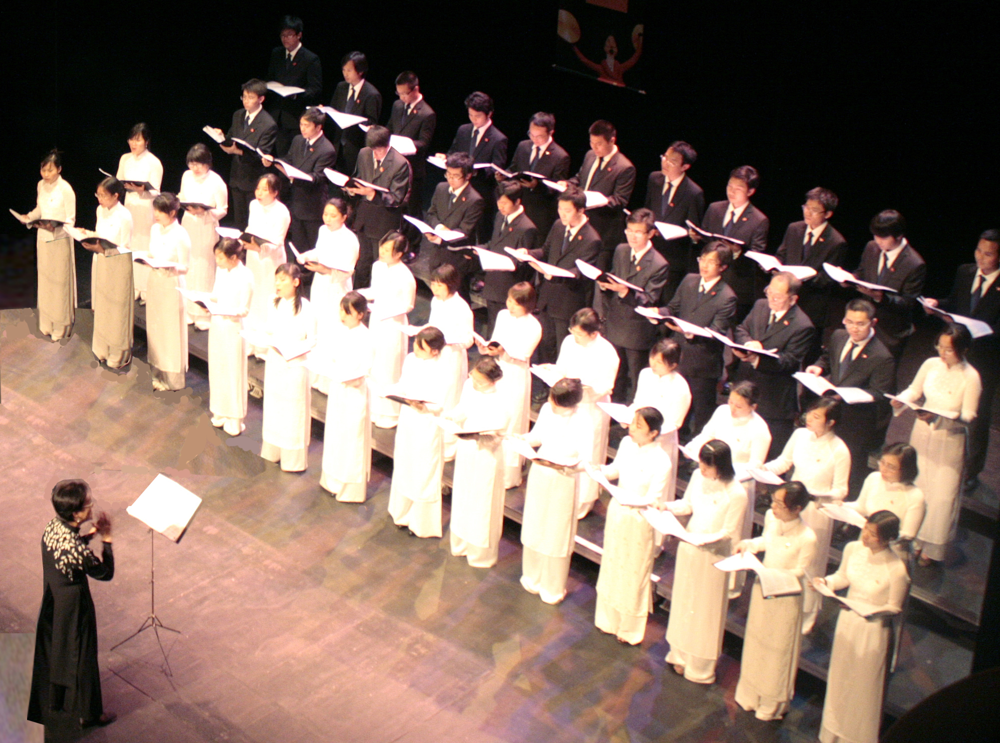

<!--
title: Thơ Chị San gửi đến HCQH
author: Nguyễn Tích Kỳ
status: completed
-->

*Hà nội 26.06 2010*

*Thân ái gửi Anh Chị Tích Kỳ- Ngân Hà và Ban Hợp Ca Quê Hương trên đất Pháp.*

*Sau khi theo rõi những hoạt đống của Ban, tôi thực sự sững sờ và mến mộ các bạn. Mến mộ về tài tổ chức và huấn luyện của Anh Chị Tích Kỳ-Ngân Hà. Mến mộ về tài dàn dựng nghệ thuật âm nhạc của thành viên Nam Anh. Mến mộ về sự khổ luyện, say mê và vượt khó của các thành viên trong Ban, hầu hết chỉ là sinh viên, nghiên cứu sinh, viên chức người Việt Nam tại Pháp không được qua đào tạo về ngành âm nhạc, khó khăn về kinh phí, tự trang trải cho mọi hoạt động của Ban, cho học tập, làm việc, vừa phải đảm bảo của mình trên đất người.*

*Với thời gian rất ngắn (thành lập mới một năm) Cá bạn đã xây dựng được một Dàn Hợp xướng tham gia quốc tế thành công tốt đẹp. Đã làm rung cảm trái tim nhiều bận bè Quốc tế làm họ ngỡ ngàng thán phục về con người Việt Nam, làm họ hiểu và cảm nhận được vẻ đẹp văn hóa Việt Nam, đó là việc làm thực chất nhất, đầy đủ và sâu sắc nhất thể hiện lòng yêu quê hương Tổ Quốc của các bạn, mà không một lời ca nào có thể đủ để ca ngợi lên điều đó.*

*Tôi ngàn lần thầm càm ơn các bạn, vì các bạn đã làm giàu hơn trong tôi niềm tự hào là người Việt Nam. Làm giàu hơn trong tôi sự cảm nhận về âm nhạc . Các bạn đã thể hiện được tới người nghe : sự tinh túy, truyền cảm qua bài « Người Hà Nội », sự hào hùng, say đắm qua bài « Du kích Sông Thao » sự tươi vui, đầy bản sắc dân tộc qua bài « Trống cơm ».*

*Không thể tưởng tượng được khi biết điều kiện vật chất, điều kiện nghiệp vụ và thời gian của các bạn hạn hiếm, lại có thể mang đến thành công như vậy. Chỉ có thể giải thích rằng : trong mỗi con người các bạn đang có dòng máu siêu hình là con cháu của vị Thánh Gióng bất tử cộng với lòng yêu Tổ Quốc đến cháy bỏng của các bạn, thì các bạn mới làm được như vậy.*

*Để cảm ơn các bạn, tôi xin tặng mấy vần thơ làm từ trái tim mình :*

*Thơ về Ban Hợp Ca Quê Hương (trên đất Pháp)*

*Mùa xuân Kỷ Sửu chào đời*  
*Eiffel đất Pháp viết lời ngợi ca*  
*Một dàn hợp xướng xa nhà*  
*Bừng lên tia chớp sáng lòa Tây Âu*  
*Giữa lòng văn hóa toàn cầu*  
*Paris hoa lệ nổi mầu Việt Nam*  
*Một năm tuổi đã dám làm*  
*Tham gia âm nhạc với làng Âu tây*  
*Hơn ba mươi nước trình bày*  
*Fimu Belfort từ đây nổi cồn*  
*Canh Dần đánh dấu vàng son*  
*Hợp Ca người Việt mãi còn dư âm*  
*Bạn bè quốc tế âm thầm*  
*Ngưỡng mộ, thán phục không cầm lệ rơi*  
*Sinh viên, người Việt đất người*  
*Làm nên chiến tích để đời chẳng quên*  
*Lòng yêu Tổ Quốc vững bền*  
*Các con xa Mẹ viết nên sử vàng*  
*Vượt lên thử thách gian nan*  
*Xây danh đất Mẹ Việt Nam chói lòa*  
*Có tình yêu nước, yêu nhà*  
*Là có âm nhạc lời ca tuyệt vời*  
*Yêu dàn hợp xướng xa xôi*  
*Trái tim mến mộ của người ở quê*  
*Chúc Ban thành đạt mọi bề*  
*Học tập, công tác cùng nghề hát ca*  
*Góp nền văn hóa nước nhà*  
*Sánh cùng quốc tế chói lòa thế gian*

***Nguyễn Bích San***  
***Hà Nội 25.06.2010***

