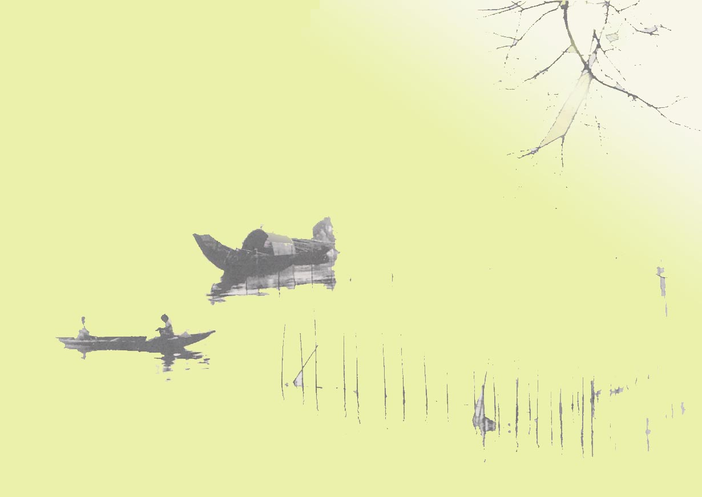

<!--
title: 38 độ trong bóng râm ……với ký ức hát ru tuổi thơ
author:  hamytran
status: completed
-->

  
***Nhân một ngày Paris nóng chảy người***

*Mến tặng cô chú …*

*«Lặng rồi cả tiếng con ve*
  
*Con ve cũng mệt vì hè nắng oi*  
*Nhà em vẳng tiếng ạ ời*  
*Kẽo cà tiếng vọng mẹ ngồi mẹ ru*  
*Lời ru có gió mùa thu*  
*Bàn tay mẹ quạt mẹ đưa gió về

»*  

  

Giữa cái trưa hè oi ả, cháy da cháy thịt  của châu Âu – nơi tưởng chừng như không bao giờ biết đến thế nào gọi là cái nóng, cái oi nồng đặc trưng của mùa hè nhiệt đới – tiếng ve nức nở râm ran rộn ràng cả khoảng vườn trước nhà đã kéo tôi ngược trở về với kí ức của tuổi thơ  – môt kí ức dù không quạt, không máy lạnh nhưng lại tươi mát đến tận sâu thẳm tâm hồn. Nhắm mắt quay ngược thời gian, nghếch chân, dang tay sõng soài trên nền đất để sống lại những tháng ngày không thể có lần thứ hai giữa tiết trời bức bối quả thật là một cách trốn nắng hiệu quả cả về chất lẫn lượng !

Kí ức ấy gắn liền với những bài ru của mẹ, với chiếc quạt làm từ mo cau khô mà bà gom lại và giữ cẩn thận như một vật báu ! Xứng đáng là vật báu quá đi chứ bởi cái thời vừa bắt đầu đổi mới, con nhà nông làm gì có tiền mà mua nổi một cái quạt con cóc chứ đừng nói gi đến quạt điện chạy với công suất 110V (huống chi đâu phải nơi nào cũng được hưởng sái điện từ đường dây 500KW đâu. Ngày ấy, « điện » là một thứ sản phẩm vô hình xa xỉ mà nhà nhà ao ước, người người ao ước.). Cũng chẳng có tiền mua được quạt nan vì cũng đáng giá đến mấy hào chứ đâu có ít ! Ấy vậy cho nên cái quạt mo cong queo, sần sùi, gấp cạnh cho vừa nắm tay lại là thứ « của nhà trồng được » nên quý lắm ! Tôi còn nhớ cái quạt xấu xí ấy còn được dùng vào việc phạt đứa trẻ nào cãi bố mẹ và hay ăn vụng nữa cơ !

Có lẽ bài thơ kia là một cái duyên kéo tôi gần lại với tuổi thơ và càng gần thì càng thấm và rưng rưng tiếc  nuối quãng thời gian chẳng thể quay trở lại được !

Đâu dễ quên được những đêm mùa hè mất điện (*mà bây giờ trưởng thành, đủ ngôn từ để diễn tả cảm giác lúc ấy thì mới hiểu thế nào là « cực hình » với một đứa trẻ con mà cái nóng là một sự « ám ảnh » dai dẳng – dai dẳng đến tận bây giờ !*), mồ hôi nhễ nhại, khóc lóc phụng phịu, đập chân đập tay vì bức bối. Mẹ lại lóc cóc thức dậy phe phẩy cái quạt mo, thắp nến để đuổi muôĩ nữa ! Ôi sao những đêm hè oi ả đến rợn người ấy, người ngợm nhớp nháp vì mồ hôi,  không gian tĩnh lặng một cách đáng sợ  chỉ nghe bên tai tiếng muỗi vo ve mà chỉ muốn bứt dây đi dội nước cho thỏa thê cứ in mãi trong tâm trí tôi như một phần không thể thiếu của bản ngã!

Hồi ấy, cũng đã mơ hồ cảm giác thương mẹ phải thức để phe phẩy quạt cho mình ngủ, nhưng vì vẫn chỉ là đứa trẻ 6,7 tuổi nên tất cả chỉ dừng lại ở cảm giác, thứ cảm giác không thể đánh gục được cái nóng oi nồng kia ! Nhớ và thương đến nao lòng những lúc  mẹ gật gà ngủ mà chiếc quạt mo thõng xuống chiếu, cái đứa trẻ đỏng đảnh đáng ghét ấy giật mình thức dậy mếu máo bắt mẹ phải quạt tiếp. Cứ thế cho đến gần sáng, chắc ông trời cũng thương mẹ nên bác điện lực lại cho quạt chạy đến 7h sáng – lúc nhà nhà đi làm, trẻ nhỏ đi học, nên phải tiếp tục cắt điện luân phiên để đảm bảo tiết kiệm cho quốc gia.

Từ ngày CP hết tuổi được ru ngủ, thật hiếm hoi tôi được nghe  mẹ hát ru –  *trừ những lúc bà đến bế ẵm tắm táp cho mấy đứa em con cậu tôi. Nhưng cũng lâu lắm rồi vì bây giờ các em đều đă lớn khôn hết cả* – đâm ra nhớ và thèm đến khôn tả !

Có lẽ lúc ấy tôi còn quá bé để biết mẹ đã ru tôi lớn bằng những điệu ru gì, nhưng cảnh những lúc mẹ  ẵm CP trong tay rồi ru em bằng những khúc hát ngắn, dễ nhớ và rất nhiều hình ảnh ngộ nghĩnh của trẻ thơ cứ theo tôi mãi. 
 
*« À á à ời*  
*À á à ơi*   
*Cái bống mày ngủ cho ngoan*  
*Để mẹ đi cấy đồng sâu chưa về*  
*Bắt được con trắm con trê*  
*Vặn cổ đem về cho cái ngủ ăn*   
*À á à ời*  
*À á à ơi »*  

………………  Rồi

*« À á à ời*  
*À á à ơi*   
*Cái cò mày đi ăn đêm*  
*Đậu phải cành mềm lộn cổ xuống ao*  
*Ông ơi ông vớt tôi nao*  
*Tôi có lòng nào ông hãy xáo măng*  
*Có xáo thì xáo nước trong*  
*Đừng xáo nước đục đau lòng cò con*  
*À á à ời*  
*À á à ơi »*  

………………….  Hay là
 
*« À á à ời*  
*À á à ơi*   
*Bống bống bang bang*  
*Bống ăn cơm vàng cơm bạc nhà ta*  
*Chớ ăn cơm hẩm cháo hoa nhà người*  
*À á à ời*  
*À á à ơi»*

*« À á à ời*  
*À á à ơi*   
*Bống bống bang bang*  
*Bống ăn cơm vàng cơm bạc nhà ta*  
*Chớ ăn cơm hẩm cháo hoa nhà người*  
*À á à ời*  
*À á à ơi»*

………………….  Còn cả
 
*« À á à ời*  
*À á à ơi*   
*Ví dầu cầu giáng đóng đinh*  
*Cầu tre lắc lẻo gập gềnh khó đi*  
*Khó đi mẹ dắt con đi*  
*Con đi trường học mẹ đi trường đời*  
*À á à ời*  
*À á à ơi »*

Tôi cứ thích ngắm mẹ mãi những lúc mẹ ru vì tôi thấy mẹ nhìn em trìu mến, rung rung em trong vòng tay rồi thơm thít, lúc ấy thấy ghen tị vì mẹ bế em, hát cho em nghe rồi nựng má em mà mình thì chẳng có được ưu ái đấy  ! Nhưng rồi cũng quên bẵng là mình đang ghen khi chính mẹ lại dạy tôi những khúc hát đấy để ru em ! Có lẽ nhờ thế mà tôi thấy phần hồn của mình gắn nhiều với nhũng lời ru mẹ truyền lại cho tôi.

Sau này khi cắp sách đến trường, tôi mới được biết những khúc hát ru của mẹ đều được lấy từ ca dao, tục ngữ, truyện cổ tích của Việt Nam. Nhưng lại chẳng phải là ca dao, tục ngữ nữa vì chúng đã được lồng nhạc điệu vào rồi ! Ấy thế ngừoi ta mới gọi là khúc hát ru, là lời ru ! Nhờ được lớn lên trong những làn điệu ru ấy mà sau này, tôi thích văn, thích thơ, thích và có thiên hướng với những môn học liên quan đến tâm  hồn, tình cảm con người hơn là những môn khô khốc khó nhằn như toán, lý, hóa, sinh !

Mới đây không lâu vô tình đọc được tin nhà nước đang muốn nghiên cứu hình thức hát ru – một nét đẹp truyền thống của văn hóa Việt Nam, góp phần nuôi dưỡng tâm hồn trong sáng, ngây thơ của trẻ nhỏ – nhưng ngày đang bị mai một bởi ảnh hưởng của văn hóa phương Tây. Bây giờ nghe các bà mẹ trẻ ru con bằng cách bật nhạc bé Xuân Mai, Đàm Vĩnh Hưng, Bảo Thy,… hay hùa theo phong trào dùng nhạc cổ điển để ru con với mong muốn con mình sẽ trở thành uyên bác mới thấy những cái thuộc về ngóc ngách tâm hồn quan trọng đến nhường nào nhưng lại không được định hướng đúng đắn : là con người Việt Nam thì phải được nuôi dưỡng bằng tâm hồn Việt, bằng những giá trị đạo đức tinh thần của ngừoi Việt Nam. Cây mất gốc thì sao cành lá, ngọn ngành có thể xum xuê, tươi tốt được đây ?

Miên man…. mơ hồ vô định về tuổi thơ, ao ước được bé lại để được lọt thỏm trong vòng tay của mẹ, được bố kiệu trên vai rong chơi khắp ngõ. .…lại dội về « Khúc hát ru những em bé lớn trên lưng mẹ » của nhà thơ Nguyễn Khoa Điềm :

*« Em cu Tai ngủ trên lưng mẹ ơi*  
*Em ngủ cho ngoan đừng rời lưng mẹ*  
*Mẹ giã gạo mẹ nuôi bộ đội*  
*Nhịp chày nghiêng giấc ngủ em nghiêng*  
*Mồ hôi mẹ rơi má em nóng hổi*  
*Vai mẹ gầy nhấp nhô làm gối*  
*Lưng đưa nôi và tim hát thành lời:*  
*Ngủ ngoan a Kay ơi, ngủ ngoai a Kay hỡi*  
*Mẹ thương a Kay, mẹ thương bộ đội*  
*Con mơ cho mẹ hạt gạo trắng ngần*  
*Mai sau con lớn vung chày lún sau..*  
 
*Em cu Tai ngủ trên lưng mẹ ơi*  
*Em ngủ cho ngoan đừng rời lưng mẹ*  
*Mẹ đang tỉa bắp trên núi Ka Lưi*  
*Em ngủ ngoan em đừng làm mẹ mỏi*  
*Mặt trời của bắp thì nằm trên đồi*  
*Mặt trời của mẹ, em nằm trên lưng*  
*Ngủ ngoan a Kay ơi, ngủ ngoan a Kay hỡi*  
*Mẹ thương a Kay, mẹ thương làng đói*  
*Con mơ cho mẹ hạt bắp lên đều*  
*Mai sau con lớn phát mười Ka Lưi…*  
*Em cu Tai ngủ trên lưng mẹ ơi*  
*Em ngủ cho ngoan đừng rời lưng mẹ*  
*Mẹ đang chuyển lán, mẹ đi đạp rừng*  
*Thằng Mỹ đuổi ta phải rời con suối*  
*Anh trai cầm súng, chị gái cầm chông*  
*Mẹ địu em đi để đánh trận cuối*  
*Từ trên lưng mẹ, em đến chiến trường*  
*Từ trong đói khổ em vào Trường Sơn*  
*Ngủ ngoan a Kay ơi, ngủ ngoan a Kay hỡi*  
*Mẹ thương a Kay mẹ thương đất nước*  
*Con mơ cho mẹ được thấy Bác Hồ*  
*Mai sau con lớn làm người Tự do…»*

Muốn trôi mãi theo dòng thời gian ấy… không muốn mở mắt… không muốn thức dậy vì sợ….sợ cái nóng rợn người ngoài kia….. dù biết, đã có thời, nó gắn kết ta với những chuỗi ký ức không thể phai …..Nhưng đây đâu phải chốn quê nhà ….. 
 
*H.A 
Paris,*   
*ngày 22 tháng 08 năm 2012*

