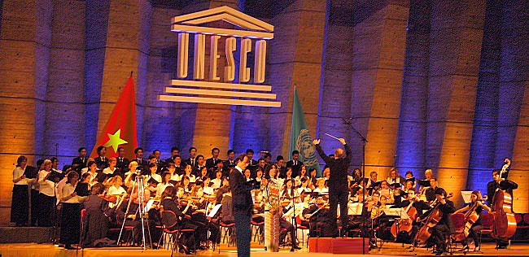
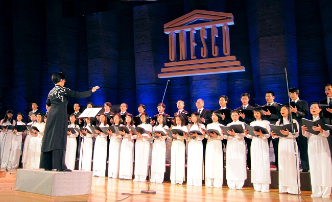
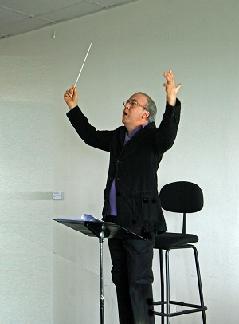
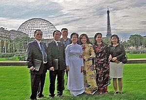
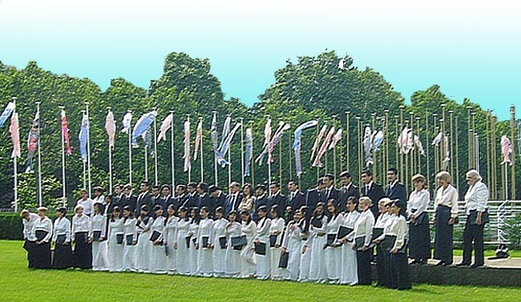

!--
title: Nguyên Chủ nhiệm UBNVNONN gửi tưTp HCM nhân dịp Đại Lễ Ngàn Năm Thăng Long
author: Nguyễn Tích Kỳ
status: completed
--

  
*Từ TpHCM nghe bài hát ngợi ca “Người Hà Nội”. Nhân dịp chuẩn bị “Đại Lễ Ngàn Năm Thăng Long”, qua đài Truyền hình VTV4, từ TpHCM, xúc động và tự hào biết bao khi được xem, nghe dàn hợp xướng dàn nhạc giao hưởng của Cơ quan Văn hoá-Khoa học-Giáo dục Liên Hiệp Quốc tại Paris (UNESCO) và ban Hợp Ca Quê Hương của Kiều bào cùng biểu diễn bài ca “Người Hà Nội” từ Paris (Pháp) vang vọng về.*

*Trong chương trình của Đài VTV4 có hình ảnh của Hợp Ca Quê Hương do Nguyễn Ngân Hà điều khiển nhân những dịp lễ hội của Kiều bào.
Tôi đã có dịp thưởng thức ban Hợp Ca Quê Hương qua bài “Du Kích Sông Thao” của nhạc sĩ Đỗ Nhuận mà nguyên Đại sứ nước ta tại Pháp Nguyễn Đình Bin đã viết bài “hoan nghênh và cảm phục”.*

*Xúc động và vui mừng xiết bao khi được nghe dàn hợp xướng bao gồm Hợp Ca Quê Hương và dàn nhạc giao hưởng của Cơ quan Unesco trình diễn với quy mô hoành tráng, thể hiện rõ nét tính quốc tế của tiết mục.*
*Hợp xướng và dàn nhạc đã diễn tả lột được chất thơ, hào khí, hào hùng của vùng đất Rồng bay, Thủ đô ngàn năm văn hiến của dân tộc, luôn vững vàng là trụ cột trung tâm đầu não của đất nước, luôn tiến lên mặc cho bao gian nan, thử thách của lịch sử ngoại xâm gây ra. Thiết tha sôi nổi, hùng hồn, rồi lạc quan yêu đời quyết tâm đi đến ngày toàn thắng mà nhà văn, nhà thơ, nhạc sĩ Nguyễn Đình Thi mô tả qua các đoạn của bài hát đã gieo vào thính giác, tâm hồn người thưởng thức những cảm xúc nêu trên.*
*Chỉ mới hai câu đầu, với 2 giọng nữ, nam trong trẻo đầy xúc cảm “Đây Hồ Gươm Hồng Hà, Hồ Tây” của giọng nữ cao (soprano) Lệ Quyên và “Đây Thăng Long, đây Đông Đô, đây Hà Nội mến yêu” của ténor Jean-Claude Rosaz (nam cao người nước ngoài) cất lên đã làm rung động sâu sắc, thu hút tâm hồn người nghe. Dàn hợp xướng gồm người ViệtNam(Hợp Ca Quê Hương) và người nước ngoài cùng hát tiếng Việt cũng như dàn nhạc giao hưởng dưới sự chỉ huy của nhạc trưởng Jorge Lozano-Corres đã thể hiện một cách xuất sắc cái hồn và nội dung, tiết tấu các chương của bài hát.*

*Đặc biệt, tôi nhớ mãi động tác cuối của nhạc trưởng khi kết thúc bài hát : giương cao chiếc đũa chỉ huy, chỉ về phía trước, giữ nhịp cho nốt cao nhất cuối cùng của bài hát rồi dàn nhạc, dàn hợp xướng cùng hoà vang, đồng loạt kết thúc tưng bừng, báo hiệu ngày chiến thắng của dân tộc VN, của người dân Hà Nội.*

*Bản hợp xướng “Người Hà Nội” có thể nâng cao thêm về chất lượng, phong phú hơn về thể hiện giai điệu của các chương. Trước tiên, nên có những câu nhạc không lời kết nối giữa các chương. Và điều cần quan tâm thêm là phần hoà âm nên làm cho giai điệu chính được nổi bật hơn. Ví dụ : Về hai đơn ca nam nữ mở đầu bài, nên chăng có bè “vocaliser” đệm theo, nghe như tiếng sóng reo vỗ bờ, tiếng gọi của hồn thiêng sông núi ? Và cũng có thể viết bè “vocaliser” cho chương cuối làm nổi bật niềm hân hoan của người dân Hà Nội, của dân tộc ViệtNamluôn tin tưởng vào thắng lợi cuối cùng của Tổ quốc ! Ở một số đoạn, cũng có thể sử dụng phương thức hát đuổi (canon) giúp cho giai điệu, tiết tấu đa dạng, tươi sáng thêm ?*
*Dù sao, với bài hát “Người Hà Nội” đã được trình diễn như vừa qua, Hợp Ca Quê Hương cùng với dàn hợp xướng dàn nhạc giao hưởng Unesco đã ghi thêm trong chương trình biểu diễn của mình một điểm son rõ nét.*

*Theo tôi, nhớ về phong trào văn nghệ của Kiều bào ở Pháp, lâu lắm rồi, tôi mới lại được nghe một bài hợp xướng hay, hướng về đất nước thân yêu, ca ngợi “Thủ đô Hà Nội” và “Con người Hà Nội”. Và không chỉ có Kiều bào mà còn có bè bạn người nước ngoài, nhạc sĩ, thành viên ban hợp xướng tham gia, đặc biệt tại sân khấu trụ sở Unesco (Paris). Không dễ gì mà quy tụ, tập hợp được những con người như vậy để tập luyện và biểu diễn.*

*Thật là một kỳ công lớn của những bạn chủ trương và tổ chức thực hiện.*

*Xin chân thành cám ơn và biết ơn những nhạc sĩ, những ca sĩ và nhạc trưởng Jorge Lozano-Corres đã tặng cho khán thính giả, đặc biệt cho những người Việt Nam ở ngoài và trong nước một buổi ca nhạc tuyệt vời, có ý nghĩa quốc tế, không chỉ về mặt nghệ thuật, mà còn là những tình cảm sâu sắc của bè bạn người nước ngoài đối với dân tộc VN qua bài ngợi ca “Người Hà Nội”.*

*Xin chân thành cám ơn Ban Giám đốc và các phóng viên Đài Truyền hình VTV4, Ban lãnh đạo UNESCO và nhất là cám ơn Hợp Ca Quê Hương, đặc biệt Ban lãnh đạo Hợp Ca đã nhiều hay ít có góp phần tổ chức, và biểu diễn thành công một buổi ca nhạc đầy chất lượng, một hoạt động có tính quốc tế trong năm đất nước Việt Nam chuẩn bị trang trọng “Đại Lễ Ngàn Năm Thăng Long – Hà Nội”.*

*Thân chúc Hợp ca Quê hương ngày càng quy tụ thêm nhiều Kiều bào thích ca hát, luôn có nhiều tiết mục mới, luôn nâng cao chất lượng nghệ thuật phục vụ cho Kiều bào và bạn bè người nước ngoài sống ở Pháp cũng như ở các nước khác, hướng về đất nước thân yêu.*

*Để kết thúc bài viết này, tôi muốn nói lên một tình cảm sâu sắc và suy nghĩ chân thành : Khi nhớ lại một số câu trong “Người Hà Nội” như : Hà Nội say mê chen đón Cha về. Kín trời phất phới vàng sao” …, gần 1000 năm đã trôi qua, bao biến đổi thăng trầm của lịch sử đất nước và dân tộc, từ đời Lý, Trần, Lê, Nguyễn … đến nay. ViệtNamvẫn còn đó, Thăng Long-Hà Nội, vẫn vững vàng, bè bạn thế giới ngày càng đông, rộng, quan hệ hữu nghị hợp tác chân tình. Với bối cảnh như trên, tôi mạnh dạn nêu : “Ngàn năm Thăng Long-Hà Nội – “Thời đại Hồ Chí Minh”.*
                          
*Tp HCM kỷ niệm Đại lễ Ngàn Năm Thăng Long – Hà nội.*

*2010*  
***Hồng Minh***
 

##  một vài phản ánh đó đây……

Cô Ngân Hà ơi,

Chắc giờ này cô đang ở Hà Nội?
Cháu và mấy người bạn của cháu vừa cùng ngồi xem phóng sự **“Từ Paris hướng tới 1000 năm Thăng Long”** trên **VTV4** phát lúc 8h sáng nay theo giờ Paris. Hôm nay cháu mới được xem cô ạ. Cháu xem qua TV, còn một số người xem từ Việt Nam, từ Mỹ, Úc, Brazil và Nga qua trang web của VTC. Cô biết là cháu khó tính, nhưng cháu phải nói ngay là phóng sự thật tuyệt vời. Các bạn cháu cũng khẳng định thế. Theo cháu, đây hoàn toàn không phải là một clip MTV mà là một phim tư liệu ngắn về HCQH. Rộng hơn thế, phóng sự là một thông điệp quý, một cử chỉ đẹp.
Sau khi xem xong cháu càng hơn tin vào những lời khen dành cho HCQH mà cháu nghe được trong mấy ngày qua. Đúng là không phải họ khen xã giao đâu. Trong số họ có cả dân nhạc viện và giới phê bình âm nhạc, những người rất am hiểu văn hóa Việt Nam, lịch sử và đời sống âm nhạc Việt Nam. Một số người còn là quản trị của các diễn đàn âm nhạc trên internet và họ là nhưng thư viện sống về bài hát Việt Nam và ca sỹ Việt Nam. Và đúng là khi họ đặt họ vào vị trí những người khán giả có kiến thức, họ có cách nhìn thật tự nhiên, khách quan và toàn diện.
Phóng sự sử dụng thông tin và tư liệu khá phong phú về HCQH từ trước đến nay. Phần phỏng vấn làm rất nhẹ nhàng, cân đối. **Tăng Nguyễn Trung Hiếu** và **Minh Thu Trần** trả lời rất hay và duyên dáng. Các bạn nước ngoài phát biểu cảm nghĩ rất xúc động. Nhiều khuôn mặt HCQH rất ăn hình.*

*Phản hồi từ khán giả cho thấy sự kết hợp giữa ta và tây trong clip này rất thú vị và có tính biểu tượng cao. Không thấy ai bàn tới chuyện nghiệp dư hay chuyên nghiệp và đương nhiên không có ai so sánh HCQH với Hợp xướng Đài Tiếng nói Việt Nam hay Nhà hát Nhạc vũ kịch Việt Nam hay Nhạc viện Hà Nội, mà họ chỉ chủ yếu nói về sự nhiệt huyết của những người hát và những người thực hiện phóng sự.*

*Một số bạn là phóng viên văn hóa muôn liên hệ với chị **Lệ Quyên** và nhạc trưởng **Jorge Lozano-Corres** của UNESCO để viết bài. Rất nhiều fan của chị Lệ Quyên trên một số diễn đàn nhạc Việt nói với cháu rằng họ rất xúc động khi thấy chị Lệ Quyên xuất hiện trở lại trên truyền hình và cho rằng HCQH thật vinh hạnh khi được ngôi sao một thời vang bóng của Việt Nam cộng tác. Giữa một dàn hợp xướng kết hợp giữa nghiệp dư và chuyên nghiệp, chất chuyên nghiệp, kỹ thuật và nhạc cảm của Lệ Quyên, như cháu đã nói với Cô, vẫn nổi trội và không thể phủ nhận, cho dù ai cũng biết cảm thụ âm nhạc là điều hết sức chủ quan, dễ bị tình cảm và định kiến chi phối, cho dù người cảm thụ có là người trong ngành, trong giới đi nữa. Cái này chú **Nguyễn Thiện Đạo** cũng đã nói và cháu rất thích cách chú Đạo xử lý đoạn “Này lớp lớp người đi …” với tempo nhanh, dồn dập và có hồn. Lớp lớp người đi mà chứ có phải đi lại thẫn thờ đâu.*

*Cô ơi, Cô nhớ xin DVD của VTV cho nhóm, Cô nhé. Và nếu có thể, cô xin cả băng Master của họ, nhất là phần phỏng vấn. Cô cũng cho cháu gửi lời chào chị Vân Anh và các anh chị VTV4.*

*Nhân email này, với tư cách là một thành viên hiện còn sinh hoạt chung trong HCQH, đồng thời cũng đã có kinh nghiệm làm việc và giao thiệp với nhiều người khác nhau, mình cũng lưu ý một vài bạn đã viết những bình luận trên facebook, mà theo văn hóa của mình, là hết sức bậy bạ và dung tục khi nói về phóng sự của VTV4. Cho dù các bạn có biện minh bằng bất kỳ lý do gì, cho dù các bạn bảo đó là không gian cá nhân, cho dù các bạn bảo là các bạn chỉ công kích người ngoài, thậm chí cho dù các bạn bảo rằng đó là cách các bạn chỉ đang nói về chính bản thân mình chứ không nói tới ai khác, nhưng trong bối cảnh của một công việc đáng tự hào và trân trọng của cả tập thể, liên quan không chỉ tới các cá nhân của HCQH mà còn liên quan tới cả nhiều cơ quan Nhà nước, đối tác và cả tổ chức quốc tế, thì điều đó là không thể chấp nhận được. Hơn nữa, hành vi này lại diễn ra không phải là lần đầu. Mấy bạn hãy thận trọng!*

*Cháu chúc Cô có những ngày công tác và tham quan thật thành công.
Hẹn gặp lại Cô sớm.*
 
***cháu **M.Hà***  
***29/07/10***
 
##  Từ 1000 năm Thăng Long – Hà Nội, thắp sáng tình yêu Quê hương

*Những ngày này, Paris dường như bắt đầu chuyển mùa. Nắng không còn gay gắt, tiết trời đôi lúc se se lạnh. Đâu đó, người ta có thể bắt gặp một vài tán cây đã chuyển màu. Lác đác, những chiếc lá vàng lìa cành nhẹ rơi trong gió. Khung cảnh ấy dễ làm cho người đi xa da diết nhớ về Quê hương, nhớ về Hà Nội.*

*Hà Nội đang đón chờ 1000 năm tuổi, Hoàng thành Thăng Long vừa được UNESCO công nhận là di sản văn hoá thế giới. Những sự kiện ấy càng làm cho mỗi người dân Việt Nam dù trong nước hay đang đi xa thêm yêu quý, tự hào về Hà Nội.*

*Hướng về 1000 năm Thăng Long – Hà Nội, Hợp ca quê hương đang góp phần nhỏ bé của mình vào đại lễ đó. Những chương trình Hợp ca tham gia cùng VTV4 hay cầu truyền hình Paris – Vientiane – Hà Nội mới vừa phát sóng chưa lâu thêm một lần nữa khẳng định tinh thần một lòng hướng về quê hương, hướng về nguồn cội của hơn 60 thành viên trong Hợp ca.*

*Bất chợt bắt gặp câu thơ quen thuộc của nhà thơ Đỗ Trung Quân : **Quê hương mỗi người chỉ một/ Như là chỉ một mẹ thôi/ Quê hương nếu ai không nhớ/ Sẽ không lớn nổi thành Người**. Hợp ca Quê hương đã và đang ước nguyện, là nơi thắp sáng tình yêu quê hương đất nước cho mỗi thành viên. Và chỉ khi luôn mang cho mình tình yêu quê hương, luôn nhớ đến cội nguồn dân tộc mới có thể tạo nên sức mạnh niềm tin cho mỗi thành viên vững vàng vượt qua những khó khăn vất vả của cuộc sống xa nhà, trưởng thành và “làm Người cho đến tận mai sau”.*
 
***VMT***  
*10/08/10*
*Dr. Manh Tan VU  *
*Cardiologist  *
*Department of Cardiology, Viettiep-Haiphong Hospital*  
*Department of Internal Medicine, Haiphong Medical University*

***Tham khảo thêm - Autres articles***  

[Dai Su VN Tai Paris gui tu HN](/#post/2012-10-12%20%20Dai%20Su%20VN%20Tai%20Paris%20gui%20tu%20HN)

