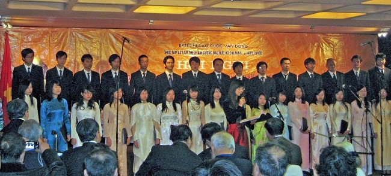
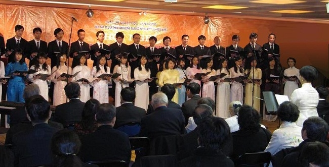
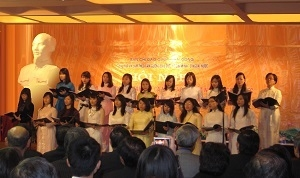
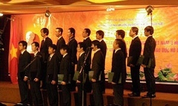
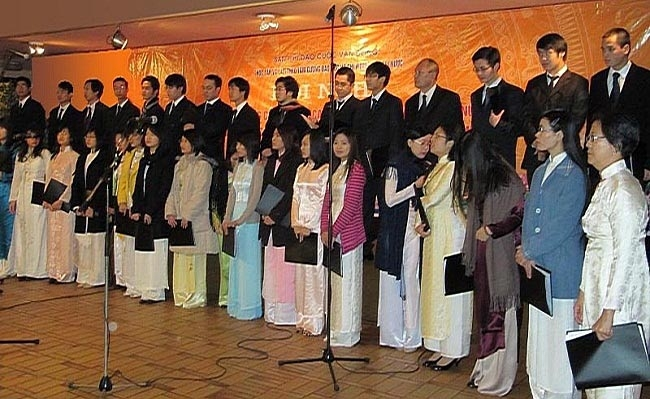

<!--
title: Hội nghị điển hình tiên tiến “Học tập và làm theo tấm gương đạo đức Hồ Chí Minh” tại Pháp 5.12.2009
author: Nguyễn Tích Kỳ
status: completed
-->

 

Hình ảnh HCQH

**NDĐT** - Ngày 20-12- 2009, Hơn 50 đại biểu đến từ hơn 20 quốc gia đến dự cuộc gặp mặt đầy xúc động và ý nghĩa này.
Sau hơn 2 năm thực hiện Chỉ thị 06 của Bộ Chính trị phát động Cuộc vận động “Học tập và làm theo tấm gương đạo đức Hồ Chí Minh”, đến nay Cuộc vận động đã và đang trở thành sinh hoạt chính trị sôi nổi trong toàn xã hội, được mọi tầng lớp nhân dân hưởng ứng, học tập và làm theo. Cuộc vận động cũng thu hút được những tình cảm tốt đẹp của đồng bào ta ở nước ngoài dành cho Chủ tịch Hồ Chí Minh, quy tụ được lòng yêu nước, niềm tự hào dân tộc, tự hào về Bác Hồ, hướng về quê hương đất nước.
Cuộc gặp các điển hình tiên tiến trong Cuộc vận động “Học tập và làm theo tấm gương đạo đức Hồ Chí Minh” tổ chức tại Pháp là dịp biểu dương các đại biểu có thành tích xuất sắc đến từ các nước trên thế giới.
Tại hội nghị, các đại biểu đã thắp hương trước bàn thờ Bác Hồ ở Đại sứ quán Việt Nam ở Pháp, đến đặt hoa tại số 9 ngõ Compoint, nơi Bác Hồ sống và làm việc trong giai đoạn từ 1921-1923 trong hành trình đi tìm đường cứu nước. Đoàn cũng đến đặt hoa trước tượng Bác Hồ và thăm quan Không gian Hồ Chí Minh tại Bảo tàng lịch sử sống ở công viên thành phố Montreuil. Các đại biểu tham gia cắt băng giới thiệu triển lãm ảnh với chủ đề “Bác Hồ với kiều bào” và xem những hiện vật, tư liệu mới phát hiện và công bố về những tình cảm thắm thiết của Chủ tịch Hồ Chí Minh với kiều bào.

 

Các bài phát biểu của các tấm gương điển hình tại Hội nghị khẳng định, học tập và làm theo tấm gương đạo đức Hồ Chí Minh là cách thể hiện thiết thực nhất, cụ thể nhất lời dạy của Bác Hồ là ” suốt đời phụng sự Tổ quốc, phục vụ nhân dân”. Thông qua hội nghị, các đại biểu được hiểu hơn về công lao trời biển của Bác Hồ, càng hiểu và ý thức hơn về trách nhiệm công dân đối với đất nước để góp phần xây dựng đất nước giàu, mạnh như Bác Hồ hằng mong muốn. Sự hội tụ các đại biểu xuất sắc của đồng bào từ mọi nơi trên thế giới tại hội nghị trở thành nguồn động viên, khích lệ những người con của dân tộc Việt Nam đang sinh sống, làm việc tại nước ngoài phát huy mạnh mẽ hơn nữa truyền thống yêu nước, tinh thần đại đoàn kết toàn dân tộc, quyết tâm hành động thiết thực, làm theo tấm gương đạo đức sáng ngời của Bác.

   

Tại hội nghị, các đại biểu được thưởng thức chương trình văn nghệ đặc sắc do ban Hợp Ca Quê Hương trình bày. Những lời ca, tiếng hát ca ngợi Chủ tịch Hồ Chí Minh do các sinh viên, nghiên cứu sinh, nghệ sĩ Việt Nam đang học tập, nghiên cứu và sinh sống tại Pháp.

  

*HUY THẮNG và KHẢI HOÀN*
                                                                                                             
*Phóng viên thường trực báo Nhân Dân tại Paris.*