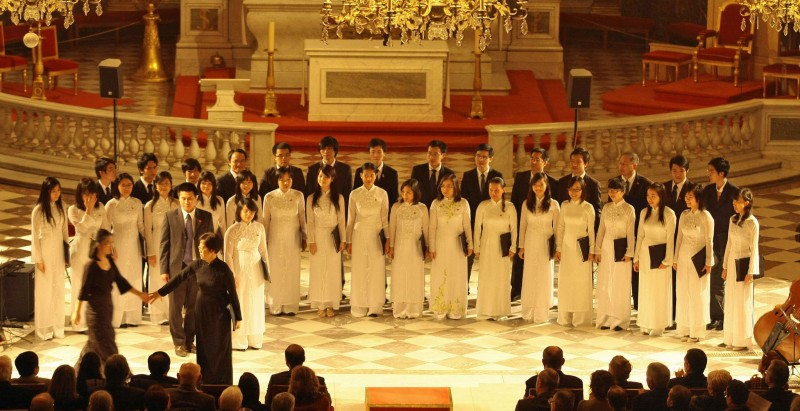
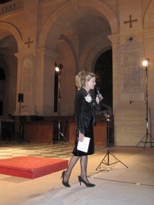
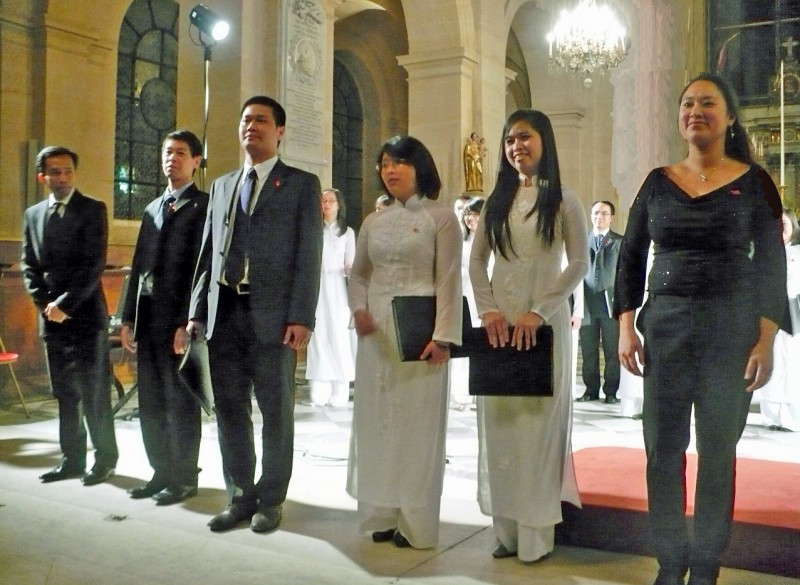
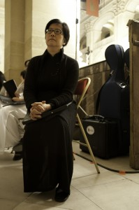
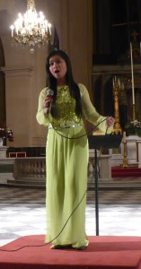
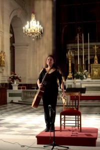

<!--
title: Hợp Ca Quê Hương tại Saint Louis des Invalides
author: Nguyễn Tích Kỳ
status: completed
-->

Các em thân thương,

Tôi tự kiềm chế, không viết ngay cảm nghĩ của mình sau buổi trình diễn tại nhà thờ Saint Louis des Invalides. Vì phải chờ hai sự việc :

1.  Trong bản thông tin thời sự bằng tiếng Pháp của TV4 lúc 21g30 (giờ Paris) BTV Kiều Anh có tường trình sự kiện về Hợp ca Quê Hương tại nhà thờ Saint Louis des Invalides ở Paris ngày 08 /11/ 2010.

 

2.   Chiều hôm nay 10 /11 / 2010 đích thân Bà trách nhiệm của nhà thờ Saint Louis des Invalides đã điện thoại cho Cô. Trước hết, một lần nữa để cảm ơn sự tham gia của Hợp ca Quê Hương và sau đó thông báo là nhà thờ đã nhận được nhiều tiếng vang rất tốt về cuộc trình diễn của Hợp ca Quê Hương.

  

  

Bây giờ chú có thể yên tâm viết cảm xúc.

Chú xin trân trọng  chia xẻ thành công buổi trình diễn của Hợp ca Quê Hương tại nhà thờ Saint Louis des Invalides, với các em H.Phương / M.Hương / M.Phượng / Trọng Dũng / Mạnh Tân / Hà Diệp / Thu Hiền / Hiền Lương / Thanh Hiền.  Tuy ở khắp 4 phương trời, lòng các em vẫn đau đáu nhịp theo từng bước của Hợp ca Quê Hương. Điều này,  làm chú xúc động vô chừng, nó biểu hiện sự đoàn kết, thương yêu, đùm bọc.

Chú không quên những em,  H.Đăng / P. Hiệp / V.Long – Thúy / T.Anh / M.Thu bé / N.Lâm / V.Anh/ H.Hậu / Q.Hiển / D.Hưng / T.Hùng / T.Mỹ / H.Thu / Q.Việt / T.Huyền / T.Cảnh / P.Hùng / M.Chính / N.Lân / Đ.Mai / T.Nhung  ngày đêm sát cánh bên Cô chú chắt chiu từng chi tiết, đảm nhận bất kì công việc cho buổi trình diễn này thành công. Những em H. Nam / Q.Tùng tuy mới là lần đầu cũng không ngần ngại lao vào khuân vác âm thanh ánh sáng, ghi hình ảnh, cả em L.Tuyết và em Q.Nga vô hình chung cũng đã trở thành nhiếp ảnh. Chú cảm động vô cùng, khi đọc trên nét mặt mỗi em nét âu lo của giây phút trước khi xuất trận. Chú cảm nhận thấy trên từng nét mặt, phảng phất niềm quyết tâm.

Nhìn mỗi em, chú thầm áy náy « Các em ngoan thế, tại sao đôi khi mình lại trách mắng chúng, thật là nóng tính qúa ».  

Em T.Tâm sau màn trình diễn solo, đã tất tưởi thay đồng phục trắng, khiêm tốn hòa mình vào dàn hợp ca. Hai em H. Châu và V.Ngọc tuy đã thấm cái từng trải của pianistes chuyên nghiệp,  nhưng vẫn bị không khí hừng hực của Hợp ca Quê Hương níu kéo.

Còn các em như Q.Nga suốt thời gian hăng say cần cù luyện tập, đến giờ phút chót công việc không cho phép tham gia, cũng tất bật sau giờ công sở, vội vàng « phi đến » chỉ để ủng hộ và chụp ảnh cho đoàn. Còn nhiều em mà chú chưa kịp ghi danh, chú xin lỗi và xin hứa với những em « mới toanh » chưa lên sân khấu. Lần sau các em sẽ góp mặt với đoàn, lần sau đoàn ta sẽ  đầy đủ.

             

Hôm nay Cô Ngân Hà không chảy nước mắt khi giới thiệu bài « Du kích Sông Thao » như ngày nào tại festival Fimu. Cô đã đưa dắt Hợp Ca chúng ta « đi vào baì trường ca » một cách giản dị, chân tình, sống lại những ngày đầu “Du kích Sông Thao” đối diện kẻ thù, rồi cùng “Người Hà Nội” kiên cường và bất khuất đã bước vào cuộc kháng chiến trường kì. Đất nước của chúng ta là thế đấy.

Tự hào về Hợp ca Quê Hương dâng trào trong tôi như bất tận.

Hợp Ca Quê Hương nâng niu và nhẹ nhàng khép lại trang sinh hoạt này và xin hứa trong tương lai sẽ còn cố gắng nhiều hơn nữa.

 *NTK*

*Antony 10/11/2010*
