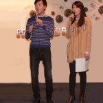
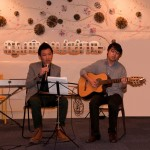

<!--
title: Sinh nhật Hợp Ca Quê Hương 3 tuổi tại Trung Tâm Văn Hóa 21/04/2012
author: Nguyễn Tích Kỳ
status: completed
-->
**Sinh nhật Hợp Ca Quê Hương ba tuổi**

  

    

*Sinh Nhật*  
*Hai từ thật giản dị này đối với HCQH thiêng liêng chi lạ.*  
*Ba năm rồi đấy nhỉ.*

Ba tuổi đời đã đi qua như tia nắng lung linh ”**Trăng chiều**” của **Đặng hữu Phúc/ Phan Đan**, mà chúng ta thường hát.
Chặng đường thời gian, tuy ngắn, nhưng dài gắn bó trong vòng tay ân tình.
Hôm nay, chúng ta đã gạt bỏ sang bên những gập gềnh vướng mắc của công việc, chỉ giữ lại những giây phút kết đoàn của một lộ trình bình dị mà chân thành.
Sự gặp gỡ và quây quần chung quanh một đam mê của những tâm hồn đầy cá tính thật không phải là giản đơn.
Sự chia xẻ một đam mê, cùng chung trong một luồng nhạc Cách Mạng, duy trì tình yêu cháy bỏng đối với Quê Hương,  quên cái  tôi  để tiến đến chúng ta  là cả một qúa trình chung sống, học tập và trau dồi, không phải ai ai cũng thể hiện được.
Xin chân thành ghi nhận sự đóng góp và tinh thần đoàn kết của các em và các bạn.
 
Hôm nay, đóng góp của **Tổ Ẩm thực**, rất ấn tượng: chị Cẩm Khê / Chị Đỗ Hằng / Hồng / Hậu / H.Nhung / C.Trân /  N. Ánh /  P.Hùng / Linh / X.oanh / N.Hà / Hiệp và nhiều em nữa đã góp phần, thể hiện bằng món ăn, hoa quả và thời gian. Hoành tráng qúa, với cái bánh SN to đùng .

  
 
Em Nhung và em Hậu đã thức thâu đêm. “Nâng bát cơm đầy mà lòng càng nhớ câu ân tình” câu hát này rất phù hợp với hoàn cảnh.

          

 **Tổ trang trí** đầy sáng tạo của em N.Ánh và những bàn tay khéo léo của các em Hiền /  Yến / M.Anh / T.Dũng đã nâng chất hoành tráng đến cao độ.

        

**Tổ Âm nhạc** có những tiết mục đơn ca – tốp ca với tiếng đàn của Thế Anh, Minh Anh rất ngọt ngào và sôi động, những sáng tác hài kịch vui, nhộn. Tất cả tham dự cuộc thi “**tài năng trẻ**“. Các em đã sử dụng tiêu đề  “**tài năng trẻ**“ một tiêu đề rất thời trang.
Tôi ngạc nhiên nhưng không ngộ nhận.  Các em chỉ sử dụng tiêu đề này để chứng minh HCQH còn “tồn kho” rất nhiều tài năng trẻ.

  

Minh Anh

  Thanh Dũng & Quốc Việt

  Thế Anh

                

Cuối cùng hai Giải **Quần chúng và  Giám Khảo**, được trao cho tiết mục “**Kén rể**” . Một tác phẩm zí zỏm, thời sự, và cũng là một sáng tạo tập thể của 4 em : H.Nhung / T.Hùng / Sơn và Lâm.

  

**Tổ Âm thanh** thì em Q.Việt đã tháo gỡ cả dàn âm thanh đem từ nhà đến, chăm lo, cân bằng dung lượng cho từng tiết mục.

      

Phải làm sao để có thể chiếu clip từ VN gửi đến. Xúc động quá, có em đã hết học kỳ, tuy đã về VN công tác, vẫn đau đáu hướng về HCQH, chung vui, chia xẻ.

  

Em Thanh Tâm  lĩnh xướng giọng Sop, đang học ở tỉnh xa . Đã tất bật “chạy” về và chỉ có thời gian tạt qua nhà để thay quần áo rồi tất tưởi đến với HCQH, gặp mặt chung vui bằng một bài mà em vừa sáng tác. Gắn bó là thế đấy.

Các em ơi, HCQH sẽ luôn phát huy tình đoàn kết, bồi dưỡng tinh thần “lá lành đùm lá rách” .
Không thể nào không nhắc đến sự có mặt của nghệ sĩ **Lệ Quyên**, nghệ sĩ **Kim Chính**, là những “làn chị” luôn gắn bó và nâng niu HCQH. Cảm ơn Lệ Quyên đã đến với HCQH hôm nay cũng như những SN trước đó . Rất bình dị, mặc dù chị chưa bao giờ “luyện” với cây đàn Minh Anh, nhưng vẫn “xuất trận” chung vui . Chứng minh, chất chuyên nghiệp của Lệ Quyên và Minh Anh ở tột đỉnh cao độ.

  

Và cũng không thể nào không nhắc đến sự có mặt của anh T.Dũng  mới từ VN về đến Paris  đã “vác”  guitare đến chung vui cùng HCQH, hòa đàn với  Q.Việt “một cây guitare nhà ” , và đã đệm cho một ca khúc của các chị từng đứng trong hàng ngũ ban văn nghệ của HNVNTP.

Rất ấn tượng khi anh Jérôme người bạn đời của Đ.Hằng đã trình bày một bài hát việt, tuy anh ta không biết tiếng việt. Có người yêu trong HCQH là thế đấy.

Viết đến đây, tôi không quên những cánh tay của **Tổ sắp xếp-thu dọn** của các em Hưng / H.Vân / Trang, với sự giúp đỡ của một số anh em “qua đường” họ âm thầm sắp xếp, thu dọn chăm lo cho hiện trường được gọn gàng sạch sẽ, khi ta hoàn trả.
Nếu tôi có quên một ai. Thông cảm cho tôi nhé. Hôm nay, những người có cảm tình với HCQH đến dự khá đông.
Rất cảm ơn những em có gánh nặng trách nhiệm tổ chức như T.Hùng và hai em dẫn chương trình Thu bé và Giang. Tôi tự hỏi sau sự việc này các em đã mất bao nhiêu kí-lô và tiếp nhận được bao nhiêu “đụng cham”.

Chú rất hãnh diện được tiếp bước cùng các em trên chặng đường còn lại.
Cảm ơn tất cả các em HCQH, thành công này là một công trình tập thể.

Hôm nay,
Rất cảm kích sự có mặt của ban điều hành HNVNTP, những người bạn đồng hành  thủy chung.
Rất cảm ơn ban lãnh đạo Trung Tâm Văn Hóa VN tại Paris, ân nhân của HCQH từ những ngày đầu.
Rất biết ơn Đại sứ quán VN tại Paris, nơi dung độ hơi ấm từ Quê Mẹ, và cũng là nơi luôn khích lệ từng bước đường của HCQH.

Một lần nữa, thân ái chào tạm biệt và xin hẹn mùa sau.  
*Nguyễn Tích Kỳ*

**Chia xẻ với các em, đây là **mail của Đại sứ Đặc mệnh toàn quyền Dương Chí Dzũng.**  

*Anh Kỳ thân mến*

*Xin cảm ơn anh đã gửi giấy mời dự kỷ niệm Hợp Ca Quê Hương tròn 3 tuổi. Vì điều kiện cong tác nên tôi không dự được. ĐSQ sẽ có hoa và cử đại diện đến vui chung với Anh Chị và Hợp Ca.*

*Xin chân thành chúc Hợp Ca ngày càng lớn mạnh và tiếp tục có những đóng góp tích cực cho phong trào văn nghệ chung của Cộng đồng người Viet Nam ta tại Pháp và châu Âu.*

*Thân ái,*

*Dương Chi Dzũng*  
*Ambassadeur du Viet Nam en France*  
*Tel     : +33 1 44146414*  
*Fax    : +33 1 44967089*

