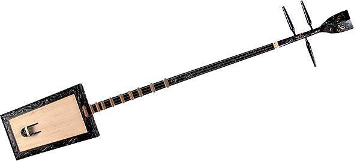
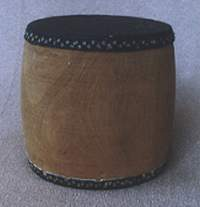
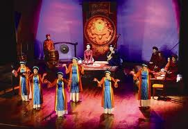

<!--
title: (Français) Ca Trù est une forme de poésie chantée
author: Nguyễn Tích Kỳ
status: completed
-->

  
**Ca Trù**

Le **Ca trù** (歌籌) est une forme de poésie chantée de la [musique vietnamienne](fr.wikipedia.org/wiki/Musique_vietnamienne) pratiquée au nord du pays depuis le XI siècle.

« Le chant Ca trù » a été inscrit en 2009 par l’[UNESCO](https://fr.wikipedia.org/wiki/UNESCO) sur la [liste du patrimoine immatériel nécessitant une sauvegarde urgente](https://fr.wikipedia.org/wiki/Liste_du_patrimoine_immat%C3%A9riel_n%C3%A9cessitant_une_sauvegarde_urgente) car les musiciens de Ca trù sont pour la plupart âgés et leur nombre est en diminution.

**Histoire**

Le Ca trù est officiellement apparu sous la [dynastie Lý](https://fr.wikipedia.org/wiki/Dynastie_L%C3%BD) au [XIe siècle](https://fr.wikipedia.org/wiki/XIe_si%C3%A8cle). Au départ il était appelé Hát Khuôn et était joué lors des rites royaux ou religieux. Plus tard le style s’est répandu dans divers événements comme les banquets ou mariages sous le nom Hát Hàng Ho. Le Ca trù utilisait des [castagnettes](https://fr.wikipedia.org/wiki/Castagnettes) en [bambou](https://fr.wikipedia.org/wiki/Bambou) comme principal instrument et les spectateurs accompagnaient le chanteur avec des [toms](https://fr.wikipedia.org/wiki/Tom_%28musique%29). Ca Trù est aussi nommé Hát Nhà Trò, Hát Thưởng, Hát Cửa Quyền, Hát Cửa Đình ou Hát ả đào.

La pratique du Ca trù a décliné durant l’[Indochine française](https://fr.wikipedia.org/wiki/Indochine_fran%C3%A7aise)[[1]](https://fr.wikipedia.org/wiki/Ca_tr%C3%B9#cite_note-catruthanglong-0) et les [guerre d’Indochine](https://fr.wikipedia.org/wiki/Guerre_d%27Indochine) et guerre du Việt Nam.

Avant [1945](https://fr.wikipedia.org/wiki/1945) il y avait encore de nombreux endroits où le Ca trù était joué mais le Ca Trù est alors devenu le Cô Đầu, joué par une seule femme, similaire à une [geisha](https://fr.wikipedia.org/wiki/Geisha). Il a alors été combattu car considéré comme un symbole de la classe dirigeante.

**Description**

Les groupes de Ca trù sont composés de trois personnes, une chanteuse et deux instrumentistes. La chanteuse utilise des techniques respiratoires et le [vibrato](https://fr.wikipedia.org/wiki/Vibrato) pour produire des ornementations sonores uniques tout en jouant du phách, un morceau de bambou frappée avec deux morceaux de bois.

De nombreux textes de Ca trù ont été produits par les poètes [Chu Mạnh Trinh](https://fr.wikipedia.org/w/index.php?title=Chu_M%E1%BA%A1nh_Trinh&action=edit&redlink=1), [Nguyễn Công Trứ](https://fr.wikipedia.org/wiki/Nguy%E1%BB%85n_C%C3%B4ng_Tr%E1%BB%A9), [Tú Xương](https://fr.wikipedia.org/w/index.php?title=T%C3%BA_X%C6%B0%C6%A1ng&action=edit&redlink=1), [Dương Khuê](https://fr.wikipedia.org/w/index.php?title=D%C6%B0%C6%A1ng_Khu%C3%AA&action=edit&redlink=1) et [Tản Đà](https://vi.wikipedia.org/wiki/T%E1%BA%A3n_%C4%90%C3%A0).

  
Deux instrumentistes accompagnent la chanteuse de la sonorité profonde du [Đàn đáy](https://fr.wikipedia.org/w/index.php?title=%C4%90%C3%A0n_%C4%91%C3%A1y&action=edit&redlink=1) , un [luth](https://fr.wikipedia.org/wiki/Luth) à trois cordes,

  
et du rythme énergique d’un trống chầu, un tambour d’éloge.

  
Certaines représentations de Ca trù comprennent également de la danse.

*Un article de wikipedia. L’encyclopédie libre*  
*Photos internet*

