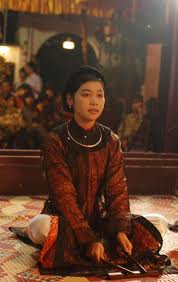
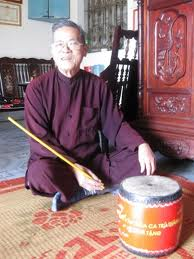

<!--
title: Hát Ca Trù
author:  Nguyễn Tích Kỳ
status: completed
-->

Một buổi vinh danh ca trù Hát ca trù hay hát ả đào là một bộ môn nghệ thuật truyền thống ở phía Bắc Việt Nam kết hợp hát cùng một số nhạc cụ dân tộc. Ca trù thịnh hành từ thế kỷ 15, từng là một loại ca trong cung đình và được giới quý tộc và trí thức yêu thích. Ca trù là một sự phối hợp nhuần nhuyễn và đỉnh cao giữa thi ca và âm nhạc.

 Ngày 1 tháng 10 năm 2009, tại kỳ họp lần thứ 4 của Ủy ban liên chính phủ Công ước UNESCO Bảo vệ di sản văn hóa phi vật thể (từ ngày 28 tháng 9 tới ngày 2 tháng 10 năm 2009), ca trù đã được công nhận là di sản phi vật thể cần bảo vệ khẩn cấp. Đây là di sản văn hóa thế giới có vùng ảnh hưởng lớn nhất Việt Nam, có phạm vi tới 15 tỉnh, thành phố phía Bắc. Hồ sơ đề cử Ca trù là di sản văn hóa thế giới với không gian văn hóa Ca trù trải dài khắp 15 tỉnh phía Bắc gồm: Phú Thọ, Vĩnh Phúc, Hà Nội, Bắc Giang, Bắc Ninh, Hải Phòng, Hải Dương, Hưng Yên, Hà Nam, Nam Định, Ninh Bình, Thanh Hóa, Nghệ An, Hà Tĩnh và Quảng Bình.

Nguồn gốc Các chuyên gia nghiên cứu đến nay, đa số đã đồng ý cho rằng Ca trù dưới hình thức ngày nay đã bắt đầu có từ thời nhà Lê (thế kỷ XV) sau khi cây đàn đáy do Đinh Lễ (hay Đinh Dự theo một số Giáo phường) sáng chế ra. Hát nói xuất hiện sớm nhưng phải đợi đến đầu thế kỷ thứ 19 mới có những tác phẩm lưu truyền đến nay như các tác phẩm của Nguyễn Công Trứ, Cao Bá Quát … Nguồn gốc của thể Hát nói trong văn chương Việt Nam được giải thích bằng những nguyên nhân và các sự việc sau đây :

1. Hát nói là sự phàm tục hoá những thể thánh ca. Trước khi có Hát nói, ở Việt Nam đã có những bài hát xoan, hát cửa đền, cửa chùa, những bài thét nhạc. Những thể ca trong các dịp tế lễ đó chuyển dần công dụng và được các tao nhân, mặc khách tổ chức ngay trong những cuộc giải trí riêng của họ . Các bài hát ả đào bắt đầu từ đó.

2. Hát nói là sự cụ thể hoá ảnh hưởng của tư tưởng Lão-Trang. Xưa kia văn chương Việt Nam về nội dung phải gò bó trong những tư tưởng Khổng Mạnh, về hình thức phải đem theo những qui luật khắt khe, những lối diễn tả nhất định. Cuối thế kỷ thứ 18, do hoàn cảnh rối ren trong xã hội, tư tưởng Lão-Trang có cơ hội bành trướng và hát nói chính là sáng tạo của các nhà nho phóng khoáng, thích tự do, ở đấy họ có thể gửi gấm những tư tưởng, cảm xúc vượt ra ngoài khuôn phép với cách diễn đạt cởi mở, rộng rãi hơn.

3. Hát nói là biến thể của song thất lục bát. Các nhà viết sách thời xưa cho rằng Hát nói là một hình thức biến đổi của thể ngâm Song thất lục bát: Trong hát nói có Mưỡu là những câu thơ lục bát, nhiều câu 7 chữ có vần bằng, vần trắc, có cước vận, yêu vận . Nhưng khi đã phát triển, Hát nói là một thể tài hỗn hợp gồm: thơ, phú, lục bát, song thất, tứ tự, nói lối … # # # Trong lối Hát ả đào có nhiều loại như: Dâng hương, Giáo trống, Gủi thư, Thét nhạc thì Hát nói là lối thông dụng và có tính văn chương lý thú nhất. Thành phần trình diễn Biểu diễn trong không gian truyền thống Một chầu hát cần có ba thành phần chính:

  
3-1. Một nữ ca sĩ (gọi là “đào” hay “ca nương”) sử dụng bộ phách gõ lấy nhịp,

   
3-2. Một nhạc công nam giới (gọi là “kép”) chơi đàn đáy phụ họa theo tiếng hát

  
3-3. Người thưởng ngoạn (gọi là “quan viên”, thường là tác giả bài hát) đánh trống chầu chấm câu và biểu lộ chỗ đắc ý bằng tiếng trống.

Vì là nghệ thuật âm nhạc thính phòng, không gian trình diễn ca trù có phạm vi tương đối nhỏ. Đào hát ngồi trên chiếu ở giữa. Kép và quan viên ngồi chếch sang hai bên. Khi bài hát được sáng tác và trình diễn ngay tại chỗ thì gọi là “tức tịch,” nghĩa là “ngay ở chiếu.” Âm nhạc Ca trù vừa là một loại thanh nhạc (vocal music), vừa là một loại khí nhạc (instrumental music). Có một ngôn ngữ âm nhạc tế nhị, tinh vi.

• Thanh nhạc : Ca nương phải có một giọng thanh – cao – vang, khi hát phải biết ém hơi, nhả chữ và hát tròn vành rõ chữ, biết nảy hạt (đổ hột), đổ con kiến. Ca nương vừa hát, vừa gõ phách. Phải biết rành 5 khổ phách cơ bản, đánh lưu không, tiếng phách phải chắc và giòn, lời ca và tiếng phách phải ăn khớp với nhau.

• Khí nhạc : Kép đàn dùng đàn đáy phụ họa. Bản đàn không nhất thiết phải đi theo bài hát, vì phải theo khổ đàn, nhưng khổ đàn – khổ phách – tiếng ca hợp nhau, hài hòa nhuần nhuyễn. Có những cách đàn ca chân phương- theo lề lối hay hàng hoa- sáng tạo và bay bướm.

• Quan viên là người cầm chầu, tiếng trống chầu vừa chấm câu khi tham gia vào cuộc diễn tấu, nhưng có tính chất phê phán, khen chê đúng chỗ, để khích lệ ca nương – kép đàn, giúp cho thính giả biết được đoạn nào hay – thật hay và như thế được giáo dục âm nhạc trong cách nghe. Một số tác phẩm nổi tiếng Bài bản ca trù có nhiều loại. Phổ thông nhất là hát nói, một thể văn vần có tính cách văn học cao.

Những bài hát nói nổi tiếng phải kể đến :

• Cao Bá Quát với “Tự tình”, “Hơn nhau một chữ thì”, “Phận hồng nhan có mong manh”, “Nhân sinh thấm thoắt”…

• Nguyễn Công Trứ với “Ngày tháng thanh nhàn”, “Kiếp nhân sinh”, “Chơi xuân kẻo hết xuân đi”, “Trần ai ai dễ biết ai”…

• Dương Khuê với “Hồng hồng, tuyết tuyết” tức “Gặp đào Hồng đào Tuyết”. • Chu Mạnh Trinh với Hương Sơn phong cảnh.

• Tản Đà với “Gặp xuân”,“Xuân tình”, “Chưa say”

• Nguyễn Khuyến với “Hỏi phỗng đá”, “Duyên nợ”

• Nguyễn Thượng Hiền với “Chơi chùa Thày”;

• Trần Tế Xương với “Hát cô đầu” …

Ngoài ra còn có những làn điệu cổ điển khác như “Tỳ bà hành” (bản diễn Nôm của Phan Huy Vịnh theo cổ bản của Bạch Cư Dị). Những điệu huê tình, gửi thư, bắc phản, hát giai… cũng thuộc thể ca trù. Ca trù ngày nay Nghệ thuật ca trù được khai thác trong nhiều bộ phim cũng như trong các chủ đề âm nhạc Việt Nam. Có thể bắt gặp ca trù trong phim Mê Thảo thời vang bóng hay trong bài hát “Một nét ca trù ngày xuân” của nhạc sĩ Nguyễn Cường…

Theo thống kê của các nhà nghiên cứu, năm 2010 có 63 câu lạc bộ ở 15 tỉnh, thành phố trên cả Việt Nam có hoạt động thường xuyên và có kế hoạch luyện tập truyền nghề ca trù. Một số tỉnh thành phía Bắc, điển hình là các tỉnh có nhiều câu lạc bộ ca trù như:

• Hà Nội: Câu lạc bộ Ca trù Lỗ Khê, CLB Ca trù Thăng Long, CLB Ca trù thôn Chanh (Phú Xuyên), CLB Ca trù Hà Nội.

• Ninh Bình: Câu lạc bộ Ca trù đền thờ Nguyễn Công Trứ, CLB Ca trù Cố Viên Lầu

• Hà Tĩnh: Câu lạc bộ Ca trù Nguyễn Công Trứ, CLB Ca trù Cổ Đạm

***Ca Trù Bách khoa toàn thư mở wikipedia.***   
***hình ảnh từ internet***

