<!--
title: Hợp tác với UNESCO Kỹ niệm Đại Lễ 1000 năm Thăng-Hà Nội Tháng 11 năm 2010
author: Nguyễn Tích Kỳ
status: completed
-->
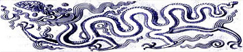 

***Hợp tác với  UNESCO  Kỹ niệm Đại Lễ 1000 năm Thăng Long - Hà Nội*** 

                                   
*Cũng vào thời điểm này, ngày Chủ nhật 01/08/2010 vào lúc  08:21:56 AM.  Việt Nam đã tổ chức cầu truyền hình Hà Nội - Viêng Chăn – Paris/Unesco : ” Hướng về 1000 năm Thăng Long - Hà Nội  hòa điệu văn hóa, khát vọng Hòa Bình”*
 
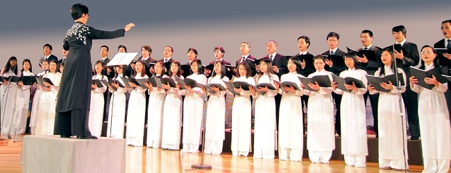  
*Tại điểm cầu Paris, dàn Hợp ca Quê Hương thể hiện tác phẩm “Người Hà Nội”
của Nguyễn Đình Thi. Chỉ huy: nhạc sỹ Nguyễn Thiện Đạo.*

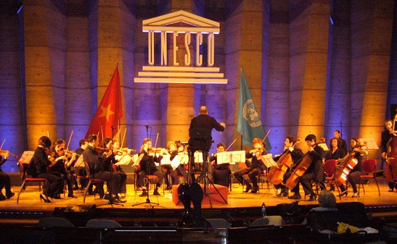 
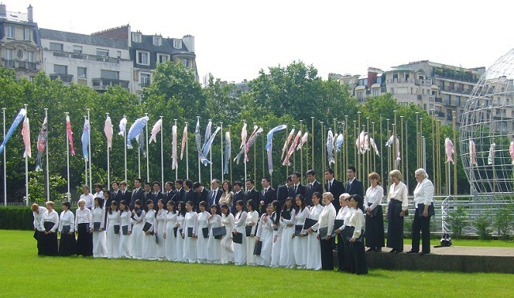 
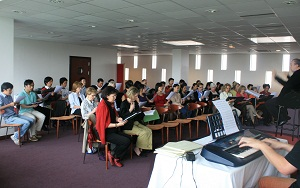 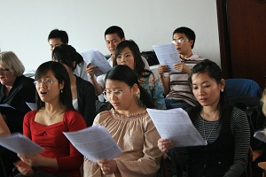 
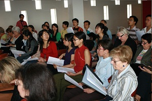 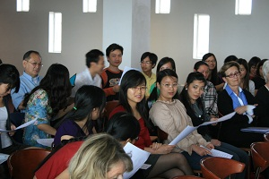 
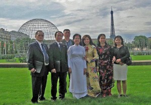 
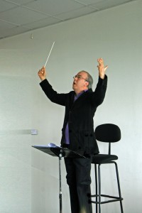 
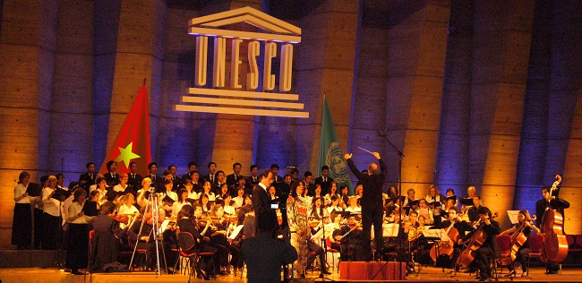 

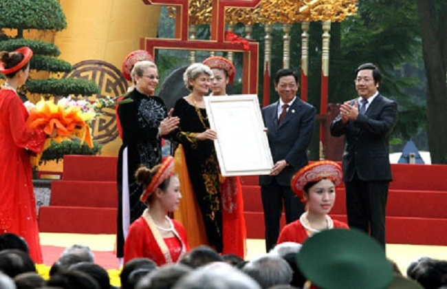 

*Khai mạc ngày Đại lễ Thăng Long – Hà Nội Bà Bukova trao bằng tại Hà Nội…*

 Trích đoạn bài phỏng vấn chị Nguyễn Ngân Hà về sự hợp tác giữa Hợp Ca Quê Hương với Dàn nhạc Giao Hưởng và dàn Hợp xướng của UNESCO cho Đại Lễ 1000 năm Thăng Long-Hà Nội.
Huy Thắng - Chị đã làm thế nào để thuyết phục ông nhạc trưởng của dàn Hợp xướng và dàn nhạc giao hưởng UNESCO cũng như các thành viên tham gia vào buổi hoà nhạc mừng thủ đô ngàn tuổi ?

Ngân Hà – Là một thành viên lâu năm của dàn Hợp xướng của UNESCO, tôi biết rằng phương châm hoạt động của dàn Hợp xướng này là nhằm hướng đến sự giao lưu giữa các nền âm nhạc, dùng âm nhạc làm cầu nối bạn bè. Khi được biết Đại hội đồng UNESCO sẽ thông qua nghị quyết cùng phối hợp kỷ niệm với Việt Nam Đại lễ 1.000 năm Thăng Long – Hà Nội, vào năm 2010. Tôi và một và một người bạn đồng nghiệp đã nghĩ ngay đến kế hoạch kết hợp Hợp ca Quê Hương với dàn hợp xướng của UNESCO để cùng trình diễn tác phẩm Người Hà Nội. Cả hai chúng tôi muốn, nhân danh là người Việt, cán bộ làm việc tại UNESCO và sống trên đất Pháp, đóng góp một phần nhỏ bé của mình vào lễ hội này. Nhân tố quan trọng này khiến chúng tôi quyết tâm thuyết phục ngài nhạc trưởng Jorge Lozano-Corres (người Mê hi cô), các thành viên dàn hợp xướng của UNESCO, các thành viên của HCQH nhu cầu cần luyện tập bài Người Hà Nội. Và cũng đồng thời có sự động viên khuyến khích của lãnh đạo UBND Thành phố Hà Nội. Thành thật mà nói, sự kết hợp này là một ví dụ điển hình cho sự hoà nhập của cộng đồng người Việt ở nước ngoài. Từ trước đến nay, chưa từng có một sự kiện âm nhạc Việt nam nào mà lại có sự tham gia của đông đảo của bạn bè quốc tế đến vậy. Đây cũng có lẽ lần đầu tiên một bài hát về Hà Nội được nhiều người không phải người Việt nam hát đến vậy. Thành công của phương thức hợp tác mới mẻ này khiến tôi và các thành viên Hợp ca Quê Hương rất phấn khích. Hơn nữa, chương trình này lại càng có ý nghĩa khi Hoàng thành Thăng Long được UNESCO chính thức công nhận là di sản thế giới và bài trường ca Người Hà nội đang được phát sóng nhiều lần trên đài truyền hình VTV4 Việt nam.

Huy Thắng đại diện thường trực Báo Nhân dân tại Paris  .
Hôm nay, là ngày đầu tiên hợp tác và tập với nhạc trưởng Jorjé của UNESCO. (Cô đang viết một thư cảm ơn sự nhiệt tình của anh Jorjé đối với HCQH)
Anh Jorjé là người rất vui tính, nhạy cảm, và kiến thức của anh đối với VN rất sâu đậm, anh nắm rất vững tinh thần của bài Người Hà Nội mặc dù anh không biết nói một tiếng Việt nào.
Tài năng và sự nhạy cảm của anh đã thuyết phục Cô chú. Anh rất xứng đáng cho sự hợp tác nghệ thuật  giữa dàn Hợp xướng UNESCO và HCQH của chúng ta. Khởi điểm này rất quan trọng đáng đáng ghi nhớ. Chú hy vọng sẽ được tiếp nối trong tương lai.
Về phần chúng ta, chú nghĩ rằng. Đây là một cơ hội hiếm có, tuy quá trình HCQH còn trẻ, mà chúng ta đang đặt chân lên sân chơi quốc tế.
Một nhận định không kém phần quan trọng HCQH đã và đang « tỏa ra ngoài ».
Do vậy, lần luyện tập đầu tiên này rất quan trọng và mỗi chúng ta có trách nhiệm để lại cho bạn một ấn tượng tốt. Chú rất hiểu những chuyện có thể xẩy ra : bận thi, đau ốm hoặc vướng mắc chuyện riêng tư bất khả kháng, nhưng phải thông báo kịp thời.
 
Sáng hôm nay, buổi tập đầu tiên cùng với dàn Hợp xướng UNESCO. Chú rất ngạc nhiên và xúc động về sự có mặt của những người không phải là thành viên của ban hợp ca, Anh Chị Kim Chi là những người bạn biết đặt chữ TÂM lên trên công việc.
Chú muốn nhấn mạnh sự tương thân tương trợ, đoàn kết và luôn phải củng cố cho HCQH ngày càng vững mạnh trên những chặng đường sắp đến.
 
Nếu trong công việc chú có đụng chạm tự ái của một ai, thì xin hãy đưa vấn đề này lên địa bàn « người ta làm được, thì mình cũng làm được và cố gắng thì sẽ tốt hơn ».
Vả lại Ông Cha đã nói « Tiên trách kỷ, hậu trách nhân » là thế đó.

*Chú TK*

 
