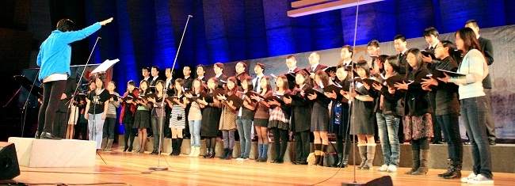
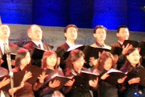
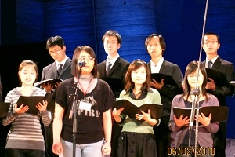
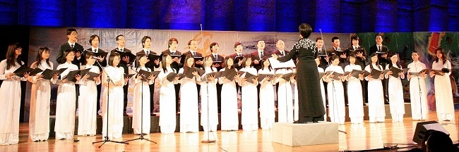
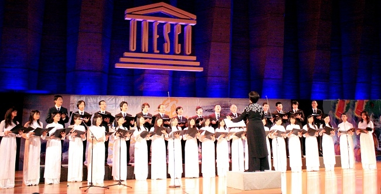

<!--
title:Tết Canh Dần lần hợp tác đầu tiên của HCQH và HNVNTP tại UNESCO 06.02.2010
author: Nguyễn Tích Kỳ
status: completed
-->

Hợp ca Quê hương được thành lập từ tháng 09 năm 2009.
Đây là lần đầu tiên hợp tác Tết với HNVNTP  tại UNESCO 2010
 
Hơn 2000 người đón Xuân canh Dân trong không khí mang đậm chất Thăng Long- Hà Nội tại Pháp.
Vẫn bánh chưng xanh, câu đối đỏ, vẫn cành đào, cành mai ngày Tết, nhưng buổi lễ hội Tết tại Pháp năm nay mang một ý nghĩa đặc biệt hơn, đó là hướng tới kỷ niệm 1.000 năm Thăng Long-Hà Nội. Trong khuôn khổ lễ hội mừng Xuân, nhiều hoạt động phong phú đã diễn ra như chúc thọ người già, mừng tuổi trẻ thơ, trò chơi dân gian, biểu diễn võ thuật, giao lưu gặp gỡ với các hội đoàn Việt Nam và Pháp…
 
  
  
  
   
 

Điểm nhấn của đêm hội là chương trình ca múa nhạc, cải lương với chủ đề “Thăng Long-Hồn Việt”. Những tiết mục được dàn dựng công phu và hoành tráng của các nghệ sĩ nghiệp dư đến từ các hội đoàn Việt Nam tại Pháp đã tái hiện chặng đường lịch sử phát triển nghìn năm của thủ đô Hà Nội từ lúc dời đô về Thăng Long cho đến nay. 
 
Lần đâu tiên HCQH ra mắt kiều bào tại quảng trường UNESCO.

“Người Hà Nội” do ban Hợp ca Quê hương trình diễn đã để lại những xúc cảm mạnh mẽ trong lòng bà con Việt kiều, nhất là những người sinh ra, lớn lên và ra đi từ Hà Nội.

***Tham khảo thêm - Les autres articles***

[Tet2016](/#post/2016-02-22%20Tet2016)

[Tet Cong Nhan](/#post/2014-02-26%20Tet%20Cong%20Nhan)

[TET QUY TY UNESCO 2013](/#post/2013-04-18%20TET%20QUY%20TY%20UNESCO%202013) 

[tet nham thin unesco](/#post/2012-01-01%20tet%20nham%20thin%20unesco) 

[Nham Thin Arcueil 2012](/#post/2013-01-01%20Nham%20Thin%20Arcueil%202012)  
 
[Tet Tan Mao Unesco](/#post/2013-11-04%20Tet%20Tan%20Mao%20Unesco)  

[Tet Tan Mao Arcueil](/#post/2013-04-11%20Tet%20Tan%20Mao%20Arcueil)

[tet canh dan 2010](/#post/2012-12-14%20tet%20canh%20dan%202010) 

  

 