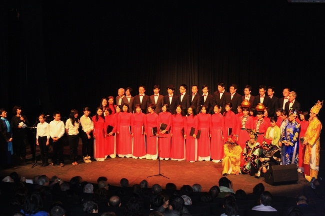
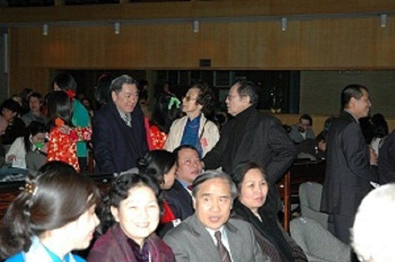
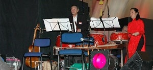
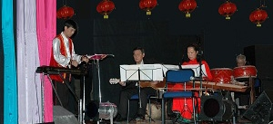
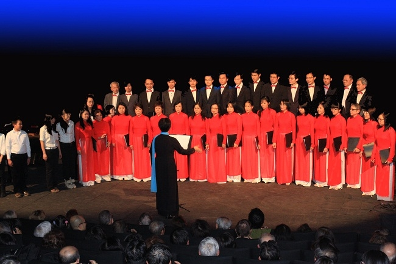
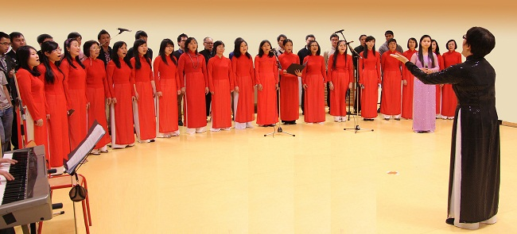
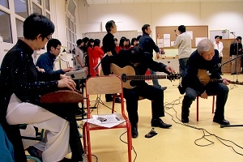
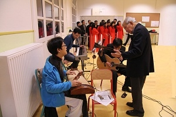
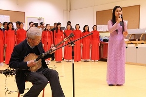
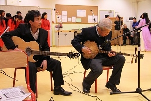

<!--
title: Nhâm Thìn Arcueil 2012
author:  Nguyễn Tích Kỳ
-->

**Mỗi độ xuân về Cộng đồng Việt Nam tại Paris giúp Thị Trấn Arcueil hình thành một Tết Nguyên Đán hoành tráng.**
 
Năm nay có sự tham gia của những đoàn thể :
* HCQH (Hợp Ca Quê Hương)
* HNVNTP (Hội người Việt Nam tại Pháp)
* UJVF (Hội thanh thiếu niên Việt Nam tại Pháp)

 

Vào dịp Tết Nguyên Đán, cộng đồng Việt Nam tại Paris lại có truyền thống hợp tác với “Hội Hữu Nghị Arcueil-Vietnam” nhằm giúp thị trấn bạn xây dựng một chương trình văn nghệ mừng Xuân. Như thông lệ, chương trình có sự hiện diện của Đại Sứ và các cơ quan chính quyền của Thị Trấn.  
  
 

Thị trấn Arcueil-Cachan luôn song hành bên cạnh nhân dân Việt Nam. Họ đã nhiệt liệt ủng hộ Việt Nam trong 2 cuộc chiến : giành Độc lập và Chủ quyền của dân tộc Việt Nam thời thuộc địa; ủng hộ việt Nam chống chiến tranh phi nghĩa của Đế quốc Mỹ.

  
  
   
   

