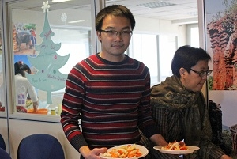

<!--
title: Sinh nhật HCQH 3 tuổi
author:  Nguyễn Tích Kỳ
-->

**Mừng Sinh Nhật Hợp ca Quê Hương 3 tuổi**  
  
ảnh Lâm – Tuyết & H.Đăng
          
Sinh nhật  
Hai từ thật giản dị mà thiêng liêng chi lạ.  
Ba năm đã qua.
Ba tuổi đời trôi như tia nắng lung linh ”Trăng chiều”  của Đặng hữu Phúc/ Phan Đan, mà chúng ta thường hát.  
  
Khoảng thời gian tuy ngắn, nhưng dài vòng tay ân tình và gắn bó.  
Hôm nay, chúng ta hãy gạt sang bên những gập gềnh, chỉ giữ lại trong ta những giây phút kết đoàn của một lộ trình bình dị mà chân thành.  
Từ gặp gỡ, đến duy trì tình yêu cháy bỏng với Quê Hương, cùng chung một đam mê hướng về dòng chảy của nhạc Cách Mạng, quên cái « **tôi** » để hướng về cái « **chúng ta** ». Sự kết đoàn của những tâm hồn đầy cá tính không phải là giản đơn, nó đòi hỏi ở mỗi chúng ta một quá trình chung sống, học tập, luôn phải tự uốn nắn và hòa nhịp với mọi người, không phải ai cũng thể hiện được điều này.  
Viết đến dòng này, tôi liên tưởng đến tinh thần đóng góp, tình đoàn kết của các em và các bạn.  
  
  
Hôm nay chung vui ngày sinh nhật HCQH.  

Chúng ta cảm ơn sự đóng góp của « **Tổ Ẩm thực** », rất chất lượng và ấn tượng : em Cẩm Khê, em Đỗ Hằng, em Hồng, em H.Nhung, em C.Trân, em N. Ánh, em P.Hùng, em Linh, em X.Oanh, em N.Hà, em Hiệp... Mỗi em đã thể hiện một món, đang cùng với nhiều em mới cũ, sắp xếp tại chỗ.  
   
   
   
   
   
   

Hoành tráng qúa, cái bánh Sinh nhật to đùng của Em Nhung và em Hậu đã thức thâu đêm thực hiện đấy.  
  

« **Tổ trang trí** », với sáng tạo của em N.Ánh đã đem lại nhiều nét đặc thù, thêm vào bằng những bàn tay khéo léo của các em Hiền /  Yến / M.Anh / T.Dũng đã nâng chất hoành tráng đến cao độ.

« **Tổ Âm nhạc** » đã đến với những tiết mục : đơn ca, tốp ca, hài kịch vui nhộn, đã hòa chung với tiếng đàn ngọt ngào của Thế Anh & Minh Anh rất bốc lửa trong cuộc thi  “tài năng trẻ”. Một lần nữa các em đã chứng minh HCQH còn “tồn kho” rất nhiều tài năng trẻ.  
  
Vi Hương & Thùy Linh  Kịch : “Chuyện đời thường của các thành viên HCQH”  
  
Đơn ca Trần Hùng “Im lặng đêm Hà Nội”  
  
Đơn ca Tuấn Nam “ Nồng nàn Hà Nội ”  
  
Song ca Hiệp  &  Ngọc Ánh: nhạc kịch “Aimer”  
  
Đơn ca Hải Yến “Thanks for the music”  
  
Song ca Minh Anh & Việt Dũng “Remember When”  
  
Kịch:”Kén rể”Ngọc Lâm, Hồng Nhung, Bùi Sơn, Trần Hùng

Cuối cùng tiết mục “Kén rể” một sáng tạo tập thể rất zí zỏm và thời sự của H.Nhung, T.Hùng, Sơn và Lâm đã đoạt  « Giải Quần chúng » và « Giải ban giám khảo ».  

« **Tổ Âm thanh** » thì em Q.Việt đã không ngần ngại tháo gỡ cả dàn âm thanh đem từ nhà đến, chăm lo, cân bằng dung lượng cho từng tiết mục; và hơn nữa, phải làm sao để có thể chiếu clip từ Việt Nam gửi đến.  
  
   
Xúc động quá, em Trung Mỹ tuy đã về VN công tác nhưng vẫn đau đáu hướng về HCQH, vẫn chung vui và chia sẻ, đã gửi đến ngày SN một vidéo-clip từ VN.  

Em Thanh Tâm lĩnh xướng của HCQH giọng Sop đã từ tỉnh chạy về tham dự, em chỉ có thời gian tạt qua nhà thay quần áo, tất tưởi đến dự sinh nhật chung vui, và giới thiệu một bài mà em vừa sáng tác. Gắn bó là thế đấy.  
  
Không thể nào quên sự có mặt của nghệ sĩ Kim Chính, nghệ sĩ Lệ Quyên, những “làn chị” luôn gắn bó và nâng niu HCQH từ những ngày đầu. Và ở cuối phòng, khiêm tốn phóng viên thường trực Mai Hà của TV4 cũng « phóng » từ Bỉ sang dự.  

Cảm ơn Lệ Quyên đã đến với HCQH, rất bình dị chia sẻ, mặc dù chị chưa bao giờ “luyện” với cây đàn Minh.Anh. Nhưng họ đã chứng minh chất chuyên nghiệp của họ ở đỉnh cao.  
  
Sự có mặt của Thanh Dũng, một « cây văn nghệ » của HNVNTP từ VN mới về đến Paris  đã “vác”  guitare đến chung vui hòa nhịp với “cây guitare HCQH” Quốc Việt, và đã đệm một ca khúc cho các « chị » một thời đứng trong hàng ngũ văn nghệ của HNVNTP.  
   
Rất ấn tượng khi anh Jérôme người bạn đời của Đ.Hằng một thành viên mới của HCQH, anh đã dũng cảm trình bày một bài hát Việt, tuy anh ta không biết tiếng việt… Có người yêu trong HCQH là thế đấy.  
Các em ơi, HCQH sẽ luôn phát huy tình đoàn kết, và luôn củng cố tinh thần “lá lành đùm lá rách”.

Những cánh tay của « **Tổ sắp xếp & thu dọn** » của em Hưng, H.Vân, Trang đã cùng một số anh em âm thầm thu dọn, chăm lo cho hiện trường được tốt đẹp, gọn mắt, sạch sẽ khi hoàn trả TTVH.  
Nếu có quên nhắc đến một ai. Thông cảm nhé.
 
Hôm nay, người có cảm tình với HCQH đến dự đông quá.  
Tôi muốn hỏi, sau sinh nhật này, những em có gánh nặng trách nhiệm chung như T.Hùng và hai em dẫn chương trình Thu bé và H.Giang đã mất bao nhiêu kí-lô và đã đụng cham với những ai nhỉ. Các em yên tâm có hăng say thì mới có đụng chạm.  
Chú rất hãnh diện sẽ tiếp bước cùng các em trên chặng đường còn lại.
 
HCQH rất cảm kích sự có mặt hôm nay :
* Ban điều hành HNVNTP, những người bạn đồng hành thủy chung.
* Ban lãnh đạo Trung Tâm Văn Hóa VN tại Paris, ân nhân của HCQH từ những ngày đầu.
* Đại sứ quán VN tại Paris, nơi dung độ hơi ấm Quê Hương, cũng là nơi luôn khích lệ từng bước đường của HCQH.

Cảm ơn các em, thành công này là một công trình tập thể.
  
Cho phép chú/tôi chia sẻ với các em một vòng tay ân tình và hẹn gặp lại mùa sau.
 
Tích Kỳ
21.04.2012