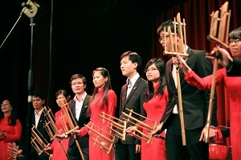

<!--
title: Thị Trấn Gretz-Armainvilliers 23-24/03/2013
author:  Nguyễn Tích Kỳ
-->

*Tuần lễ « **Giao Lưu văn hóa quốc tế** »
tại Thị Trấn Gretz-Armainvilliers.*

  
ảnh H.Đăng

Nhân dịp tuần lễ 23-24/03/2013 với chủ đề « **Ngày Giao Lưu văn hóa quốc tế** » bao gồm **Hội thảo – Triển lãm mỹ nghệ – ca múa – ẩm thực v.v…**, chúng ta vừa kết thúc buổi trình diễn tại Gretz-Armainvilliers, một thị trấn cách Paris khoảng 40km về phía Bắc.

Những quốc gia tham dự gồm có: Thái lan – Campuchia – Mã Lai – Bhutan – và Việt Nam. Hiện diện tại sự kiện có Đại sứ Dương Chí Dũng, nhà sử học Pháp Alain Ruscio và nhà xã hội học Jean de Bannes.  
Về phía văn nghệ, bên cạnh các đại diện quốc tế còn có sự tham gia của các đoàn thể văn nghệ quần chúng Việt Nam như : Việt võ Đạo, Phượng ca nhạc cổ truyền, nhóm múa  « Sông Hồng và Cửu Long » và cuối cùng là **Hợp ca Quê Hương**.  
  
ảnh H.Đăng

Tuy vừa mới trải qua giai đoạn rất bận rộn để chuẩn bị cho chương trình Tết với HNVNTP, HCQH vẫn nhiệt tình nhận lời mời từ phía bạn vì biết rõ khả năng « vượt khó » của tất cả các thành viên « mới và cũ ».  
  
ảnh H.Đăng

Một lần nữa, tinh thần chiến đấu của các thành viên HCQH lại được khẳng định qua việc đã chuẩn bị thành công một chương trình dài 60’ trong khoảng thời gian tương đối ngắn.  
   
ảnh H.Đăng

Sơ lược chương trình, Hợp xướng chúng ta mở màn với « **Ca ngợi Tổ quốc** » của Hồ Bắc, tiếp nối bằng « **Trăng chiều** » của Đặng hữu Phúc.  
  
ảnh H.Đăng

Em Trung Hiếu cống hiến một bài tình ca của đồng bào miền Thượng « **mùa Xuân về trên sông Dakrông** » của Tố Hải.

Tiếp đó là tiết mục tập thể nhạc cụ tre nứa được dàn dựng bởi thành viên trẻ đa tài Minh Anh. Nhạc cụ **Tra n’gô**, thuộc gia đình nhạc gõ của vùng Đông-Nam-Á, đã được giới thiệu qua làn điệu dân ca **Inh lả ơi** và nhạc phẩm Pháp « **Ma Normandie** » của Fédéric Bérat. Tuy là lần đầu tiên xuất hiện tại vùng này nhưng cây đàn **Tra n’gô** đã được khán thính giả say sưa đón nhận trong cả các giai điệu Việt-Pháp.  
    
ảnh H.Đăng

Dàn Hợp xướng tiếp tục với bài « **Tiếng hát Biên thùy** » 4 chương  của Tô Hải bao gồm :
* Chương Một : Núi rừng hùng vĩ của Tổ quốc.
* Chương Hai : Tiếng hát của chiến sĩ biên phòng.
* Chương Ba : Tiếng gọi của Quê Hương.
* Chương bốn : Bảo vệ lao động – kiến thiết Tổ quốc.
 
  
ảnh H.Đăng

Không thể nào quên giới thiệu cây **đàn Bầu** đặc trưng nhạc cụ Việt Nam.  
  
ảnh H.Đăng-Minh Anh trình diễn « **Lên ngàn** » của Hoàng Việt.

Khi dàn Hợp xướng cất tiếng ca bài « **Tổ quốc tươi đẹp** », tràng pháo tay hầu như vô tận. Đây là bài dịch sang tiếng Việt từ vở Opéra nổi tiếng **Nabuco** của Guiseppe Verdi mà toàn dân Ý chiêm ngưỡng như một bài quốc ca thứ hai của nước Ý vậy.     

HCQH kết thúc với bài « **Việt nam quê hương tôi** » của Đỗ Nhuận mà chính con trai của ông là Đỗ Hồng Quân  phối nhạc.  
   
ảnh H.Đăng

HCQH đã trọn vẹn với lời hứa, với công việc. Chúng ta có thỏa mãn 100% với những gì đã làm, đã thực hiện ? Chắc chắn  : ta có thể làm tốt hơn và hoàn thiện hơn.
  
ảnh H.Đăng
 
Bạn rất chu đáo đối với chúng ta. Đã trịnh trọng tuyên bố “ Rất hài lòng đã đặt lòng tin vào đúng người, đúng chỗ” 
Từ dịch vụ xe cộ, đến miếng ăn, nước uống, thâm chí bục đứng cho các em nam, bạn rất chu đáo.  
Riêng phần âm thanh, tôi nghĩ chắc chắn là trong tương lai bạn sẽ tạo điều kiện chuẩn mực thật tương xứng với sân khấu và không gian mà bạn đang có. Chúng ta rất thông cảm với những khó khăn và vấp váp của bạn.

Chúc các em một cuối tuần vui vẻ.  
TK  
24.03.2013