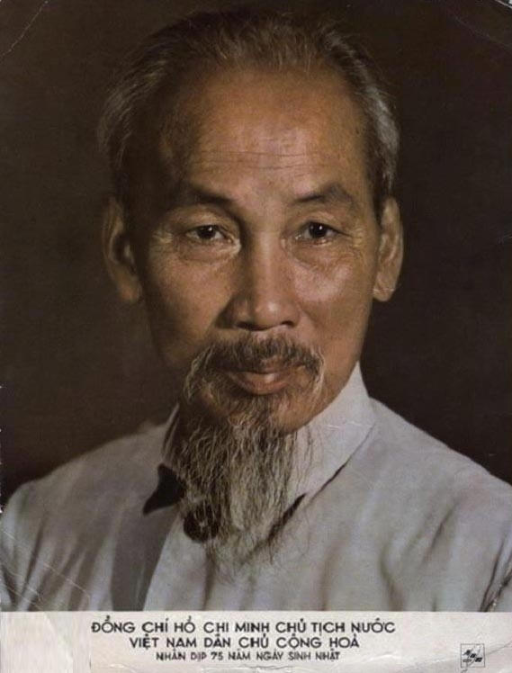
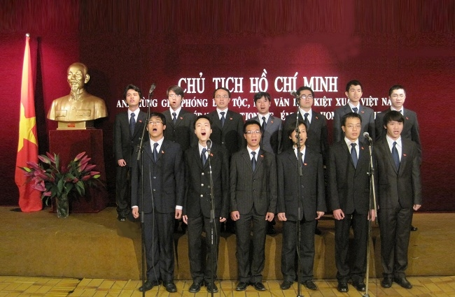
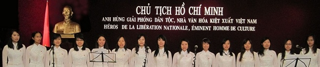
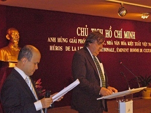
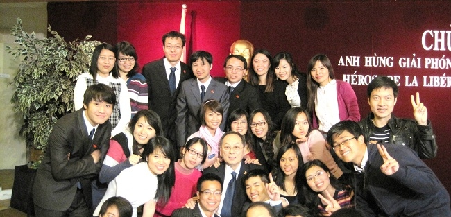
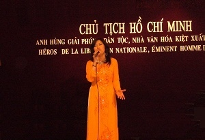
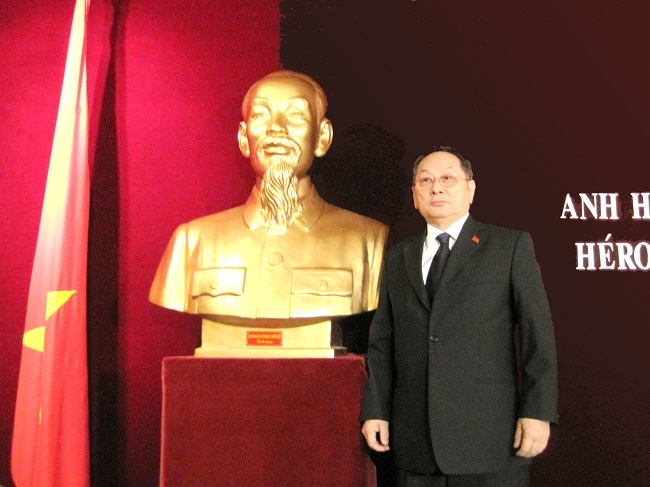

<!--
title: Chào mừng sinh nhật Bác kính yêu 19.05.1890 / 02.12.1969  
tại Đại Sứ quán việt Nam tại Paris 27.04.2010

author: Nguyễn Tích Kỳ
status: completed
-->
  
                                                   “Dân tộc ta, nhân dân ta, non sông đất nước ta đã sinh ra Bác Hồ kính yêu, người anh hùng giải phóng dân tộc, danh nhân văn hóa kiệt xuất, và chính Người đã làm rạng danh dân tộc ta, nhân dân ta và non sông đất nước ta”. Hơn 40 năm kể từ khi Người đi xa, tư tưởng của Người, tấm gương đạo đức cách mạng của Người vẫn luôn trường tồn trong lòng dân tộc, vẫn luôn sát cánh với mỗi chúng ta trong học tập, trong lao động, trong dựng xây. “Lời Bác là lời Tổ quốc “. “Tình Bác là tình nước non “.

Năm tháng qua đi, “thế giới vẫn luôn hát về Người, Việt Nam vẫn luôn hát về Người” bằng những lời ca hay nhất, bằng những tiếng hát đẹp nhất. Một lần “nghĩ về Bác là một lần lòng ta trong sáng hơn “. Lúc sinh thời, Bác Hồ nói “văn hóa, văn nghệ cũng là một mặt trận, và mỗi nghệ sỹ là một chiến sỹ trên mặt trận ấy “. Bác còn là một nhà thơ lớn, một nhân cách thơ. Người rất yêu thơ và yêu các làn điệu dân ca của dân tộc. Học tập tư tưởng và tấm gương đạo đức của Người, Hợp ca Quê hương – nơi quy tụ những sinh viên, nghiên cứu sinh, công chức quốc tế là người Việt Nam đang sống, học tập và làm việc tại Pháp, có chung niềm say mê với nghệ thuật hát hợp xướng – đã lựa chọn việc dàn dựng và tái hiện trên đất Pháp những tác phẩm kinh điển của nền ca khúc cách mạng Việt Nam và những giai điệu dân ca quen thuộc như một đóng góp nhỏ bé vào việc quảng bá hình ảnh và văn hóa của đất nước với bạn bè Pháp, bạn bè quốc tế, như một cách hướng tình cảm về quê hương đất nước.

Chào mừng sinh nhật lần thứ 120 của Chủ tịch Hồ Chí Minh kính yêu, chúng ta cùng dâng lên Người những lời ca, những bông hoa tươi thắm nhất.

  
Photo H.Đăng  
  
Photo H.Đăng  
  
  
Ông Hans D’Orvile Đại diện UNESCO đọc diễn văn  
  
  
Thanh niên HNVNTP    
  
Ca sĩ Lệ Quyên
  
photo Tuyết