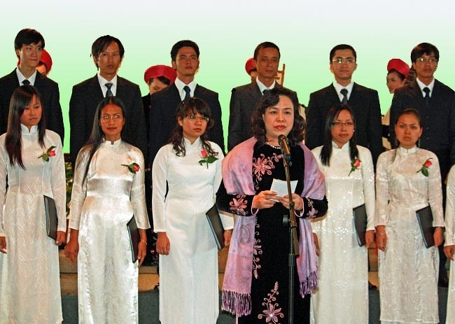
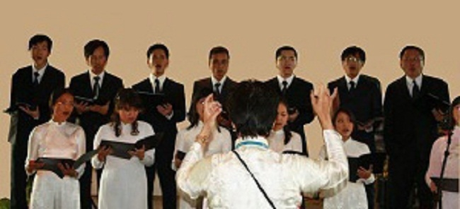
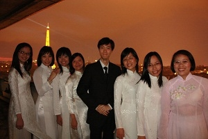
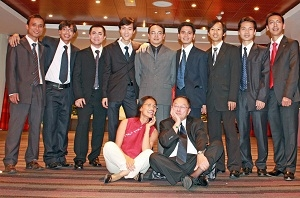
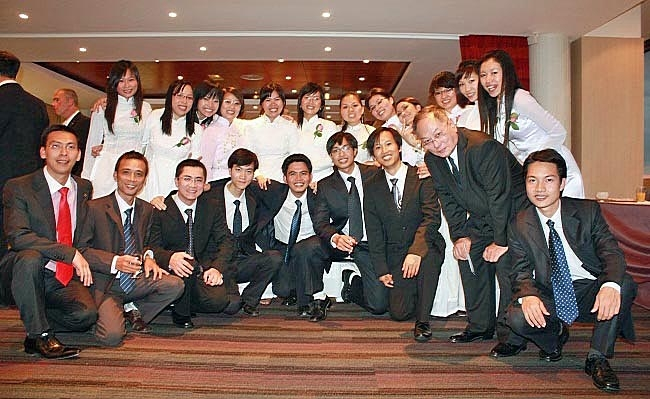

<!--
title: PCT. UBND Tp Hà Nội Bà Ngô Thị Thanh Hằng tai UNESCO 14.09.2009
author: Nguyễn Tích Kỳ
-->

  PCT. UBND Thành phố Hà Nội Bà Ngô Thị Thanh Hằng  
                    và Đs Việt Nam bên cạnh Unesco ông Văn Nghĩa Dũng  
                         kết hợp tổ chức tiệc chiêu đãi tại trụ sở UNESCO  
                                 Kỷ niệm 999 năm Thăng-Long Hà-Nội.  
                                                Thành phố vì hòa bình.  
                      Lần thứ nhất Hợp ca Quê Hương ra mắt tại UNESCO  
                                                         14.09. 2009.  
  
Photo H.Đăng

TTXVN – Tối 14/9/2009  Phó Chủ tịch Ủy ban Nhân dân thành phố Hà Nội Ngô Thị Thanh Hằng và Đại sứ Việt Nam bên cạnh UNESCO Văn Nghĩa Dũng đã tổ chức tiệc chiêu đãi tại trụ sở của Liên hợp quốc (UNESCO) ở thủ đô Paris.

Nhân dịp này, bà Ngô Thị Thanh Hằng nhắc lại sự kiện cách đây 10 năm, Hà Nội được UNESCO trao tặng danh hiệu ” Thành phố vì Hòa bình “, và bày tỏ vui mừng trước việc UNESCO quyết định tham gia kỷ niệm 1.000 năm Thăng Long-Hà Nội, sẽ được tổ chức vào năm 2010.

Phó Chủ tịch thành phố Hà Nội nhấn mạnh: “Nhân dân Việt Nam nói chung và Hà Nội nói riêng luôn tự hào về lịch sử nghìn năm văn hiến, với những nét văn hóa đa dạng và độc đáo – nơi lưu giữ những di tích lịch sử, văn hóa, nghệ thuật vô giá. Trong quá trình phát triển và hội nhập, Hà Nội vẫn giữ những nét thâm nghiêm cổ kính và được tô điểm thêm bởi các công trình hiện đại, là điểm đến an toàn cho đầu tư, du lịch của bạn bè từ khắp năm châu”.
 
  
photo Tuyết

   
Photo H.Đăng

photo Tuyết
