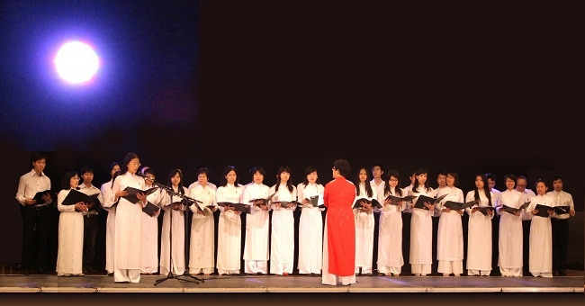
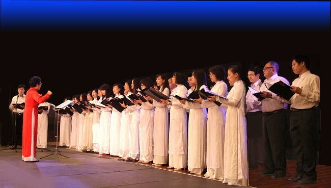
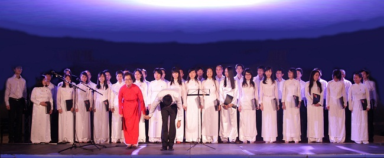

<!--
title: Tuần lễ giao lưu quốc tế tại Creteil 14.11. 2011
author: Nguyễn Tích Kỳ
-->
 
Conseil Général du Val de Marne tổ chức Tuần lễ giao lưu quốc tế 
tại Thị Trấn Creteil 14.11. 2011
 
* **Christian Favier** Sénateur.  Président du Conseil général du Val-de-Marne.  
* **Gilles Saint-Gal** Vice-président en charge de la Jeunesse, du Tourisme et des Loisirs.

Le Bureau du Conseil général ont le plaisir de vous inviter à la soirée d’ouverture de “ Un Notre Monde “
 
le samedi 12 novembre 2011 à l’Hôtel du Département  
21-29, avenue du Général-de-Gaulle  à Créteil

photos: Tuyet