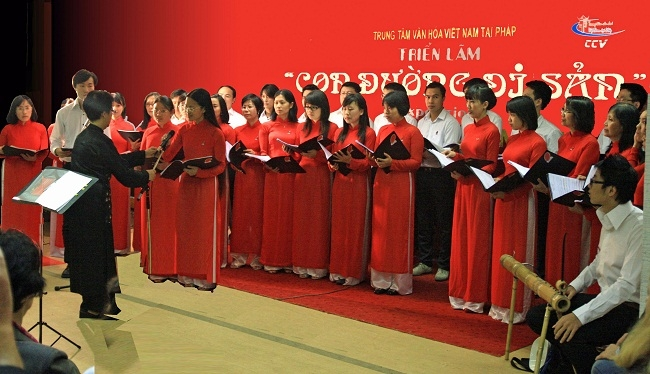
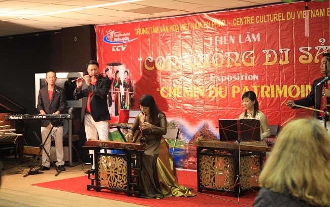
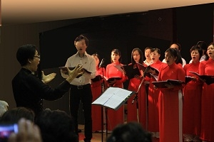
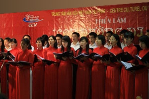

<!--
title: Hội đoàn FICEP & CCV tổ chức tuần lễ văn hóa tại Paris 23.09. 2011
author: Nguyễn Tích Kỳ
status: completed
-->

***Con đường di sản 23.09. 2011***

***Tuần lễ Văn hóa quốc tế do Hội đoàn FICEP*** *(Forum des Instituts Culturels à Paris)*    
***và Trung Tâm Văn Hóa Việt Nam (CCV) tổ chức tại Paris*** 

     
*đoàn văn công đến từ Hà nội*  
 
    
*photo Tuyết*  

Hợp ca Quê Hương được CCV ( Trung Tâm Văn Hóa Việt Nam ) mời mở đầu cho tuần lễ sinh hoạt này. Hôm ấy HCQH sẽ hân hạnh trình diễn trước quan khách ngoại quốc và vị tân Đại sứ Dương Chí Dũng mới nhậm chức,  Đại sứ chưa bao giờ xem HCQH cả.  

Vừa vui mừng vừa lo lắng.

Những ngày hè thư giãn mới chấm dứt… các em đang lần lượt trở vế tổ chức  một năm học mới.   Hợp Ca Quê Hương cũng chuẩn bị bước sang năm  2011 – 2012. 

Năm nay, Hợp ca Quê Hương có thêm những gương mặt mới đầy đam mê và lửa. Với sự việc quan trọng này, toàn bộ HCQH hăng say học bài mới, ôn bài cũ.

Sau một thời gian luyện tập, tôi nhận thấy sự cố gắng của  tất cả các em tiếp tục hướng về con đường chất lượng.

Hợp ca Quê Hương đang bước vào một năm học mới, với một niềm tin vững chắc.

Buổi trình diễn hôm nay, thứ sáu 23.09.2011 đã đưa tôi đi ngược thời gian, trở lại lần trình diễn đầu tiên ngày Kỷ niệm  Quốc Khánh 02.09. 1945  -  02.09.2009  tại Đại sứ quán Việt Nam tại Paris .

Hôm nay, các em cũng đặt hết tâm hồn vào « Trường ca Sông Lô » của Văn Cao hòa cùng tiếng piano trầm bổng của Thế Anh cùng tiếng đàn bầu nhặt khoan của Minh Anh đưa dắt chúng ta trở về với bạt ngàn rừng cọ đồi chè nơi đất Tổ. Và giọng hò của Việt Hà cũng đã phần nào giao kết với bài « Ta đi tới » của nhà thơ Tố Hữu. Đến bài « Du kích sông Thao » của Đỗ Nhuận thì hầu như khán thính giả kể cả những bạn nước ngoài,  chan hòa với nhịp mái chèo của người du kích Sông Thao ngày nào.

Toàn bộ các em Hợp ca Quê Hương đã hát với tấm lòng, với trái tim bỏng cháy.

Cảm ơn chị Ngân Hà đã đưa dắt chúng ta đi vào thế giới âm thanh của đam mê, dĩ nhiên trên con đường nghệ thuật có gì là hoàn thiện 100% đâu. Văn ôn võ luyện vẫn phải luôn là kim chỉ Nam của chúng ta.

Nói vậy không qúa đáng đâu nhé.

Thông thường, tất cả các các dàn Hợp xướng chuyên nghiệp hoặc bán chuyên nghiệp. Nhạc trưởng (chef d’orchestre) và Trưởng hợp ca (chef de chœur), đều là người  bán chuyên nghiệp cả,  họ được đào tạo có sách vở, kể cả những người hát trong ban Hợp xướng, tất cả họ đều có chút ít căn bản về nhạc lí.

Riêng Hợp ca Quê Hương của chúng ta, thì toàn bộ từ Nhạc trưởng (chef d’orchestre) kiêm Trưởng hợp ca (chef de chœur) chỉ là nghiệp dư, động cơ và yếu tố quyết định chỉ là sự đam mê nguồn nhạc kinh điển cách mạng VN .

Chúng ta nên tự hào điểm này.

Để chứng minh. Sau đây là phản ánh của khán thính giả Việt và Pháp ngày hôm ấy .

-   « Nghe mấy người hát, tôi cảm thấy nổi da gà »

-   « Các em hát rất đạt, chỉ tiếc không có điều kiện sân khấu, không có đủ không gian »

Đại sứ Đặc mệnh toàn quyền Dương Chí Dũng và phu nhân nói :

-   « Rất hay và rất ấn tượng. Hy vọng HCQH ngày càng tiến xa và tiếp tục phục vụ cộng đồng »

Anh Giám đốc Trung Tâm Văn Hóa Việt Nam tại Paris :

-   « Thành công lắm, xem mãi không chán, khi chúng ta có một sân khấu tương xứng thì còn hay hơn nữa »

Khán thính giả Pháp nói :

-   « Chúng tôi đã xem và nghe nhiều dàn Hợp xướng chuyên nghiệp. Các bạn rất xứng đáng, không thua kém họ đâu. »

-   « Chúng tôi tuy không hiểu tiếng việt, sự đồng cảm giữa Nhạc trưởng và dàn Hợp xướng đã giúp cho chúng tôi hiểu ý của bài hát. Chúng tôi rất xúc động »

Lướt qua vài nhận xét đó, chúng ta có thể kết luận : buổi trình diễn hôm 23.09.2011  thành công.

Chúng ta có quyền hài lòng. Nhưng, không được tự mãn.

Phải luôn tâm niệm « Trình diễn lần sau, phải hơn lần này. »

(Xin nhắc ngoài lề, buổi trình diễn sắp tới ngày thứ bảy 01.10. 2011 do Ngọc tổ chức cũng tại Trung Tâm văn hóa này, mục đích quyên tiền giúp các em nạn nhân chất độc da cam tại VN. Ngọc có yêu cầu sự hợp tác của Hợp ca Quê Hương. (Ngọc là người đệm đàn piano, đã từng giúp Hợp ca Quê Hương trong giai đoạn khó khăn.)

Tôi hi vọng chúng ta sẽ có mặt đầy đủ.

***Thành viên mới của hôm nay sẽ là thành viên gương mẫu của ngày mai.Thành viên của hôm qua sẽ luôn luôn là hậu phương cột trụ của Hợp ca Quê Hương.Và tất cả chúng ta có sứ mạng xây đắp, bảo vệ, duy trì và giữ lửa cho Hợp ca Quê Hương.***

NTK

Antony 27.09.2011