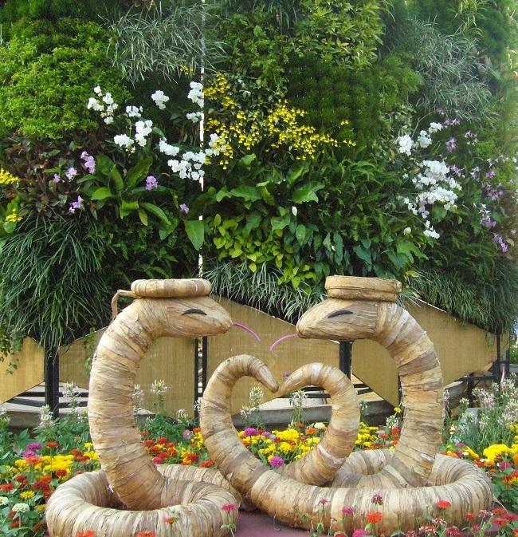
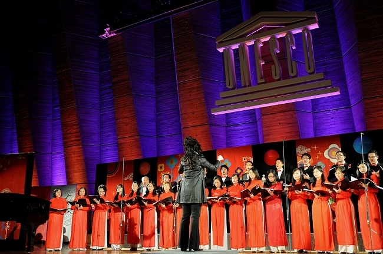
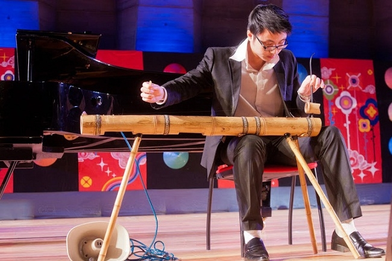

<!--
title: Tết Qúy Tỵ UNESCO 06/02/2013
author: Nguyễn Tích Kỳ
status: completed
-->

  

***Rất tiếc năm nay chúng tôi vì công việc sẽ phải vắng mặt trong dịp đón xuân  Qúy Tỵ cùng với bà con tại Paris.  Nhưng HCQH vẫn có mặt cùng với HNVNTP, mừng đón Xuân với cộng đồng.***  

*Là cơ hội cho HCQH thử nghiệm, sự trưởng thành của các em trên lãnh vực nghệ thuật.*

  
*Photos T.Tâm  Em Thanh Tâm điều khiển. Em tốt nghiệp khoa Thanh nhạc và Lý-Sáng-Chỉ  Nhạc Viện Tp. HCM và em cũng là một trong những người lĩnh xướng của HCQH.*

  

*Hôm nay em Minh Anh biểu diễn đàn bầu. Hiện nay em là một trong những em đàn Piano của HCQH. Minh Anh là một thành viên trẻ của HCQH  Chắc chưa nhiều người chưa biết Minh Anh, em vốn là một thủ khoa đầu vào khoa Lý-Sáng-Chỉ của Học viện Âm nhạc Quốc gia Việt Nam. Em thành thạo và điêu luyện môn piano và ít nhất 4 loại nhạc cụ dân tộc  Minh Anh đã đoạt nhiều huy chương vàng trong nhiều hội diễn văn hóa nghệ thuật của Hà Nội và toàn quốc.*