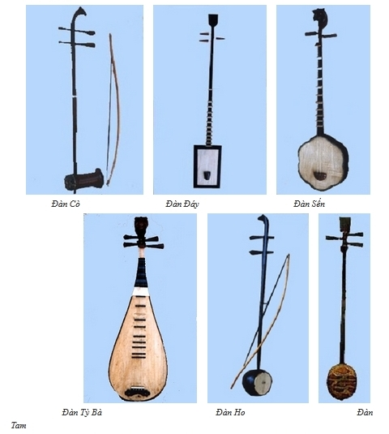
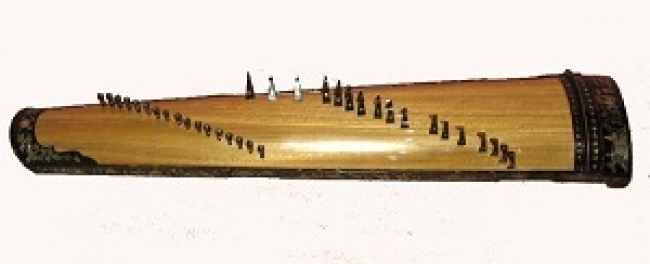
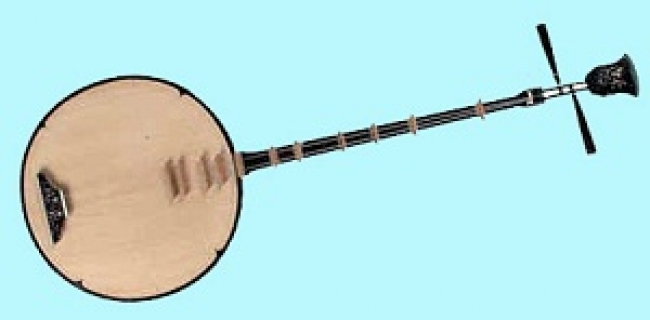
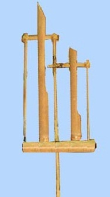
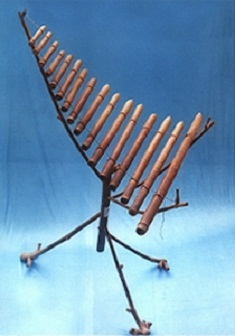
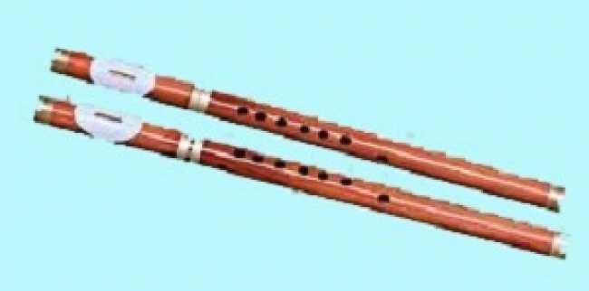
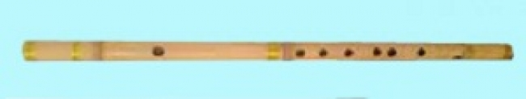
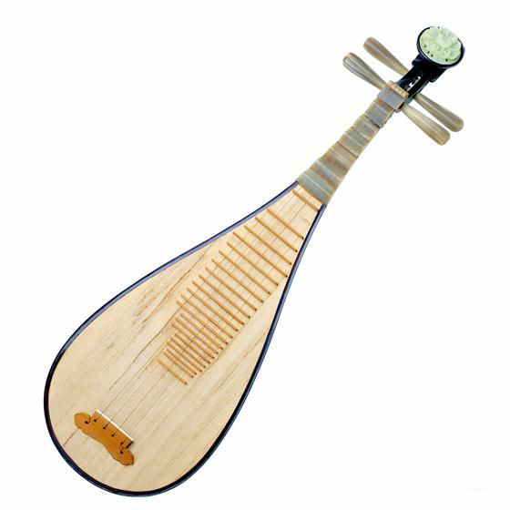
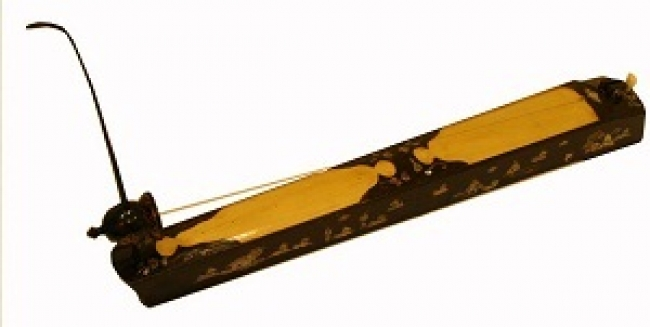

<!--
title: HÃY TẠO ĐIỀU KIỆN CHO CÁC NHẠC KHÍ DÂN TỘC TA ĐƯỢC GIAO LƯU VỚI CÁC NHẠC KHÍ QUỐC TẾ
author: Nguyễn Tích Kỳ
status: completed
-->

***HÃY TẠO ĐIỀU KIỆN CHO CÁC NHẠC KHÍ DÂN TỘC TA ĐƯỢC GIAO LƯU VỚI CÁC NHẠC KHÍ QUỐC TẾ.***

***GS-NSND Quang Hải***

*Nhạc khí dân tộc Việt Nam có một lịch sử hàng ngàn năm, đã trải qua một quá trình cải tiến và hoàn thiện của nhiều thế hệ. Nhờ vậy, nó đã có khả năng biểu hiện vô 

cùng phong phú và đa dạng: vừa thâm thúy, vừa tế nhị và hào hứng. Đây là niềm tự hào của cả dân tộc ta. Ở đó còn chứa đựng biết bao thành quả khoa học trong cấu 

trúc và kỹ thuật biểu hiện, mà nhiều nhạc khí khác trên thế giới chưa làm được. Nhưng trên bình diện quốc tế, nói như vậy chẳng mấy ai tin. Bởi lẽ vai trò và vị trí của 

nhạc khí dân tộc trong âm nhạc cổ truyền xưa và nay chưa thể có được những minh chứng thuyết phục. Trách nhiệm của các nhà khoa học âm nhạc là phải chứng 

minh cho được, và làm được điều đó sẽ rất phù hợp với đường lối hòa nhập quốc tế của Đảng và Nhà nước hiện nay: “Hòa nhập nhưng không hòa tan”. Cách làm tốt 

nhất là tạo điều kiện cho các nhạc khí dân tộc ta giao lưu đối thoại với các nhạc khí tiên tiến trên thế giới. Nghĩa là phải có những tác phẩm cụ thể, tạo điều kiện cho 

nhạc khí dân tộc thi thố. Khi ấy sẽ có những trường hợp “tôi” làm được, còn “anh” thì chịu thua, có những chỗ “tôi” thì liến thoắng, bay nhảy, còn “anh” thì phải thức thủ 

ngồi nghe! Đấy là những suy nghĩ tôi đã ấp ủ nhiều năm qua.*

*Việc nhạc khí dân tộc tham gia vào dàn nhạc giao hưởng đã có những năm cuối thập niên 50 của thế kỷ trước, trong vũ kịch **Tấm Cám** và trong nhiều tác phẩm 

hòa tấu của các cây bút khả kính ở Việt Nam. Nhưng ở đây tôi muốn làm cho vai trò và vị trí của nó sâu đậm hơn, đến mức giao lưu và đối thoại thì việc so sánh, đối 

chiếu mới rõ ràng, cụ thể hơn. Từ năm 1963, khi được Bộ Văn hóa điều động về công tác tại Dàn nhạc Dân tộc Trung ương, tôi đã bắt đầu để tâm tới vấn đề này. Cho 

tới nay, ngoài trên 30 tác phẩm viết cho sân khấu, kịch nói, cải lương, kịch truyền hình, phim và múa, riêng về nhạc dân tộc tôi đã làm được gần 10 tác phẩm.
Trong số những tác phẩm loại này, có 3 tác phẩm được giải thưởng Nhà nước, 2 Huy chương vàng, 2 Huy chương bạc Hội diễn Nghệ thuật toàn quốc. Đặc biệt có một 

tác phẩm được chọn tham dự Đại nhạc hội Quốc tế lần III tại St. Peterburg (1988). Đó là Concerto No.1 Quê tôi giải phóng cho đàn tranh và dàn nhạc giao hưởng.
Từ những tác phẩm trên, tôi đã rút ra được một số nhận xét rằng: nhạc khí dân tộc ta chẳng những lão luyện về các điệu thức dân tộc, mà còn chơi được cả nhạc theo 

hệ thống bình quân luật.*

  
*Đàn Tranh*

*Đàn thập lục (miền Nam gọi là đàn tranh) hoàn toàn bắt chước được kiểu đánh trémolo giai điệu có bát độ như của đàn piano. Ngoài ra, tôi còn phát hiện một hướng 

cải tiến nhạc khí gọi là **“đàn tranh thế hệ mới”**. Chẳng những đổi mới về cấu trúc, mà còn phải đào tạo một thế hệ nhạc công mới chơi loại đàn tranh này. Tôi đã 

hướng dẫn một luận văn cao học về vấn đề này, và đã bảo vệ thành công cách đây vài năm. Nếu cải tiến kiểu đó, ngoài những khả năng giàu có như hiện nay, đàn 

tranh còn có thể vừa đánh vừa đệm, với nhiều nhấn nhá thoải mái. Thêm nữa, nó còn có thể đánh được nhạc phức điệu (một mình đánh nhiều bè khác nhau) không 

kém các nhạc khí phương Tây. Nói một cách nôm na dễ hiểu: phương pháp cải tiến cấu trúc “đàn tranh thế hệ mới” này là đảo ngược thứ tự dây trầm vào bên trong, 

dây cao ra bên ngoài. Đàn tranh hiện tại, đứng về mặt khoa học không phù hợp với điều kiện cơ thể con người, vì ngón cái (to, khỏe, chậm chạp) phải gẩy các dây cao, 

các ngón khác yếu hơn, nhanh nhẹn hơn lại gảy các dây trầm! Khi cần trémolo, hiện nay phải giao cho ngón cái và ngón trỏ thay nhau vừa móc vừa gảy, sẽ không tiện 

bằng giao cho các ngón còn lại luân phiên nhau móc. Một đằng vừa khều vừa móc sẽ không thuận lợi bằng móc liên tục, vì móc liên tục sẽ thuận tiện hơn với điều kiện 

tự nhiên của bàn tay. Hơn nữa, ta lại có thể trémolo một lúc nhiều dây khác nhau. Nhưng “đàn tranh thế hệ mới” này có được thực tiến chấp nhận hay không, còn phải 

thể nghiệm nhiều năm. Nếu bắt đầu từ bây giờ, thì ít nhất 10 năm sau mới có kết quả. Làm công tác nghiên cứu khoa học bao giờ cũng phải kiên trì, tận tụy và chịu khổ 

như vậy thì mới thành công được.*

  
*Đàn Nguyệt*

*Qua hai tác phẩm viết cho đàn nguyệt: **Corcerto Bình minh** và Biến tấu trên chủ đề dân ca quan họ Bắc Ninh **Hoa thơm bướm lượn**, tôi cũng phát hiện thêm 

những khả năng kỳ diệu của nhạc khí dân tộc. Đàn nguyệt chỉ có 2 dây, với trên dưới chục phím mà cũng có thể thao thao bất tuyệt, dám thi thố với dàn nhạc giao 

hưởng thì mới thật là cừ khôi!
Trên dây Hò nhất (hơi Bắc), muốn chuyển sang hơi Oán, người ta chuyển sang Hò tư (cho giọng Nam) hoặc Hò nhì (cho giọng nữ). Nhưng tôi đã chuyển thử sang dây 

Hò năm, thấy cũng quá “ngọt”. Chỉ cần nhấn một vài nốt (nhấn cho gọn), và nếu thiếu một vài nốt khác thì tôi lại tránh không đụng đến chỗ thiếu đó, hoặc nhờ một 

nhạc khí nào đó của dàn nhạc đánh thay… Tóm lại, sở trường ưu việt của đàn nguyệt là những ngón nhấn, nếu không biết tận dụng nó thì thật là uổng. Sở trường này, 

các nhạc khí phương Tây cũng phải chịu thua!*

    
*Chang Ng'ô và  Đàn T'rưng*

*Ngoài ra, tôi còn hai tác phẩm viết cho đàn tr’ưng và dàn nhạc giao hưởng: **Concerto Dốc sương mù** và Biến tấu trên chủ đề dân ca Nam bộ Lý lu là. Từ lâu tôi 

đã có ý định dùng tác phẩm để góp phần đưa đàn tr’ưng vượt khỏi giới hạn Tây Nguyên chật hẹp bao đời, tạo điều kiện cho nó giao lưu rộng rãi trong nước và trên thế 

giới để giới thiệu một điển hình về nền văn minh tre nứa của Việt Nam, mà lâu nay ít ai nói tới. Cái khó nhất của đàn Tr’ưng là xâm nhập vào âm nhạc tài tử Nam bộ, vì 

ở đó có những đặc điểm mà trong nhạc Tài tử gọi là “các loại hơi”: hơi Bắc, hơi Nam xuân, hơi Nam ai, hơi Nam đảo, hơi Oán… (đó là các điệu tính đặc thù của nhạc Tài 

tử).
Thật ra, một số nhạc khí du nhập lâu đời vào dàn nhạc dân tộc ta, nhưng cũng không phải tất cả chơi được hết nhạc Tài tử (ví dụ như tam thập lục). Đàn tr’ưng muốn 

nhập cuộc với nhạc có phong cách tài tử phải thực hiện được hai điều sau đây: một là, làm thêm một số ống cần thiết khác với hệ thống bình quân luật, xếp ở một vị trí 

thuận lợi, để dùng khi cần đến; hai là, phải luyện cho thuần thục một số appoggiatura – vorshlag, nghĩa là các kiểu luyến láy đặc thù để “lừa lỗ tai người nghe”, hoặc đi 

bè khác để tránh những nốt không có, hoặc giao những nốt đó cho nhạc khí trong dàn nhạc làm thay như trên. Ở Concerto Dốc sương mù, tôi đã thí nghiệm cho đàn 

tr’ưng rao được hơi Bắc, hơi Nam xuân, hơi Nam đảo, và sau cùng rao Vọng cổ và vào được Vọng cổ. Thật ra, chuyện này không có gì mới lạ. Trước đó hàng mấy chục 

năm, sáo trúc đã vào được hơi Oán một cách dễ dàng bằng con đường luyến láy, đậy nửa lỗ, 1/3 lỗ… Đàn tr’ưng cũng có hoàn cảnh tương tự, vì thế tôi đã cho đàn 

t’rưng tận dụng kinh nghiệm này của sáo trúc.*

  
*Sáo Mèo*

  
*Sáo Trúc*

*Ở biến tấu ống của NSND Đỗ Lộc với hệ thống bình quân luật hoàn chỉnh (không phải lắp thêm những ống phụ như nói trên). Với hai tác phẩm viết cho đàn tr’ưng và 

dàn nhạc giao hưởng, tôi đã chủ động tạo điều kiện cho hai tay đánh khác nhau (không phải lúc nàocũng giống nhau và cách nhau bát độ như trước đây). Bây giờ, đàn 

tr’ưng có thể đánh một lúc hai bè khác nhau hoàn toàn. Trong Biến tấu trên chủ đề **Lý lu là (2007)** có biến tấu thứ 4 với tiêu đề **Đêm cúng chùa**, tôi muốn 

đưa thính giả đến với một đêm cúng rằm tại một ngôi chùa của quê hương Tiền Giang. Ánh trăng chiếu sáng như gương, thiện nam tín nữ lớp quỳ lớp đứng đông đúc đến 

tận bãi cỏ ngoài sân chùa cùng **“hợp tấu” bài Khai kinh kệ.***

*Ở đây, thay mặt cho các nhà sư và thiện nam tín nữ, dàn nhạc giao hưởng và đàn tr’ưng “tụng” bằng các giai điệu của mình: thoạt đầu họ đi đồng âm, sau đó phát 

triển dần đến phức điệu 4 bè (theo kiểu fugato). Biến tấu này có cấu trúc 3 đoạn. Đoạn A: cả dàn nhạc và đàn tr’ưng “tụng” theo hơi Bắc, đoạn B: khi đã về khuya, họ 

lại “tụng” sang hơi Oán, đoạn A’: bình minh sắp ló dạng chuyển trở lại hơi Bắc với cao trào trong tiếng trống sấm và đại hồng chung để kết thúc biến tấu. Như vậy, tác 

phẩm này đã đẩy kỹ thuật đàn tr’ưng lên ngang tầm với các nhạc khí gõ quốc tế, nhưng âm sắc của nó không lẫn lộn với ai, đó là âm sắc độc đáo của tre nứa Việt 

Nam.*

*Bản song tấu tranh – harpe và dàn nhạc giao hưởng tôi viết tặng ông Robert Morgado – một doanh nhân người Mỹ, một mạnh thường quân của Nhạc viện Thành phố 

Hồ Chí Minh (người đã tặng cây đàn piano Stainway và cây đàn harpe đầu tiên cho Nhạc viện Thành phố Hồ Chí Minh, cùng với hàng chục hòm sách nhạc cổ điển và đĩa 

nhạc). Ông này có cha gốc Tây Ban Nha, mẹ người Hawaii gốc Á Đông, vợ người gốc Nhật. Tôi viết tác phẩm này vào lúc ông phải vượt trùng dương từ New York về 

Hawaii để chịu tang bố (thật ra, ông đi máy bay, nhưng tôi tưởng tượng ông vượt Thái Bình Dương). Bài song tấu gồm 5 biến tấu viết theo chủ đề dân ca Nam bộ Lý 

qua cầu. Biến tấu thứ 5 là cao trào mang tính chất tang lễ. Tranh và harpe thay nhau “làm mưa làm gió” trên đoạn đường trùng dương này. Ở đó có tiếng chuông nhà 

thờ (mang màu sắc châu Âu). Giai điệu Lý qua cầu do tranh và harpe nhỏ dần, gây một cảm xúc xa xôi, như tiến vào cõi hư vô… Glissando của harpe thường theo hệ 

thống diatonique, còn glissando của tranh theo hệ thống ngũ cung. Âm sắc của harpe là dây tơ cộng với dây kim khí, còn âm sắc của tranh là dây kim khí nhưng rất 

mềm mại. Hai kiểu glissando khác nhau làm giàu thêm sự diễn cảm của dàn nhạc giao hưởng.
Qua thể nghiệm gần 10 tác phẩm, với 3 loại nhạc khí dân tộc cùng hòa với dàn nhạc giao hưởng, tôi thấy vô cùng tự hào về thành quả sáng tạo tuyệt vời của ông cha 

ta. Rõ ràng nhạc cụ dân tộc ta nào có thua kém ai! Có chăng cũng chỉ là âm lượng mà thôi. Thật ra, tôi có nhận xét, sở dĩ âm lượng có phần kém hơn do có nhiều nghệ 

sĩ (và kể cả vấn đề đào tạo ở các nhạc viện) ít quan tâm đến vấn đề tận dụng âm lượng của nhạc khí mình. Thêm nữa, với thời đại ngày nay, việc tăng âm cho nó 

không phải là vấn đề khó khăn gì. Thật ra, vấn đề quan trọng còn lại là kỹ thuật phối âm phối khí của tác giả.
Lần đầu tiên đàn tranh tiếp xúc với dàn nhạc Nghệ sĩ công huân tập thể Nga, trong buổi tập đầu tiên chưa có bố trí micro cho đàn tranh, tôi nói nhỏ với giám đốc dàn 

nhạc: “Anh bảo người chỉ huy cho dàn nhạc giảm 1/2 âm lượng: chỗ nào ff thì chơi f thôi, chỗ nào p thì đánh pp…”. Thế là dàn nhạc chỉ đánh một lần trót lọt từ đầu tới 

cuối, và tiếng đàn tranh nghe rõ mồn một. Đánh xong, cả dàn nhạc đều gõ archet và vỗ tay hoan hô. Đến tối biểu diễn thật thì có phóng thanh cho đàn tranh hẳn hoi 

(tôi có bản ghi âm tại chỗ lúc diễn, hiện tôi còn giữ, và sẽ tặng cho thư viện của Hội, nếu ai cần tham khảo có thể nghe được).*

  
*Đàn Tỳ Bà*

  
*Đàn Bầu*

*Vấn đề còn dài lắm, một người không thể hoàn thành hết được, cần nhiều người – đặc biệt là thế hệ trẻ tiếp nối. Tôi muốn nói với các đồng nghiệp, nhất là các bạn trẻ 

rằng: **“Hãy tích cực tạo điều kiện cho các nhạc khí dân tộc giao lưu với quốc tế”**. Đó là một trong nhiều cách làm cho âm nhạc dân tộc phong phú hơn, phù hợp với 

ý nguyện của đa số quần chúng.*
 
***Nguồn: Viện Âm nhạc***  
***GS-NSND Quang Hải***  
***Chủ nhật, 28/11/2010***