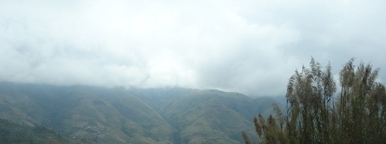

<!--
title: Bản mây
author: Nguyễn Tích Kỳ
-->

Xã Vần chải nằm vào gần giữa con đường trên trăm cây số đi từ Hà Giang lên Đồng Văn. Vần Chải có nghĩa là bản Mây, bản có nhiều mây phủ. Đó là cách gọi theo tiếng Quan hỏa của nhiều  bản vùng biên giới theo đặc điểm của địa phương mình.

Lần nào qua Vần Chải tôi cũng có tâm trạng bâng khuâng. Đây không chỉ là bản ở độ cao dốc dựng trên đường lên Đồng văn, mà còn là nơi sinh thành và cũng là nơi trở về trong lòng đá của anh hùng tiễu phỉ Sùng Dúng Lù, con người mà cái tên lừng danh một thời, bây giờ chỉ còn đọng ở trí nhớ lớp người già, có nhắc lại cũng ít ai biết.

Thuở còn trên ghế nhà trường tôi đã biết đến ông qua trang sách với hành động anh hùng, một mình đi vào hang núi gặp trùm phỉ Vàng Vạn Ly để nói cái lí  đúng, gọi Vàng Vạn Ly ra đầu thú. Lúc ấy ông là xã đội trưởng. Ông đã làm cái việc cực kì nguy hiểm thật đơn giản như đi vào rừng hái bó củi vậy.
Tôi chỉ lõm bõm một chút về đời tư ông, một đời tư rất ít tư liệu để lại, rằng ông đã từng là một mã phu, nghia là làm người chăn ngựa cho đại gia Vàng Vạn Ly. Rằng khi Vàng Vạn Ly đầu thú trở về bản thì ông cũng là người đầu tiên đến chơi nhà. Sau vì chuyện ấy có người cật vấn bảo ông mất lập trường. Còn ông thì bình thản coi Vàng Vạn Ly là bạn từ khi Vàng giao nộp súng về với nhân dân. Thêm một bước nữa, mấy năm sau, hai nhà thành thông gia. Rồi cũng lại thêm một lần nữa ông bị đánh giá lập trường không vững vàng.

 Mấy chục năm trôi qua rồi, hôm nay nhìn theo bóng trúc vương làn mây trắng mỏng tơi mà thấy lòng bâng khuâng khuâng nhớ lại hai nhân vật nổi danh một thời đã cùng nhau theo mây trắng về trời, chợt nghĩ đến sự hòa giải tuyệt vời giữa hai con người ở vùng  sơn cước.

Cuối những năm chín mươi thế kỉ trước, tôi đã bàn với giám đốc nhà xuất bản cho thực hiện cuốn tranh truyện về cuộc đời ông. Số tiền thu từ bán sách  trên 3 triệu đồng được đưa luôn vào sổ tiết kiệm biếu ông. Ngày cuối năm rét buốt đó, cầm cuốn sổ trong tay ông bảo mình chỉ thiếu có sáu mươi ngàn để mua đôi lợn thôi, được cho thế này xin cảm ơn nhưng thế là nhiều quá.

Sùng Dúng Lù thật giản dị, suy nghĩ giản dị, hành vi giản dị. Ông chẳng bao giờ biết nói về công trạng mình, chẳng đòi hỏi gì vì thấy mình cũng chỉ là một người dân bình thường.

Rời Đồng Văn trở về, tôi ngoái lại nhìn bóng trúc Vần Chải lao xao trong nắng sớm. Mùa này Vần Chải không có nắng chói chang. Nắng rẻo cao luôn chìm mờ trong sắc xám nhờ thành thứ ánh sáng bão hòa. Nhìn nắng nhìn trúc, lòng lại  nhớ về Sùng Dúng Lù, con người đáng kính đó mãi mãi là một phần lịch sử của vùng đất cao nguyên . 
 
Đỗ đức  
10/11/2010.