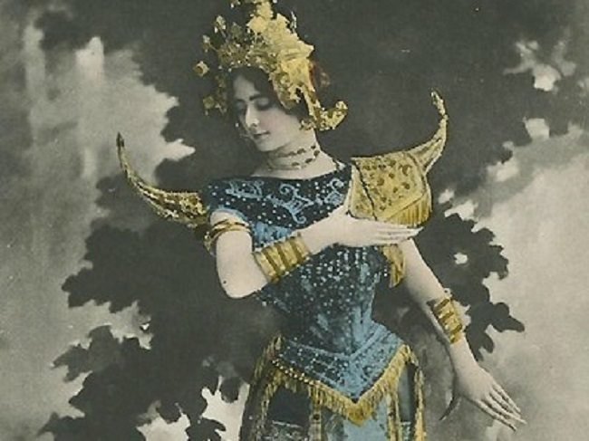
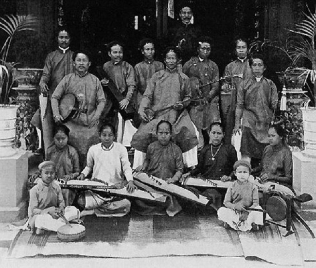
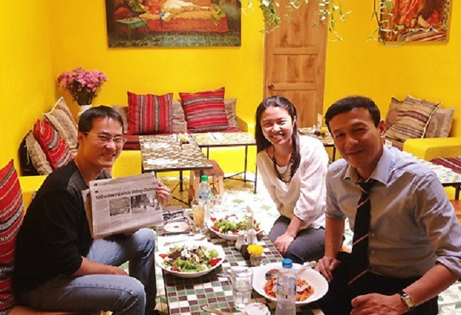

<!--
title: VŨ KHÚC ĐÔNG DƯƠNG’ – DỰ ÁN ĐIỆN ẢNH ĐẦU TIÊN VỀ ĐỜN CA TÀI TỬ
author:  Nguyễn Tích Kỳ
status: completed
-->

*Vũ khúc Đông dương’ – dự án điện ảnh đầu tiên về đờn ca tài tử*

***Một nhóm tác giả Việt Nam – Pháp cùng thực hiện kịch bản phim nhựa, phục dựng một góc đời sống văn nghệ miền nam Việt Nam những năm 1900.***

*Nhóm tác giả cùng viết kịch bản phim Vũ khúc Đông dương gồm: nhà nghiên cứu Nguyễn Lê Tuyên (Đại học Quốc gia Australia), giáo sư Yves Defrance (Đại học Rennes, Pháp), nhà văn – biên kịch Ngô Thị Hạnh, đạo diễnHuy Moeller (trường Điện ảnh Quốc tế Saigon) và nhà nghiên cứu Nguyễn Đức Hiệp (Australia).*
 
*Kịch bản phim dựa trên sự kiện lịch sử âm nhạc có thật ở Mỹ Tho – miền Nam Việt Nam những năm 1900: Đờn ca tài tử Việt Nam được mời sang trình diễn ở Hội chợ Thế giới Paris, Pháp. Phim xoay quanh cuộc đời của tài tửNguyễn Tống Triều. Ông là người thành lập ban nhạc tài tử, tìm đất diễn ở các khách sạn và rạp hát. Nguyễn Tống Triều nổi tiếng về tài nghệ chơi đàn kìm. Tiếng đàn của ông làm lay động trái tim rất nhiều người, trong đó có ông Viang – một khán giả người Pháp. Chính ông này đã mời ban nhạc tài tử Mỹ Tho qua Pháp tham dự Hội chợ Thuộc địa năm 1906 ở Marseille.*

  
*Cléo de Mérode thể hiện Vũ khúc Đông dương do ban nhạc đàn ca tài tử Việt Nam đệm đàn. Ảnh tư liệu.*

*Kịch bản phim tập trung khắc họa sự kiện ban nhạc tài tử của ông Nguyễn Tống Triều đệm nhạc phẩm Vũ khúc
Đông dương cho cô Cléo de Mérode múa tại Hội chợ này. Cléo de Mérode sinh ở Paris năm 1875, xuất thân từ dòng dõi quý phái từ Bỉ. Nàng được học ballet ở trường múa quốc gia nổi tiếng Opera Ballet ở Paris vào lúc 7 tuổi. Vào thời đó, nàng được xem là “la reine de beauté” (Nữ hoàng sắc đẹp) và nổi danh ở châu Âu khi tham gia đóng phim. Ở tuổi 25, nàng đạt được nhiều vinh quang, được phụ nữ Paris cũng như giới văn nghệ sĩ Pháp ngưỡng mộ.*

***Nhà biên kịch Ngô Thị Hạnh cho biết, ngoài những sự kiện âm nhạc có thật, phim Vũ khúc Đông dương còn hư cấu thêm nhiều tình tiết** về hành trình khám phá về thế giới âm nhạc cổ xưa của một nhân vật là cô gái 25 tuổi, sống ở thế kỷ 21. Cô có khiếu chơi đàn kìm như ông cố mình là tài tử Nguyễn Tống Triều. Tìm trong gia phả, cô được biết thêm bà cố mình là nữ minh tinh người Pháp, gốc Bỉ. Cô tưởng tượng về chuyện tình đầy thi vị và tuyệt vọng giữa hai ông bà. Chuyện phim được đan xen giữa hiện tại và quá khứ.*

  
*Ban nhạc Đàn ca Tài Tử những năm 1900. Ảnh tư liệu*

*Hiện tại, kịch bản đang trong quá trình hoàn tất. Nhóm tác giả cũng trong quá trình tìm kiếm nhà đầu tư cho dự án điện ảnh. “Chúng tôi hy vọng tìm đủ kinh phí để làm một bộ phim chỉn chu, có phần âm nhạc của phim được đầu tư công phu nhất so với những phim điện ảnh Việt Nam từ trước đến giờ. Bối cảnh của phim dự kiến quay ở Mỹ Tho – Paris – Marseille với cảnh trí phục dựng lại thời điểm năm 1900″, biên kịch Ngô Thị Hạnh cho biết.*  
***Hoạt động làm phim này nằm trong dự án “Nhà hát Đông dương”**, được thành lập từ giữa tháng 7 từ ý tưởng của nhà nghiên cứu âm nhạc Nguyễn Lê Tuyên. Đạo diễn Huy Moeller xây dựng hẳn trang web riêng cho dự án và được xem như một nhà hát ảo trên mạng. Bản nhạc “Vũ khúc Đông dương” một thời sẽ được dựng lại và công bố trên trang web này.*

  
*Từ trái qua : Đạo diễn Huy Moeller, nhà văn biên kịch Ngô Thị Hạnh và nhà ngiên cứu Nguyễn Lê Tuyên (Đại học Quốc gia Australia)*

*Hội chợ Thế giới Paris năm 1900 đã dựng lên Nhà hát Đông dương trong vòng 5 tháng. Sau khi kết thúc hội chợ, nhà hát bị dỡ đi. Nhưng những hình ảnh, những thước phim xưa cũ vẫn được lưu giữ một cách cẩn thận ở bảo tàng Pháp.
Trong dự án “Nhà hát Đông dương”, ngoài phim điện ảnh, có hai cuốn sách viết về sự kiện này được phát hành. Đầu tiên là cuốn tiểu thuyết Vũ khúc Đông dương do nhà văn, nhà biên kịch Ngô Thị Hạnh viết (ra mắt trước tháng 6/2014).
Ngày 27/9, nhóm dự án cũng ra mắt cuốn sách Hát bội, đờn ca tài tử và cải lương cuối thế kỷ 19 đến đầu thế kỷ 20 (do Phương Nam book đầu tư và phát hành). Trong buổi ra mắt sách, điệu múa của Cléo de Mérode được nghệ sĩ Trác Thúy Miêu (huấn luyện viên dancesport) thể hiện lại qua sự chỉ đạo nghệ thuật của biên đạo múa Tạ Hưng.*

***Thất Sơn***

tài liệu từ : [http://giaitri.vnexpress.net/tin-tuc/phim/sau-man-anh/vu-khuc-dong-duong-du-an-dien-anh-dau-tien-ve-don-ca-tai-tu-2857492.html](http://giaitri.vnexpress.net/tin-tuc/phim/sau-man-anh/vu-khuc-dong-duong-du-an-dien-anh-dau-tien-ve-don-ca-tai-tu-2857492.html)

