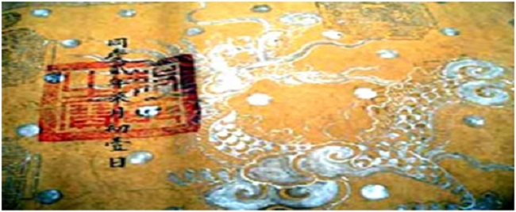

<!--
title: Nét vàng son trên nền giây Gấm
author: Nguyễn Tích Kỳ
status: completed
-->

**Nét vàng son trên nền giấy gấm**

*Nguyễn Xuân Diện*  
 
*Ngày nay, vào thăm các đình miếu hoặc các gia đình dòng dõi, đôi khi ta còn được trông thấy các bản sắc phong, mà nét vàng son còn ánh lên như nhắc nhớ đến một dĩ vãng vô cùng lộng lẫy và đẹp đẽ  của ngày xưa.
Trong lòng ta rộn lên bao cảm xúc về sự hiển linh của thần, sự uy nghiêm của quyền lực, ta còn có cả  sự choáng ngợp và khâm phục trước vẻ đẹp của tờ giấy sắc và tài hoa kỹ thuật của người xưa, mà thời gian dù có vô tình, cũng không làm phôi pha nét vàng son xưa ấy. Lòng ta tự hỏi,  ai trong chúng ta là người được giữ bí quyết chế ra tờ giấy ấy.  
Trong chúng ta cũng ít ai biết cái nghề làm giấy gấm **Long-Đằng** để viết **« Sắc phong »** là độc quyền  của một dòng họ cư trú ở ngay bên cạnh Thăng Long – Hà Nội,  trải đã mấy trăm năm.*

*« Sắc phong » gồm có hai loại :*

***Loại thứ nhất là phong cấp, khen ngợi, tưởng thưởng** cho những người có công (giống  một giấy khen, một giấy bổ nhiệm chức vụ). Là tài sản chung của dòng họ được cất giữ trong các nhà thờ họ của các gia tộc có các vị tiên liệt có công với  vua với nước.*

***Loại thứ hai** là tài sản của cộng đồng làng  xã, loại sắc phong phẩm trật cho thầnlinh(theo thường niên, hoặc một dịp lễ  lạt nào đó) được cất giữ tại đình làng hoặc đền, miếu.*

*Hiện nay, bản sắc phong cổ nhất của Việt Nam đang được đặt trong một ngôi đình cổ thuộc thị trấn Diêm Điền, huyện Thái  Thụy, Thái Bình. Hai đạo sắc này có niên đại Hồng Đức 23 (1492) và Hồng Đức  28 (1497) đờiLê Thánh  Tông, thế kỷ XV, cách nay đã hơn 500 năm, tức là nửa  thiên niên kỷ.  
Việc được nhận sắc phong thần ngày xưa là một việc rất hệ trọng của làng xã, và việc đón rước sắc phong là một nghi lễ đặc biệt.
Sách **“Đại Phùng tổng  khoán ước”** (A.2875), thư viện Viện Nghiên cứu Hán Nôm, cho biết về  nghi lễ đón rước sắc phong như sau: **“Sắc đưa về đến đình, chép thêm ra một bản, giống như bản chính (đều dùng giấy vàng mực đen, lấy người có chữ đẹp trong thôn viết đằng tả), rồi lập một  hương án, đặt lên, vái 5 vái (thay thần tạ ơn vua). Sau đó hóa bản sao đi,  còn bản chính thì rước vào trong đình” (tờ 11a).***

*Hàng năm, đến ngày hội  làng, rất nhiều làng có lệ rước sắc từ nghè, hoặc miếu ra đình, mà đoàn rước  sắc bao gồm đầy đủ tất cả các nghi trượng trangtrọng nhất. Trường hợp làng **Triều Khúc, Hà Nội** là một ví dụ.*

*Do có nội dung đặc biệt  nên sắc phong được viết trên một loại giấy đặc biệt, gọi là giấy sắc (giấy dùng viết sắc chỉ, sắc  phong), còn gọi là giấy **nghè** (giấy  do họ **Lại** cha truyền con nối ở  làng **Nghĩa Đô – làng Nghè, Hà Nội**  chế ra và dâng vào triều đình.*

***Làng Nghĩa Đô** là một làng cổ thuộc huyện **Từ Liêm, Hà Nội**. Ở đó có dòng họ Lại chuyên làm giấy sắc phong, một loại giấy từng nổi tiếng trong lịch sử văn hóa dân tộc.*

*Theo gia phả và lời truyền trong dòng họ này, thì cụ Tổ của họ này là **Lại Thế Giáp**, là con rể của Thanh Đô Vương Trịnh Tráng. Con gái của Trịnh Tráng là Phi Diệm Châu, hiệu Từ An, khi đó thấy họ nhà chồng còn nghèo, mới tâu xin nhà chúa và vua Lê cho họ Lại được đời đời làm giấy sắc dâng vào triều đình. Họ Lại còn có cụ Lại Phú Vinh được phong  đến tước Đô Thịnh hầu, giữ chức Phụ Quốc tướng quân, Đô ty Chỉ huy sứ, Ngự dụng giám Kim Tiên cục trông coi và quản lý nghề làm giấy sắc cho triều đình.*   

Dân gian có câu ca truyền tụng rằng:  
***Tiếng đồn con gái Nghĩa Đô***     
***Quanh năm làm giấy cho vua được nhờ***   

Lại còn có câu:   
***Họ Lại làm giấy sắc vua***   
***Làng Láng kéo cờ mở hội hùng ghê!***  
    

*Như vậy, họ Lại làng Nghĩa Đô khởi nghiệp làm giấy sắc từ thời Lê – Trịnh, và phát triển suốt mấy trăm năm.*

***Giấy sắc là loại giấy quý.***

   
*Trước hết là ở nguyên liệu dùng để vẽ lên mặt giấy là vàng, bạc và kim nhũ. Nhờ nguyên liệu này mà giấy sắc có hình thức và màu sắc đã đẹp lại bền, chống được sự xâm hại của các loài côn trùng và gặm nhấm, vượt thời gian còn mãi đến hôm nay.*

**Làm giấy sắc đòi hỏi rất nhiều công phu.**

*Theo các cụ ở họ **Lại** cho biết,  làm một tờ  giấy sắc cho hàng **Nhất phẩm** thì  phải có 5 người thợ cùng làm một lúc mới có thể xeo nổi một tờ giấy. Giấy để phong cho hàng phẩm cấp thấp hơn (tức là từ **Nhị phẩm**  xuống tới **Cửu phẩm**), khổ giấy hẹp  hơn, cũng phải 3 người thợ làm một tờ. Đấy là nói về xeo giấy.   

*Phần vẽ giấy sắc mới là khâu tinh xảo nhất, công phu nhất, đòi hỏi tay nghề cao.
**Vẽ gồm hai công đoạn:**     
**Vẽ chạy** là vẽ ra hình rồng mây, hình triện, hoa văn; việc này do những thợ giỏi thực hiện…     
**Vẽ đồ** là theo nét vẽ chạy mà tô kim nhũ, vàng bạc.*

*Bí quyết nhất của việc làm một tờ giấy sắc theo đúng yêu cầu là ở kỹ thuật đánh vàng, đánh bạc cho tờ giấy. Dụng cụ để làm công đoạn này là cái chầy và những cái bát lớn. Để giữ bí quyết nghề nghiệp, các công việc này được tiến hành ở nơi kín đáo nhất trong nhà, tránh người ngoài học lỏm.*   

*Nhà cụ Tám Hoàn ở Nghĩa Đô có bàn thờ lớn, gần bàn thờ là một khoảng rộng, và đó chính là nơi cụ làm công việc đánh vàng, đánh bạc hết sức bí mật này. Cụ đã mất từ lâu, và cũng chưa truyền nghề cho ai, kể cả con cháu trong nhà. Cụ chỉ để lại một kỷ vật duy nhất, là một phiến đá xanh, mặt phẳng lì, rộng một chiều 60 cm, một chiều 80 cm.*

***Giấy sắc phong có hai loại:***

*- **Dùng phong cho các quan** (phong chức, tặng tước, khen tặng)*
*- và **loại dùng phong cho các vị thần linh.***

***Giấy phong cho bách quan** có 3 hạng :*

***Hạng Nhất**, xung quanh khung có vẽ 8 con rồng nhỏ, mặt trước vẽ một con rồng lớn, ẩn trong     mây, gọi là Long án, mặt sau vẽ hình Tứ linh (Long – Ly – Quy – Phượng).* 
        
***Hạng Nhì**, xung quanh khung vẽ mây hoặc họa tiết hồi văn, mặt trước vẽ một con rồng, mặt sau vẽ Nhị linh (hai con vật trong Tứ linh).*
  
***Hạng Ba**, xung quanh in triện gấm, mặt trước vẽ một con rồng ở giữa và bốn góc in hình Ngũ tinh (Năm ngôi sao), mặt sau  vẽ bầu rượu túi thơ.*   

Giấy phong cho bách thần cũng có 3 hạng :   
***Thượng đẳng thần**: xung quanh in triện hoa chanh, phía trước vẽ một con rồng, ở giữa in hình Ngũ tinh, bốn góc in hình Thất tinh, mặt sau vẽ hình Tứ linh.*  
***Trung đẳng thần:** Mặt trước giống như sắc Thượng đẳng thần, mặt sau vẽ Lá và Bầu rượu, giữa vẽ hai chữ Thọ liền nhau, gọi là song thọ.*   
***Hạ đẳng thần:** Mặt trước giống như hai hạng trên, mặt sau không vẽ.*

Ngày xưa, vì việc phong tặng cho bách quan và bách thần là một điển lễ long trọng và thường xuyên nên cần dùng rất nhiều giấy sắc.   

*Dưới thời Nguyễn, trong niên hiệu **Khải Định** (1916 - 1926), có năm nhà nước đặt hàng làng Nghĩa Đô làm hàng vạn tờ giấy sắc. Giá giấy sắc rất cao. Lúc đó, mỗi tờ giấy sắc là một đồng bạc Đông Dương (tương đương một lượng vàng). Xem thế đủ biết nghề tuy khó, nguyên vật liệu tuy quý và đắt tiền, nhưng cũng có lãi cao.  
Họ **Lại** vì thế có nhiều gia đình theo nghề, như nhà **cụ Xã Vi, cụ Phó Nham, cụ Trương Lại, cụ Trương Xứ, cụ Xã Lịch, cụ Phó Nhiên, cụ Bếp Kiệm…**   
Ngày nay, nghề làm giấy sắc  chỉ còn một người nắm được bí quyết là cụ **Lại Phú Bàn**, thuộc dòng dõi của cụ **Lại Thế Giáp thời Lê-Trịnh**, nay đã 80 tuổi, hiện sống tại quận  Cầu Giấy (Hà Nội). Các con cháu của cụ đều không có ai có ý theo nghiệp xưa, mà chính cụ cũng không làm giấy sắc nữa. Hiện cũng chưa có tổ chức hay  cá nhân nào hội đủ các điều kiện để cụ truyền nghề làm giấy sắc.  
Thế có nghĩa là, những mây rồng vàng son trên nền giấy gấm từ thuở xa xưa có thể sẽ mãi mãi dừng lại ở thế kỷ 20.   
Rồng đã thôi bay, mây  cũng đã thôi bay, và nghề xưa mãi chỉ còn trong dĩ vãng.  

Thật đáng tiếc thay!*

