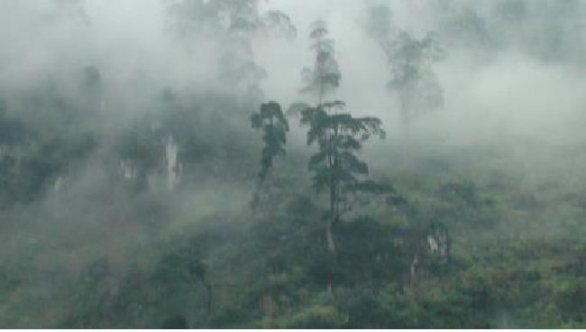
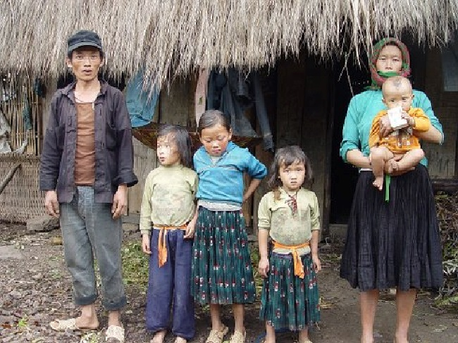
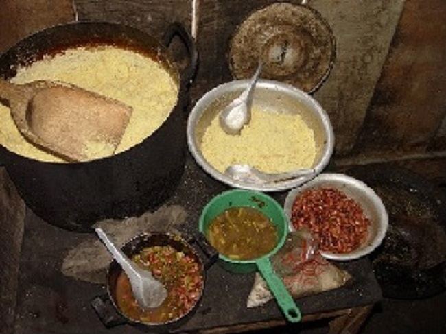
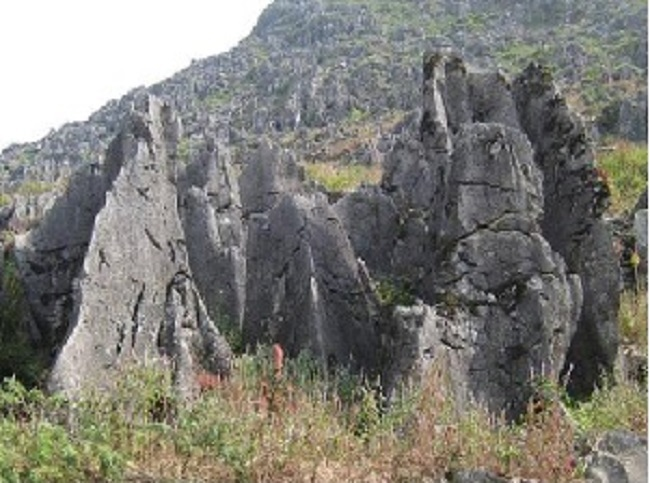
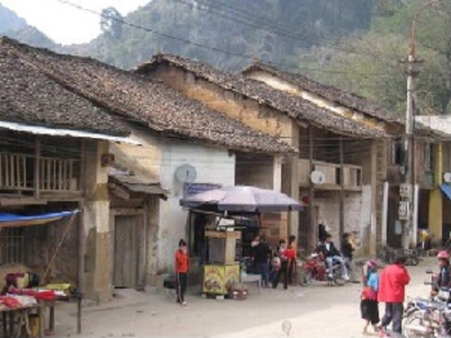

<!--
title: Đồng Văn ơi
author: Tich Ky
-->

*Thượng nguồn sông Cán Tỉ.    (ảnh doduc)*
 
Trên đỉnh núi lưng đèo người Mèo ca hát trên đỉnh núi lưng đèo người Mèo đi về…...
Câu hát véo von linh hoạt cùng ngón đàn ngọt của anh chàng cung văn khi hầu giá đồng Cô bé vùng cao đã theo tôi mãi từ Bảo Hà (Lao Cai) sang đất Hà giang. Lời ca ấy, chàng cung văn đã khéo lựa ở trong những sáng tác mới, cải một chút lời trên nền nhạc quen thuộc, đưa vào giá đồng cho hợp cảnh. Nhất là khi cô đồng nhảy chân sáo hòa được cùng nhịp với lời hát thì cung văn dễ được cô đậm đà ban cho lộc lớn lộc bé. Đó là đặc tính dân gian mạnh mẽ của cánh cung văn theo nghiệp hầu bóng luôn luôn đi sát tinh thần thời cuộc. Với những cung văn như thế, các giá đồng bao giờ cũng trở nên sống động.
Thực ra thì chẳng có chuyện trên lưng đèo người Mèo ca hát bao giờ.
Cuộc đối mặt khốc liệt với thiên nhiên của người Mèo đã chẳng thể để lại lời ca đẹp như sự tưởng tượng của người nhạc sĩ giàu tinh thần lạc quan cách mạng vẽ ra cách đây vài chục năm. Người Mèo sống hướng nội, âm thầm trong cả niềm vui và nỗi buồn. Họ chẳng bao giờ phô trương, cũng như không quen than vãn. Họa chăng thì đó là lời than trong tiếng hát làm dâu. Còn lại luôn là sự chấp nhận đối đầu với mọi thách thức. Đôi khi sự đối thoại với rượu lại nói lên nhiều điều hơn cả. Khi giọt rượu làm mềm môi, cũng là lúc cái lý được bộc lộ mạch lạc và rắn rỏi. Đó là điều tôi đọc được trong đời sống người Mông từ lâu khi đến với họ.
Cách Mèo Vạc 5 km từ hướng Yên Minh, gia đình Lầu Mí Chạ ở Ha Súa, Tà Lủng, nằm khoanh giữa nương ngô, cách sườn dốc con lộ chừng ba chục mét. Chạ nói tiếng Kinh chưa thạo, còn vợ Chạ, Sầu Thị Thá gầy nhom. Tay bế con nhỏ, chị lặng lẽ chào khách bằng một cái nhìn đề phòng và dò hỏi. Tôi định giới thiệu cách xếp đá làm tường rào khéo léo của người Mông với bạn bè thì mối quan tâm của họ lại chuyển hướng ngay sau khi chúng tôi bước vào trong căn nhà ẩm thấp, vách thưng xộc xệch bằng ván xẻ tối om. Đó là chất lượng cuộc sống quá thấp. Nó giống như bát canh luễnh loãng chỉ có chút muối trắng nhàn nhạt thả xuống.
 

*Cả nhà Lầu Mí Chạ năm 2008. (ảnh doduc)*
 
Nhà Lầu Mí Chạ có 4 đứa con gái. Anh đọc cho nghe tên từng đứa: Lầu thị Mỵ, Lầu thị Thọ, Lầu thị Dí, Lầu thị Dếnh. Còn tuổi thì gần như cách nhau ba năm đôi. Hai chiếc giường chân cọc được chôn ngay xuống nền ở hai góc nhà. Tất cả bừa bộn và nhơm nhớp hơi ẩm và mùi mốc. Nền nhà gần như ngang bằng với đất vườn, có mưa là nước có thể tự chảy vào, nên luôn ướt nhoét và đầy rác rưởi. Không bàn ăn, không ghế ngồi, không ấm chén, lại không thấy cả đèn dầu. Và cuối cùng hình như không có cả tiếng trò chuyện giữa vợ chồng con cái. Trong nhà có thừa dăm bảy cái không. Ở một góc nhà, nồi mèn mén không vung, vài ba nhát xúc nham nhở trên mặt như lời thông báo nhanh: ai cần thì cứ tự nhiên!.
 

*Món ăn mèn mén và đậu đỏ bung với muối . (ảnh doduc)*
 
Nghe Chạ bảo nồi đó là dành ăn trong cả tuần. Bên cạnh là bát đậu đỏ nấu với muối, ăn bỏ dở, còn lõng bõng chút nước. Đó là món thức ăn duy nhất dùng cho 6 nhân khẩu trong nhà. Vợ chồng Chạ bằng tuổi nhau, cùng 33 mà đã từng ấy con. Cuộc sống thế thì làm sao mà cất lời ca lên được.
Tuy không xa trung tâm huyện là bao, cũng không phải đơn côi góc núi, nhưng nhà Chạ vẫn không điện không đài. Tôi bảo có nhiều con số không trong căn nhà có tường rào đá vững chắc là do vậy. Và con số không lớn nhất cản trở bước đi của họ có lẽ là không hiểu biết! Nhà Lầu Mí Chạ, món ăn được tính từ vài trăm đến nghìn đồng. Thiếu thốn từ giọt nước, từ chút ánh sáng, đến miếng ăn hàng ngày. Chẳng biết khi yếu bệnh thì sao.
Đó là cái khó chung của một vùng đất hiểm trở không thể khắc phục ngày một ngày hai.
 

*Đá tai mèo. (anh doduc)*
 
Mới rồi cao nguyên đá Đồng Văn được tỉnh Hà Giang mạnh dạn đề xuất xin công nhận là di sản đá thế giới. Chúng ta đang hướng tới hội nhập, quảng bá thương hiệu đang là nhu cầu tự thân của từng vùng đất. Nhưng liệu có bao nhiêu chủ nhân cao nguyên còn sống khó khăn như Chạ. Tôi không nghĩ rằng quảng bá cho du lịch lên Đồng Văn là chỉ để xem đá.
Khi căn nhà chưa được sửa sang và dọn dẹp thì lời mời khách liệu đã nên đưa ra?
Mèo Vạc có Mã Pì Lèng từ lâu đáng mặt xếp hạng di sản thiên nhiên cấp quốc gia. Tôi dám chắc như vậy vì vẻ đẹp của con đèo này đã thuyết phục được bất kỳ ai từng đặt chân đến. Nhưng cho đến bây giờ vẫn chưa thấy Hà Giang đề xuất việc này. Còn Đồng Văn có một phố cổ nghèo mươi chục mái nhà cũ nhưng chính quyền đã chọn nó với tiêu chí phố cổ để lấy đà xác lập vị thế du lịch.Thực ra, miền núi Hà Giang chỉ hướng về du lịch sinh thái cũng thừa tiềm năng. Vẻ đẹp hoang sơ của thiên nhiên luôn chứa đầy huyền bí.
 

*Một đoạn phố cổ Đồng Văn. (ảnh doduc)*
 
Còn chút phố cổ, là gọi thế thôi, mươi căn nhà ám khói hiện diện bên cả loạt nhà mới xây ngoài phố thì có khác gì vài chiếc răng sún ở trong hàm răng lành!. Rõ ràng tiêu chí Phố cổ ở đây thực sự không bền vững, mà lại làm khó cho chính những nhà qui hoạch du lịch và những gia đình muốn cải thiện lại chỗ ở của mình. Mới đây con đường duy nhất trong phố cổ đang được đổ đá hộc tôn cao gần ngang nền nhà trong phố, chắc rồi để rải nhựa cho mới. Vậy là sẽ mất con đường nhỏ với một không gian xưa.
Cao nguyên đồng Văn vừa giàu lại vừa nghèo. Cái gì Đồng Văn cũng có nhưng rồi lại chẳng có gì. Lần nào lên Đồng văn tôi cũng háo hức vì vẻ đẹp thần tiên của thiên nhiên , nhưng rồi đó lại buồn cho chủ nhân vùng đất. Năm tháng đời người cứ lầm lụi úp mặt vào đá chắt lấy sự sống từ đời này qua đời khác mà chẳng thay đổi được là bao.
Lên Đồng Văn lần này vẫn nguyên cảm xúc như vậy. Đồng Văn ơi!
 
                            *Đông ngàn Đỗ Đức*

bài viết trước khi cao nguyên này trở thành công viên địa chất toàn cầu
ngày 09 tháng 10. 2011 (14:30) 
 