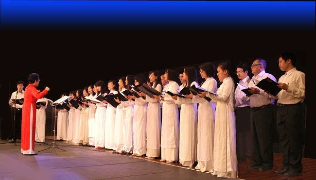
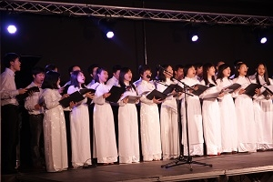
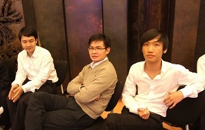
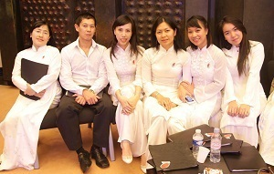
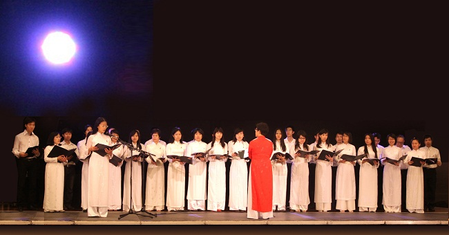

<!--
title: Creteil tuần lễ ” solidarité internationale ” 14.11. 2011  
author: Nguyễn Tích Kỳ
status: completed
-->

 
**Tuần lễ ” 10 ans de la solidarité internationale”**
 
**Christian Favier** Sénateur Président du Conseil général du Val-de-Marne  
**Gilles Saint-Gal** Vice-président en charge de la Jeunesse, du Tourisme et des Loisirs  
**Le Bureau du Conseil général** ont le plaisir de vous inviter à la soirée d’ouverture
de **” Un Notre Monde ”** le samedi 12 novembre 2011
Hôtel du Département21-29, avenue du Général-de-Gaulle à **Créteil**
 
(Conseil général de Val – de – Marne tổ chức tuần lễ « Semaine de la solidarité Internationale » lần thứ 10, với đề tài « Un – notre monde » đây là một hình thức « chơi chữ » của ban tổ chức, không phải chú đánh sai chữ đâu nhé)  
- Có 16 tập đoàn đại diện cho nhiều quốc gia : Angola, Arménie, Brésil , Cuba, Mali, Madagascar, Haiti, Togo v…v… và Việt Nam có HCQH.  
- Một chương trình văn nghệ phong phú, tiêu biểu, đặc trưng của từng nhóm : Múa dân tộc, Nhảy rap, Kịch, Thời trang, Hợp xướng, Vidéos v…v…  và mỗi Hội đoàn có riêng một không gian để quảng bá, giới thiệu sinh hoạt đặc thù của nhóm.  

  
photo Tuyết 
    
HCQH khai mạc buổi trình diễn :
-      Trường ca Sông Lô của Văn Cao hòa âm Nguyễn Thiên Đạo
-      Trăng chiều thơ Phan Đan nhạc Đặng Hữu Phúc
-      Nabuco nhạc cổ điển của Giuseppe Verdi (1813 – 1901)
-      Du kích Sông Thao nhạc Đỗ Nhuận hòa âm Đỗ Hồng quân
  
photo Tuyết  
    
photo Tuyết  
  
photo Tuyết  
  
photo Tuyết  
     
photo Tuyết   
  Mỗi Hội đoàn có 20’ để trình diễn. Trước đó thời gian tổng duyệt rất khít kẽ.
có những vướng mắc không cần thiết, quên cả châm ngôn « con sâu làm rầu nồi canh ».
Nhìn chung cục diện buổi trình diễn hôm nay,  HCQH đem chuông đi đánh xứ người đã thành công.

    
photo Tuyết
     
Bên cạnh đó không thể nào quên nhắc đến các em :
Em Tuyết có trách nhiệm chụp ảnh , thi xong phóng từ Paris về hội trường khít nút.
Có em tuy đã xin nghỉ sinh hoạt nhưng sợ đơn vị thiếu người cũng trở về với nhóm.
Có em con mọn không được khỏe nhưng cũng « đành » tạm thời bàn giao cho « đấng mày râu » để có mặt ngày xuất trận.
Có em mới toanh, HCQH chưa có thời gian thu xếp áo dài đồng phục đã tất bật « tự lo ».
Có em tuy không còn thời gian đi tập thứ  bảy nhưng vẫn mày mò đến dự, thầm lặng đứng trong quần chúng, lo lắng cho đồng đội.
                                              Chú rất hãnh diện về các em.
  
    
photo Tuyết
       
 Mỗi lần xuất trận là một lần HCQH gây ấn tượng cho người xem.
Thành công của hôm nay không chỉ cho riêng ai, mà do ý thức trách nhiệm của từng những việc nhỏ, từng cá nhân, sự đoàn kết, tình đồng đội và sự gắn bó và trách nhiệm đối với công việc.
sau đây là ý kiến Ban tổ chức (và những Hội đoàn khác) Họ nhận định rằng HCQH rất kỉ luật, hàng ngũ ngăn nắp, trang phục chỉnh tề, tập luyện có bài bản, công phu, rất xứng đáng làm sứ giả cho hình ảnh Việt Nam.
Mỗi chặng đường có một thử thách mới, không có kếtqủa nào là không có sự đóng góp tích cực thậm chí một hi sinh nào đó, mặc dù nhỏ bé.
Đòi hỏi chúng ta luôn tâm niệm « Ne pas se prendre au sérieux, mais prendre le travail au sérieux ».
Chúc các em nghỉ khỏe cuối tuần.

    
photo Tuyết
    
Thứ bảy tuần tới chúng ta bắt đầu tập cho Tết cộng đồng tại UNESCO và sau đó, khoảng tháng 3 ta sẽ còn chương trình trình diễn nữa, nhưng thôi chú không bàn nữa kẻo « xui ».   
Thân chào,  
Chú TK