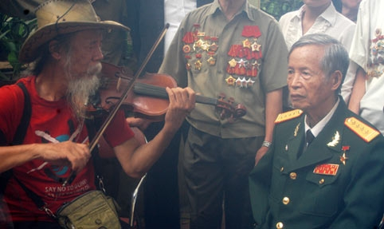

<!--
title: La Văn Cầu
author: Nguyễn Tích Kỳ
status: completed
-->

***Trong dòng người tiễn đưa Đại tướng Võ Nguyên Giáp chiều 12/10 tại nhà tang lễ Quốc gia có Anh hùng lực lượng vũ trang La Văn Cầu. Đã 82 tuổi nhưng ông vẫn xếp hàng 2 tiếng đồng hồ.***

*Trong trận Đông Khê (Chiến dịch biên giới năm 1950), khi đang chỉ huy tổ bộc phá hàng rào để đơn vị tiến công đồn, người chiến sĩ La Văn Cầu bị thương gãy nát cánh tay phải. Ông đã nhờ đồng đội chặt đứt cánh tay này để khỏi vướng, sau đó dùng tay trái ôm bộc phá đánh mở đường, tạo thời cơ cho đơn vị đánh chiếm đồn địch.
Với sự hiện diện của ông tại đám tang Đại tướng Võ Nguyên Giáp, quá khứ đau thương nhưng hào hùng về một thời khói lửa, với sự dẫn dắt của Chủ tịch Hồ Chí Minh và Đại tướng Võ Nguyên Giáp, như hiện về.
Đến viếng Đại tướng Võ Nguyên Giáp, ông La Văn Cầu trầm ngâm. Hình ảnh ống tay áo bên phải được vén gọn vào trong túi áo khiến nhiều người xúc động. Chiến tranh đã qua nhưng mất mát vẫn còn đây.
Nhiều người xin được chụp ảnh, trò chuyện với ông.
Nghệ sĩ Tạ Trí Hải đang kéo đàn ngân lên khúc ca “Hồn tử sĩ” cũng tiến lại gần xin được hát tặng vị Anh hùng bài hát “Vị Đại tướng bất diệt”.*

  
***Cẩm Quyên***  
*nguồn Vietnam Net*

