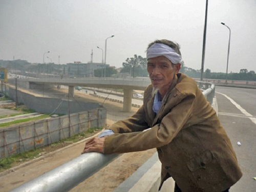

<!--
title: Người lính già cô độc sau phút tiễn đưa Đại tướng về đất Mẹ
author: Tich Ky
-->

#**Người lính già cô độc sau phút tiễn đưa Đại tướng về đất Mẹ**

13/10/2013 17:00 

*(VTC News) – Ở cái tuổi gần đất xa trời, giữa trưa nắng chang chang, ông Hòa vẫn đeo khăn trắng, đội nắng nheo mắt nhìn về không gian sâu thẳm như để tiễn biệt Người.
Sau khi vĩnh biệt Đại tướng ở phi trường, mọi người hối hả, vội vã trở lại với những lo toan, bộn bề cuộc sống, với những tính toán mưu sinh. Duy chỉ có một người với vóc dáng nhỏ bé đến cô độc vẫn còn ở lại.*

*12 giờ trưa 13/10, cụ ông ấy vẫn đứng “phơi giời”, mắt nheo nheo nhìn vào không trung vô tận, nơi linh cữu của Đại tướng vừa rời đi dù lưng ông đã còng, râu tóc bạc phơ, dáng đi thập thõm như ngọn nến leo lắt, sắp tàn trước gió. 
Trên đầu ông, một dải khăn tang trắng mà thoạt nhìn ai cũng sẽ tưởng ông vừa mất đi người thân yêu nhất của đời mình. 
Giữa cái nắng như thiêu như đốt, cụ già ấy vẫn một mình đứng giữa đất trời với những suy tư trầm mặc dường như không thể san sẻ cùng ai. Chỉ một câu nói vô tình động chạm tới sự ra đi của Đại tướng sẽ làm vỡ òa mọi nỗi đau trong tâm hồn người lính già này.*
*Người qua đường nhìn vóc dáng héo hắt của ông mà lo ngại. Sức ấy đứng phơi giữa trời liệu chịu được bao lâu? Nhưng tôi và những người cuối cùng còn ở lại trong số hàng vạn người tới sân bay để viếng Đại tướng biết rằng, ông còn lưu luyến nơi này, chưa muốn rời đi vì tiếc thương người Anh cả của mình đã về đất mẹ. Dường như ông đang muốn để nắng hong khô mọi nỗi buồn trong lòng mình.
Nhẹ nhàng dìu ông vào chỗ mát, tôi bắt đầu gợi chuyện như thể sợ mọi sự động chạm dù vô tình hay cố ý bằng những lời lẽ quá thẳng thắn về sự ra đi của Đại tướng cũng sẽ có sức thương sot vô cùng đau đớn đối với người lính già này. Người mà tôi muốn nhắc đến là ông Nguyễn Văn Hòa (61 tuổi, quê ở Thiên Dược, Sóc Sơn, Hà Nội), người từng là lính bộ binh, sau chuyển sang không quân. Ông rưng rưng kể: **“Kỷ niệm mà tôi nhớ nhất là năm 1966, Đại tướng về đơn vị của tôi cùng với Bác Hồ gắn huy chương anh hùng cho trung đoàn Sao Đỏ. Sau năm 1975, tôi lại được gặp lại Đại tướng một lần nữa. Đó là lần tôi đi công tác và tình cờ gặp Bác. Bác Giáp là người anh hùng của cả dân tộc và cả thế giới”.***  
*Rồi đôi mắt ông như chợt sáng lên khi nói về các phẩm chất đáng quý của Đại tướng. Ông say sưa kể: **“Đại tướng là người hòa nhã, tài ba lắm. Văn võ song toàn. Đại tướng là người học trò xuất sắc nhất của Chủ tịch Hồ Chí Minh”.**
Cũng theo ông Hòa, thế hệ của ông và có lẽ cả nhiều thế hệ sau sẽ học được từ Đại tướng sự đức độ vô song, lòng yêu thương con người hơn hết thảy mọi người. 
**“Đại tướng đã để lại cho không chỉ thế hệ chúng tôi mà cả muôn đời sau những gì tốt đẹp nhất. Đại tướng không chỉ là người cha già của dân tộc, mà với tôi, ông là một người thân. Khi linh cữu của Người qua đây, tôi có cảm giác như Người vẫn còn sống vậy. Ước gì Người còn sống để tiếp tục răn dạy cháu con, dìu dắt các chiến sỹ, những thế hệ sau…”,** ông Hòa nghẹn ngào lấy tay lau vội nước mắt. 
Với gia đình, ông là người đàn ông trụ cột, ít khi rơi lệ. Thế nhưng, trước sự ra đi của Đại tướng, ông cảm thấy như đứa trẻ vừa bị bỏ rơi, không nơi bấu víu. 
**“Đại tướng đã để lại vô vàn thứ quý giá của khoa học kỹ thuật, khoa học quân sự, của đường lối, của thao lược… khiến cả thế giới ngưỡng mộ. Từ hôm nghe tin Đại tướng qua đời, tôi rụng rời chân tay. Tôi để tang Bác từ hôm đó. Tới bữa cơm, tôi lại thắp hương mời Đại tướng rồi thẫn thờ ngồi ngắm di ảnh của Người. Tôi sẽ cúng Người như những gì tôi đã làm cho những người thân xấu số trong gia đình”,** ông Hòa quả quyết.
Không gian mênh mông quá khiến người sầu như càng sầu thêm. Ông Hòa mắt đẫm lệ. Ông nói với tôi, rồi đây hàng ngày ông sẽ lại tiếp tục công việc yêu thích của mình là kể cho con cháu nghe những câu chuyện về Đại tướng.*

***“Vậy là Bác đã đi rồi, về với tổ tiên, với hồn thiêng sông núi, với Người Thầy kính yêu – Bác Hồ. Từ đây, âm dương cách biệt…
Nhưng có một chân lý bất diệt: Bác mãi mãi sống trong lòng hàng triệu người Việt Nam, trong những trang sử vàng được lưu truyền tới các thế hệ sau”,** ông Hòa nghẹn ngào nói.
Rồi giọng nói như lạc đi, “phản chủ” khiến ông không thể tiếp lời, ông Hòa giơ cánh tay khẳng khiu, nhỏ bé, chông chênh đến tội chỉ về phía sân bay – nơi linh cữu của Đại tướng vừa rời đi không lâu – như muốn níu kéo bước chân Người. 
Tôi nhận ra rằng, trong ký ức của những người lính già như ông, biết bao kỷ niệm về cốt cách, trí tuệ và cảm hứng sống mạnh mẽ từ Đại tướng sẽ mãi tràn ngập, hiện hữu.
Đúng như một ai đó đã từng viết, dù Đại tướng đã đi xa, nhưng Đại tướng đã để lại cho dân tộc Việt Nam một niềm tin mới. Niềm tin mới đó là: “Khi có một điều gì đó to lớn đáng tin, dân tộc này sẽ đoàn kết và mạnh mẽ”.
Và đúng như lời ông Jorge Rondon Uzcategui – Đại sứ Cộng hòa Bolivar Venezuela tại Việt Nam đã nói: **“Thế giới đã mất đi một người anh hùng, một huyền thoại”.***

*Vậy là Đại tướng Võ Nguyên Giáp đã trở về quê nhà Quảng Bình, giữa miền cát chang chang nắng nhìn ra biển Đông xanh thẳm đúng như tâm nguyện của Người.
Cầu mong vị Tướng của nhân dân an giấc ngàn thu nơi đất Mẹ…*

**Minh Quân**  

Nguồn ***VTC News***
   
