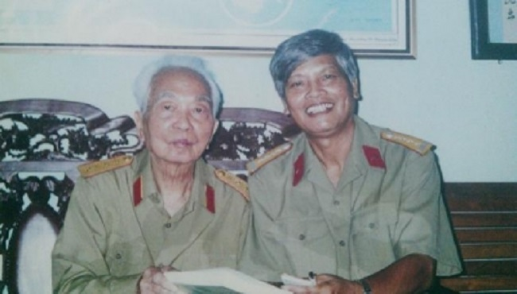

<!--
title: Từ kỷ niệm về Đại tướng trong Ngày Âm nhạc Việt Nam
author: Tich Ky
-->

Chủ nhật, 13/10/2013

**NDĐT- Những phút giây đắm mình trong giai điệu của bản hợp xướng  “Có một khu rừng như thế”  ca ngợi Đại tướng Võ Nguyên Giáp của đại tá – nhạc sĩ Doãn Nho do các nghệ sĩ Nhà hát Nhạc vũ kịch Việt Nam thể hiện giờ lại ngập tràn trong lòng những ai có mặt tại Nhà hát lớn Hà Nội đêm 3-9 vừa qua.**
 
Đó là buổi hòa nhạc nhân ngày **Âm nhạc Việt Nam** do **Hội Nhạc sĩ Việt Nam** tổ chức.
Năm nay, nhạc sĩ **Đỗ Hồng Quân** chủ tịch hội có sáng kiến vinh danh các tác phẩm hợp xướng, xứng tầm vóc của một ngày hội âm nhạc cỡ quốc gia. Và ca khúc **“Có một khu rừng như thế”** của nhạc sĩ Doãn Nho đã được chọn cho buổi công diễn.
Nhạc sĩ **Doãn Nho** chia sẻ thêm, ông không khỏi bồi hồi khi biết được tin công diễn tác phẩm nhất là ngay trong thời gian sức khỏe của **Đại tướng Võ Nguyên Giáp** đã rất yếu, ông hy vọng, dù Đại tướng không có mặt để thưởng thức nhưng bản nhạc như một nguồn động viên vô hình và Đại tướng sẽ cảm nhận được.
Nhạc sĩ cho biết để tác phẩm đạt được hiệu quả tốt nhất ông đã đề nghị nhạc sĩ **Trần Mạnh Hùng** phối khí lại và bản nhạc đã rất thành công.
Có lẽ “Có một khu rừng như thế” là ca khúc hiếm hoi được sáng tác để ca ngợi Đại tướng Võ Nguyên Giáp cho tới thời điểm hiện tại. Trong trái tim của những nhạc sĩ, hình ảnh về vị tướng tài ba của dân tộc, người anh cả của Quân đội nhân dân Việt Nam luôn trong trái tim họ, nhưng để sáng tác ra một tác phẩm xứng tầm thì không phải điều dễ thực hiện. Vì vậy, nhạc sĩ Doãn Nho cho rằng ông đã quá hạnh phúc khi hoàn thành ca khúc này.
 
Nhạc sĩ Doãn Nho đã ấp ủ tác phẩm này trong suốt cuộc đời hoạt động của người nghệ sĩ trong màu áo lính, nhưng phải tới khi vị Đại tá nhạc sĩ được đọc tập truyện **“Người thường gặp”** của nhà văn **Trần Đăng Khoa**, trong đó có truyện ngắn mang tựa đề “Rừng Đại tướng” nói về khu rừng Mường Phăng thì cảm xúc mới ùa về.
Không lâu sau đó “Có một khu rừng như thế” ra đời.
 
Ông kể, Rừng Đại tướng chính là cách bà con vẫn gọi khu rừng xưa kia là nơi đặt trụ sở chỉ huy trận Điện Biên Phủ chấn động địa cầu là nơi Đại tướng của chúng ta từng gắn bó nhưng khi vào ca khúc ông đổi tên thành “Có một khu rừng như thế” để vừa tình cảm, vừa gợi mở cho người nghe lại hoàn toàn đúng với cảm xúc thật của nhạc sĩ.
Không chọn âm hưởng hào hùng, những khối âm thanh hoành tráng làm chất liệu chính, nhạc sĩ Doãn Nho đã khai thác chất  trữ tình để sáng tác nên những giai điệu vừa gần gũi vừa thiêng liêng dạt dào tình cảm với sự khéo léo khai thác lối hát nói của đồng bào Tây Bắc.
Ấp ủ đề tài tới hơn nửa thế kỷ, ca khúc năm 2000,  nhưng phải gần một năm sau đó, năm 2001 mới hoàn thành. Điều nhạc sĩ Doãn Nho hạnh phúc nhất là, “Có một khu rừng như thế” ra đời đúng dịp kỷ niệm sinh nhật lần thứ 90 của Đại tướng. Ca khúc đã kịp dàn dựng và được phát sóng  nhiều lần trên Đài Tiếng nói Việt Nam và được đông đảo đồng bào cả nước đón nhận.
 
Kỷ niệm cho đến giờ này vẫn in đậm trong trái tim vị nhạc sĩ đại tá lão thành ấy chính là lần ông là đại diện duy nhất của cựu sĩ quan lục quân khóa 6 đi cùng đoàn cựu sĩ quan khóa 5 tới thăm Đại tướng. Và món quà mừng sinh nhật lần thứ 90 mà vị đại tá dành tặng Đại tướng chính là “Có một khu rừng như thế” do chính ông thể hiện.
12 năm sau, ca khúc lại được vang lên trong một ngày hội lớn của Âm nhạc Việt Nam, những giai điệu tràn đầy niềm xúc động ca ngợi vị Đại tướng của nhân dân Việt Nam ấy ngân vang bay tới trái tim người yêu nhạc Hà Nội cũng như cả nước chỉ hơn một tháng trước khi Đại tướng thân yêu của chúng ta đi xa.
 
NGUYỄN QUANG LONG  
Nguồn ***Nhân Dân điện tử***
