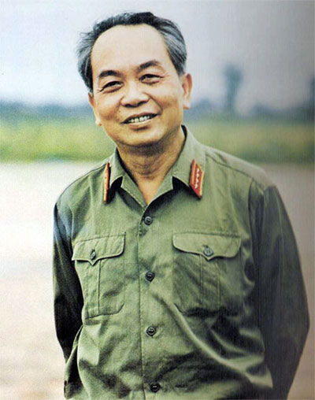

<!--
title: Bất Tử
author: Tich Ky
status: draft
-->

**ANTĐ - Khi Đại tướng Võ Nguyên Giáp ra đi, tôi bỗng nhớ câu thơ của nhà thơ Tố Hữu: Có cái chết hóa thành bất tử.**

Và tôi nhớ một dải rừng dọc Trường Sơn những năm chiến tranh nở đỏ rực một loài hoa mà những người lính gọi là hoa bất tử.

Vâng, những người lính vì dân vì nước hi sinh đã hóa thân vào màu hoa ấy.

  
Ảnh QĐND

Từ xa xưa, sử sách Việt đã nói về những vị Thánh bất tử được tôn thờ, đó là Tứ bất tử, gồm Tản Viên Đại Vương đi từ biển lên núi; Phù Đổng Thiên Vương cưỡi ngựa bay lên không trung (Sóc Sơn), Đồng tử nhà họ Chử gậy nón lên trời; Ninh Sơn (nay là Sài Sơn) Từ Đạo Hạnh in dấu vào đá để đầu thai, và Mẫu Liễu Hạnh, (Mẫu Thượng Thiên) tượng trưng cho cuộc sống tinh thần, phúc đức, sự thịnh vượng, văn thơ…

Dọc lịch sử dân tộc lại thêm những vị Thánh bất tử như Hưng Đạo Vương, Quang Trung, Hồ Chí Minh… Và tôi nghĩ, giờ đây Đại tướng Võ Nguyên Giáp cũng là một vị Thánh bất tử vì tinh thần Nhân văn của ông đã hóa vào lòng dân không thể phai mờ.

Cho dù biết trước sự ra đi của Đại tướng khiến người dân Việt và cả thế giới xúc động, nhưng tôi không thể tưởng tượng được là ông đã  thành “Thánh sống” trong lòng dân như những ngày qua khi cả nước khóc thương ông. Hàng vạn người khắp cả nước đã tự động đến dâng hoa viếng ông tại căn nhà ông ở hơn 50 năm nay, ngôi nhà 30 đường Hoàng Diệu, Hà Nội. Người dân tự nguyện xếp hàng dài hàng cây số, trật tự và nghiêm trang. Có người đến sớm từ lúc 3 giờ sáng. Có người đi xe lăn. Có người đi tàu hỏa, máy bay từ miền Nam xa xôi tận cùng đất nước. Có người dân tộc Thái, có người dân tộc Tày. Có những cụ già tóc bạc trắng phất phơ, có những em học sinh vai đeo khăn quảng đỏ… Không cần một mệnh lệnh hành chính nào, đây là mệnh lệnh của tình yêu, lòng khâm phục và sự tôn kính tự trong tâm khảm của mỗi người dân. Sự ra đi của Đại tướng khiến tôi nhớ tang lễ Bác Hồ tháng 9 năm 1969, cả dân tộc đẫm lệ khóc thương…

Ngay tại quê nhà Đại tướng tại Lệ Thủy, Quảng Bình khi nghe tin Đại tướng từ trần, không ai bảo ai đều đến ngôi nhà lưu niệm với nước mắt tràn mi, tự bày bàn thơ tế lễ. Họ như thấy người con ưu tú nhất của làng quê vẫn luôn ở bên mình, bên mái đình giếng nước, cánh đồng. Họ như thấy cả dấu chân ông trên mọi lối nhỏ quanh làng. Và họ mong ông trở về với mảnh đất quê hương…

Tôi đọc những dòng tin tưởng nhớ ông mà không kìm được nước mắt. Ngay cái làng nhỏ bên bờ sông Lam, làng Xuân Liên, Thanh Xuân (Thanh Chương, Nghệ An) nơi có Đại tướng là con rể của làng, suốt cả tuần nay người ta đổ về khu nhà thờ của dòng họ Đặng để thắp hương tưởng nhớ ông trong tâm trạng buồn bã, nghẹn ngào. Một cụ lão cao niên nói trong nước mắt: “Thưa tổ tiên, hôm nay con dẫn các đoàn thể đến đây để thắp hương cho anh Văn, người con rể vĩ đại của họ tộc chúng ta. Anh vừa ra đi trong sự tiếc nhớ vô hạn của anh em, của cả ngôi làng này”. Đó không chỉ là lời của riêng cụ lão, mà là lời của cả dân làng, dân Nghệ An với Đại tướng.

Người dân Việt không chỉ khóc thương ông, mà còn có mong muốn vị “Đại tướng của lòng dân” mãi mãi bên mình. Ấy là nguyện vọng về địa điểm của ông an nghỉ chốn thiên thu phải là nơi thật đẹp, thật thuận tiện cho người dân thăm viếng. Thật tuyệt vời, chính Đại tướng đã chọn cho mình được an nghỉ bên một ngọn núi nhìn ra biển Vũng Chùa – đảo Yến trên quê hương Quảng Bình yêu dấu, cũng là khoảng giữa miền Trung thân yêu của Tổ quốc ta.

Cả nước đang chuẩn bị cho tang lễ của Đại tướng trọng thể và linh thiêng, hợp với nguyện vọng của nhân dân. Cả nước đang hướng về Người, một vị Anh hùng dân tộc, một người học trò ưu tú của Hồ Chủ tịch, một vị Tướng vĩ đại đã làm thay đổi lịch sử trọn đời vì dân vì nước, vì dộc lập, tự do, dân giàu, nước mạnh…

Người mãi mãi bất tử, người là một vị Thánh bất tử trong lòng dân.

**Nhà thơ NGUYỄN TRỌNG TẠ**

*Nguồn An Ninh Thủ Đô
Chủ nhật 13/10/2013 07:00*
 

 
