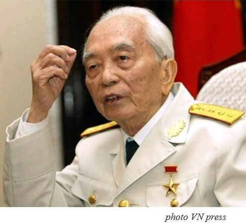

<!--
title: (Français) A l’occasion de la sortie de son livre La Marseillaise du général Giap, Claude Blanchemaison, gouverneur français de l’ASEF
author: Nguyễn Tích Kỳ
status: completed
-->

*Le général Võ Nguyên Giáp est décédé cette année à 102 ans, après avoir été l’un des principaux acteurs de la révolution vietnamienne et des guerres qui ont suivi (1945-1975), contre la France puis les Etats-Unis, amenant la victoire d’un régime communiste au Vietnam.*

*A l’occasion de la sortie de son livre La Marseillaise du général Giáp,  
**Claude Blanchemaison, gouverneur français de l’ASEF**     
**Asia Europe Fondation, donnera une conférence en salle Marc Bloch**,  
le jeudi 7 novembre 2013, à 18 heures, à l’invitation du professeur Hugues Tertrais.*

Il a été  en poste à Hanoi, Dehli, Moscou, Madrid, et a dirigé la DGCID, devenue direction de la Mondialisation, puis le Département Asie-Pacifique du ministère des Affaires étrangères.

*Claude Blanchemaison, important diplomate, a été ambassadeur de France à Hanoi entre 1989 et 1993, alors que le communisme même est en question à l’échelle planétaire : dans La Marseillaise du général Giáp, qui vient de paraître, il raconte sur un ton personnel cette ambassade, notamment marquée par la rencontre du célèbre général.
Cette conférence est organisée pour les étudiants du Master, toutes spécialités confondues.*

***Extraits du livre***  
[Blandine Grosjean](riverains.rue89.com/blandine-grosjean)   *Rédactrice en chef*
 
*Le général Giáp en 1989 : extrait de « La Marseillaise du général Giáp » de Claude Blanchemaison (éd. Michel de Maule), sortie le 10 octobre 2013 
Võ Nguyên Giáp, héros militaire de l’indépendance vietnamienne et artisan de la débâcle française à Diên Biên Phủ, est mort ce vendredi à l’âge de 102 ans. Le jour même, Claude Blanchemaison, ancien ambassadeur de France au Vietnam, envoyait à l’imprimerie les épreuves de son ouvrage « La Marseillaise du général Giáp » (éd. Michel de Maule, en vente le 10 octobre). Nous publions quelques extraits avec son aimable autorisation.*

«Ma première rencontre avec le général Giáp qui avait autrefois réussi le triple exploit de harceler l’occupant japonais, de battre la puissance coloniale française puis de chasser les américains eut lieu au début du mois d’avril 1989 à Hanoï. J’avais pris mes fonctions d’ambassadeur de France au Vietnam quelques semaines plus tôt ; Quelque peu intimidé, j’allai au rendez-vous fixé, en me remémorant ce que j’avais lu sur ce personnage hors du commun, dont il n’existait toujours pas de véritable biographie. Le héros de l’indépendance nationale pouvait aussi être vu comme un chef de guerre peu soucieux des vies humaines. L’homme qui s’avance à ma rencontre me frappe par sa petite taille, son œil vif et son grand front surmonté d’une crinière blanche– le volcan sous la neige, disaient les journalistes. Il est en tenue militaire d’été très simple, de couleur kaki tirant sur le vert olive, avec une chemisette portant des écussons rouges étoilés sur le rebord du col. Il fait tout pour se montrer aimable et pour me mettre à l’aise. Devinant sans doute mon appréhension et désireux de couper court à tout discours introductif embarrassé, il m’a pris le bras familièrement et m’a dit combien il appréciait la littérature française. Manifestement heureux de parler notre langue, le vieux Général accueillait un ambassadeur de quarante-cinq ans, qui ne pouvait évidemment pas être nostalgique d’une époque qu’il n’avait pas connue. D’entrée de jeu, il évoqua les affinités culturelles entre nos deux pays, l’importance de la francophonie et la nécessité de regarder vers l’avenir : il était grand temps, me dit-il, d’envisager de construire une coopération substantielle dans le domaine économique. La France pouvait aider le Vietnam à s’insérer dans un contexte international qui évoluait rapidement. Elle devrait aussi jouer un rôle beaucoup plus important dans la formation de ses cadres.  Il s’est cependant cru obligé d’évoquer l’histoire. Bien sûr la grande Révolution française, puisque c’était ici une référence permanente, mais aussi la colonisation, y compris dans ses aspects les plus décalés, comme par exemple l’existence d’un masque tragique de guerrier gaulois à grande moustache dans le décor en stuc au-dessus du rideau de scène à l’opéra de Hanoï. Il mentionna ironiquement le fait qu’entre 1940 et 1944 les élèves du lycée Albert- Sarraut chantaient tous les matins Maréchal nous voilà ! , sur ordre de l’amiral gouverneur général de l’Indochine. d’une manière générale, celui-ci appliquait scrupuleusement les directives de Vichy, souligna mon interlocuteur.»

**« Il faut toujours garder ses distances avec les Chinois »**

*« Il parla aussi des mille ans d’occupation chinoise. il ajouta en souriant qu’il fallait toujours garder ses distances avec les chinois. Sans nier l’importance de leur soutien logistique massif dans la lutte pour l’indépendance, il expliqua qu’il ne les avait jamais suivis aveuglément.
Certes, il avait failli accepter l’idée des conseillers militaires venus de Pékin, qui avaient suggéré début 1954 de recourir à des vagues d’assaut successives contre le camp retranché de Diên Biên Phủ, conformément à la tactique utilisée pendant la guerre de Corée.
Mais, la veille du jour initialement prévu pour l’attaque, après avoir réfléchi toute la nuit, il avait tout suspendu et avait entrepris d’expliquer à son état-major, ainsi qu’aux Chinois, que cette méthode lui paraissait, à la réflexion, totalement inappropriée.
Le système de défense français était bien conçu, véritable hérisson sur les pics duquel les assaillants auraient pu se briser et, en tout état de cause, cela aurait fait encore beaucoup plus de morts dans les rangs vietnamiens. Il alla jusqu’à me dire que le plan Navarre aurait pu réussir. C’est d’ailleurs la raison pour laquelle il avait préféré, précisa-t-il, l’approche progressive, le travail de sape, les boyaux et les tunnels sous les points d’appui.
À aucun moment, il ne critiqua les militaires français. il conclut ce rappel historique en citant Hồ chí Minh : “Nous n’avons pas eu de chars, d’hélicoptères ou d’avions détruits, pour la bonne raison que nous n’en possédions aucun.” »*

**« Aux armes, citoyens ! »**

Quelques mois plus tard, toujours à Hanoï, 14 juillet 1989, six heures du soir. Alors que l’on célèbre le bicentenaire de la Révolution française, le général Giáp, se rendra pour la première fois de sa vie à l’ambassade de France. Dans son livre, Claude Blanchemaison raconte que Giáp s’amuse : il évoque dans son français parfait ses souvenirs de lycée, cite des auteurs classiques et, soudain, au moment où retentit « La Marseillaise », il se met spontanément à en fredonner le refrain : « Aux armes, citoyens ! »

