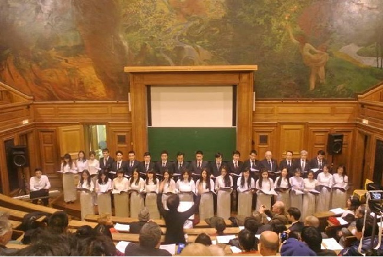
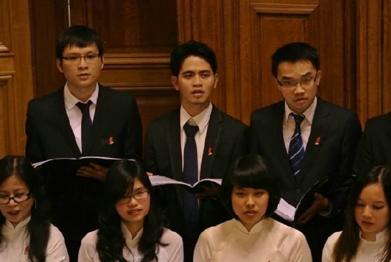

<!--
title: Một cảm nhận về tác phẩm hợp xướng «Tiếng Hát Biên Thùy»
author: Đạt
status: completed
-->

Lời Ban biên tập : 

Hợp xướng « Tiếng hát biên thùy » hay « Tiếng hát người chiến sỹ biên thùy » của Nhạc sỹ Tô Hải là một trong những tác phẩm viết cho hợp xướng 4 bè và dàn nhạc giao hưởng đầu tiên của Việt Nam.

Cùng với Trường ca Sông Lô của Văn Cao, Du kích Sông Thao của Đỗ Nhuận, Người Hà Nội của Nguyễn Đình Thi, Hồi tưởng của Hoàng Vân và Ca ngợi Tổ quốc của Hồ Bắc.

Tiếng hát biên thùy là một trong những tác phẩm hợp xướng quy mô nhất nằm trong kho tàng tác phẩm mà Hợp ca Quê hương đã dàn dựng thành công.

  
*Buổi Hòa nhạc tại Đại học Panthéon-Sorbonne Paris 1 vào ngày 18 tháng 1 năm 2014 kết thúc colloque internationnal “ La France, l’Europe et le Viêtnam depuis 1954 ”*

 Dưới đây, xin giới thiệu cảm nhận của một thành viên trẻ của Hợp ca Quê Hương      

Tôi đến với Hợp ca Quê hương chỉ mới được một thời gian ngắn. Và cũng trong khoảng thời gian ngắn ngủi đó, tôi mới được biết đến « Tiếng Hát Biên Thùy ». Bản hợp xướng « Tiếng Hát Biên Thùy » của nhạc sỹ Tô Hải là một tác phẩm hay cả trong giai điệu lẫn ca từ. Ngay buổi đầu tiên ngồi hát bài này với Hợp ca, tôi đã cảm nhận được cái đẹp của tác phẩm và cũng là cái tài hoa của người nhạc sỹ. Càng yêu, tôi càng cảm thấy cái sự hiểu biết của mình còn non kém lắm bởi vốn dĩ trước đây tôi cũng là người đam mê dòng nhạc chính thống mà sao chưa bao giờ nghe qua cái tuyệt phẩm này. Thật không biết mình còn bỏ qua bao nhiêu cái đẹp, cái hay trong văn hóa dân tộc nữa ?

Tiếng hát biên thùy có 4 chương như là bốn bức tranh thật đẹp được nhạc sỹ Tô Hải vẽ lên bằng những nốt nhạc thật tài tình. Đó là những bức tranh có màu sắc, có thanh âm khắc họa nên  có khi  là cái tuyệt mỹ  đến thuần khiết trong cảnh vật,  có khi là cái đẹp lắng đọng trong lòng người.

Ta bắt gặp ngay ở chương đầu tiên của bản hợp xướng cái khung cảnh của một buổi chiều dần buông. Không gian gần như đứng lặng trong dòng chảy chầm chậm của thời gian. Chỉ bằng một sự miêu tả điểm xuyết « sương  chiều dần dần buông » xen trong cái xao xác lá của cây rừng cộng với giai điệu nhẹ nhàng và những nốt trầm ở cuối, câu mở đầu của chương,cũng là mở đầu cho một không gian chốn biên thùy lúc chiều xuống, đẹp đến lạ kỳ. Cái đẹp đó càng được tôn lên khi câu mở đầu này được vang lên bằng các giọng basso (nam trầm) – chất giọng có khả năng thể hiện sâu sắc tính biểu cảm, lắng đọng. Chương 1 tiếp tục với giai điệu dàn trải, nhẹ nhàng với những âm thanh vang vọng là tiếng chim bay đi tìm đàn, tiếng gió reo, tiếng sáo vi vu hay tiếng cồng vang… Tất cả những âm thanh ấy như văng vẳng trong không gian gợi lên một buổi chiều biên giới đang chầm chậm buông xuống.  Giai điệu, ca từ của chương 1 mang tính hình tượng thật sâu sắc khi đưa người nghe hình dung ra một khung cảnh núi rừng hùng vĩ  mà thân thương của Tổ Quốc.

Nếu như chương 1 đẹp với giai điệu nhẹ nhàng, chậm rãi thì cái đẹp ở chương 2 lại ở chỗ tiết tấu nhanh. Những đoạn nhạc dồn dập, lên xuống tạo cho người nghe cảm giác gập ghềnh, khúc khuỷu của dốc núi trên đường hành quân. Với tiết tấu nhanh ấy, tác giả dẫn dắt  người nghe đến với hình ảnh người chiến sỹ hối hả băng rừng, băng đèo hành quân với ý chí vượt lên khó khăn để « núi rừng biên thùy không còn bóng giặc », « núi rừng biên thùy sao cờ bay » ngân dài ở cuối chương. Chương hai ngoài những đoạn nhạc dồn dập còn là sự hiện diện của những đoạn nghỉ xen giữa là những điểm nhấn đánh thức người nghe đến với những khoảng dừng giữa hừng hực khí thế hành quân trải dài trong cả chương.

Có người bạn trong Hợp ca bảo với tôi rằng anh thích chương 3 nhất bởi anh khoái cái da diết trong từng câu hát khi giọng solo tenor (giọng nam cao lĩnh xướng) vang lên. Quả thật như vậy, chương ba xứng đáng là chương lay động lòng người nhất trong cả bốn chương. Mỗi một câu solo vang lên như là một câu thổn thức từ đáy lòng của người chiến sỹ chiến đấu xa quê hương. Hình ảnh người chiến sỹ chiều chiều đứng trên đỉnh núi ngó trông xa xa về quê hương, nơi có người thân yêu đang chờ mong anh , nơi có tiếng ca vang lên trong những đêm đập lúa dưới trăng rằm… được khắc họa thật rõ nét. Không những thế, giai điệu khoan thai mà da diết, ngân dài vang mãi ở cuối câu và những đoạn hát đệm của các bè cho giọng solo đã khẳng định sự tài hoa của tác giả trong việc miêu tả nội tâm của chủ thể trữ tình với nỗi nhớ nhà, nhớ quê hương da diết ở chỗ biên thùy xa xôi. Tình yêu quê hương da diết đó trở thành tinh thần vững chắc để vượt qua khó khăn gian khổ. Hòa giọng cả bốn bè ở đoạn cuối như lời đồng thanh khẳng định sự quyết tâm ấy – quyết tâm vượt qua gian lao bằng tiếng gọi tình yêu với tổ quốc, non sông.

Chương 4 kết thúc bản hợp xướng bằng giai điệu nhịp nhàng, tràn đầy sức trẻ. Tiết tấu hoạt bát như giục giã làm hân hoan cảm xúc người nghe. Nhiệt huyết của chiến sỹ, nhân dân với công cuộc bảo vệ, lao động và kiến thiết Tổ Quốc như hòa vào dòng chảy nhanh của giai điệu trong chương. Những đoạn hát nối giữa các bè nam nữ như đối đáp nhau tạo ra cho người nghe cảm giác vui vẻ, đồng lòng quân dân trong tình yêu quê hương. Cuối chương là những đoạn ngân dài nối nhau dường như thôi thúc mãi cái nhiệt huyết ấy mãi về sau.

Về bố cục của tiếng hát biên thùy, ta nhận thấy sự xen kẽ giữa các chương có tiết tấu nhanh và các chương có tiết tấu chậm rãi, khoan thai. Như vậy, khi trình bày bản hợp xướng, cảm xúc người nghe sẽ được dẫn dắt theo từ giai điệu nhẹ nhàng, tinh tế mang tính biểu tượng tạo nên bức tranh núi rừng hùng vĩ của tổ quốc đến hừng hực khí thế vượt đèo, vượt núi để bảo vệ tổ quốc, rồi lắng lại với nỗi nhớ, niềm thương về quê hương xa xôi, về tình yêu đất nước trong con sâu thẳm tâm hồn người chiến sỹ, và kết thúc bằng không khí hân hoan giục giã. Có thể nói bản hợp xướng đã khơi gợi nên tình yêu thiêng liêng về tổ quốc tươi đẹp và anh hùng trong mỗi người.

Trong các cuộc thi âm nhạc, người ta thường đề cao tính biểu cảm trong giọng hát. Một giọng hát khỏe, hát đúng hết các nốt chưa chắc đã là hay bởi đôi lúc nó thiếu đi cái tình trong khi hát. Điều này vốn do cảm thụ bài hát của mỗi người và cách chuyển tải những sự cảm đó vào trình diễn. Hợp ca Quê hương chúng ta thật may mắn và tự hào khi quy tụ nhiều giọng hát đẹp. Chúng ta nên phát huy hơn nữa cái vốn có quý giá đó bằng việc cảm thụ sâu sắc tác phẩm để chuyển tải được cái đẹp, cái hay mà người nhạc sỹ gửi gắm như trong bản hợp xướng « Tiếng Hát Biên Thùy » này. 

*Xuân Tuấn. Paris ngày 3 tháng 1 năm 2014*

Có thể nghe: 

[ở đây](http://baicadicungnamthang.net/bai-hat/tieng-hat-nguoi-chien-si-bien-thuy-862.html)

[ở đây](http://www.bbc.co.uk/vietnamese/culture/2009/04/090406_tohai.shtml)

