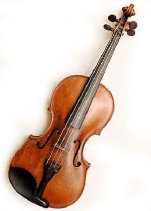
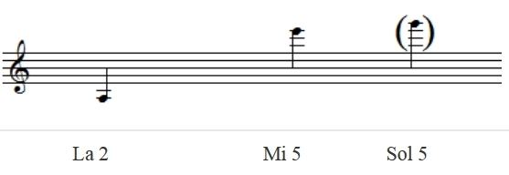
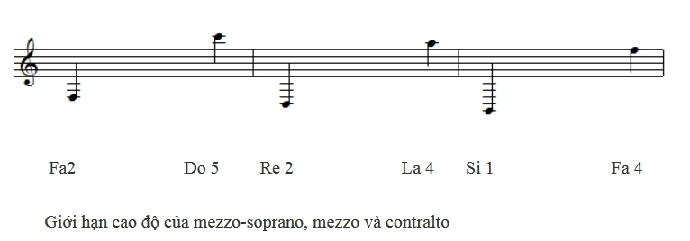

<!--
title: Thanh Nhạc
author: Nguyễn Tích Kỳ
status: completed
-->

#  Thanh Nhạc

  
*Vo Duy* 

**Phần 1**

*Ngược về quá trình phát triển của nhân loại, âm nhạc nói chung và hoạt động ca hát nói riêng chắc hẳn đã hình thành từ rất sớm, xuất phát từ các hoạt động tôn giáo, sinh hoạt, lao động và giải trí.*

*Trải qua hàng chục thế kỷ, hoạt động ca hát vẫn luôn được con người duy trì và phát triển. Có lẽ ca hát đã trở thành một phần quan trọng đối với đời sống tinh thần của mỗi người chúng ta. Chúng ta có thể hát bất cứ khi nào, ở đâu và như thế nào: Trong các dịp vui chơi lễ hội, các hoạt động tính ngưỡng, khi vui, lúc buồn, và thậm chí chẳng cần bất cứ một lý do đặc biệt nào cả. Bởi lẽ, bên cạnh ngôn ngữ, ca hát là một hình thức khác mà con người sử dụng để thể hiện suy nghĩ, tình cảm hay cảm xúc của mình một cách tinh tế hơn, khéo léo và nghệ thuật hơn.*

*Ca hát, đó là một sự kết hợp hài hòa giữ ngôn ngữ và khí nhạc (âm nhạc được viết riêng cho nhạc cụ diễn tấu). Cùng với sự phát triển và hệ thống hóa nói chung của nền âm nhạc, ca hát đã trở thành một bộ môn nghệ thuật, gọi là thanh nhạc, hết sức phong phú, tinh tế, đòi hỏi nhiều kỹ thuật cũng như sự tập luyện cần mẫn.*

*Thật khó, và gần như không thể, để có thể hát hay và chuẩn xác trong một sớm một chiều: Chúng ta cần có thời gian tập luyện. Một vài người may mắn có được giọng hát “trời phú”, ví dụ những diva (nữ danh ca) hay divo (nam danh ca) mang tầm vóc quốc tế. Họ có những kỹ thuật thanh nhạc trao chuốt, điêu luyện và hết sức riêng biệt. Tuy nhiên, để có thể làm chủ và phát huy tối đa nội lực của giọng hát, họ phải trải qua hàng chục giờ tập luyện mỗi ngày. Và câu hỏi đặt ra là tập luyện như thế nào?*

*Để trả lời cho câu hỏi ấy, trước tiên chúng ta cần xác định rõ loại giọng hát mà chúng ta đang sở hữu. Trong kỹ thuật thanh nhạc, sáu nhóm giọng hát lớn bao gồm: ***soprano, mezzo, contre-ténor, ténor, baryton*** và ***basse***. Thông thường, phụ nữ và trẻ em sở hữu những giọng hát thuộc nhóm soprano và mezzo. Và dĩ nhiên những giọng hát thuộc các nhóm còn lại dành cho đàn ông.*

***Soprano là giọng hát cao nhất trong tất cả các loại giọng hát.***

***Chúng ta có năm loại giọng soprano khác nhau:***

**Soprano colorature:** Đây là giọng hát cực kỳ nhẹ, cao, âm sắc gần giống tiếng sáo. Người sở hữu giọng hát này có thể hát những nốt cực kỳ cao, thực hiện những nốt giật hoặc xướng nguyên âm (vocaliser) một cách dễ dàng. Trong nền âm nhạc cổ điển, một số vai diễn opéra đòi hỏi giọng hát này như Nữ hoàng bóng tối trong vở “La Flute enchantée” của Mozart hoặc Zerbinette trong “Ariante à Naxos” của Richard Strauss. Những nữ danh ca sở hữu chất giọng này có thể nhắc đến Mado Robin, Nathalie Dessay, Patricia Petibon, Aline Kutan.

**Soprano lyrique léger:** Giọng nữ này có thể đạt tới những nốt cao nhưng không chói tai. Với tính chất nồng ấm và cháy bỏng, giọng hát này có thể dễ dàng tìm thấy trong các vở opéra của Mozart như vai Ilia trong “Idoménée” hoặc Despiano trong “Cosi fan lutte”. Ngoài ra còn có các vai khác như Leila trong “Les Pêcheurs de perles » của Bizet hoặc Oscar trong vở « Un bal masqué » của Verdi. Nhắc đến giọng hát nữ này, chúng ta có thể nghĩ đến Kethleen Battle, Elly Amelling hoặc Camilla Tilling

**Soprano lyrique :** Đây là giọng nữ phổ biến nhất với tính chất trữ tình lãng mạn. Vì vậy giọng hát này thường sử dụng cho những vai diễn thể hiện tính chất bi kịch như những nạn nhân, những người đau khổ, hoặc những người bị xã hội chèn ép, chà đạp . Ví dụ như vai diễn La Comtess trong « Les Noces de Fiagro » của Mozart, Michaela trong « Carmen » của Bizet, Tatiana trong « Eugène Onéguine » của Tchaikowski. Elisabeth Schwarzkopf  hoặc Gundula Janowitz là những ví dụ tiêu biểu cho giọng hát này.

**Soprano lirico-spinto :** So với soprano lyrique, giọng hát này thể hiện tính chất kịch (dramatique) nhiều hơn. Với tính chất nồng nàn, da diết nhưng mãnh liệt, giọng hát này được sử dụng trong các vở opera của Ý vào nửa cuối thế kỷ 19, tiêu biểu vai Madame Butterfly trong vở « La Bohème » của Puccini Mimi. Những nữ danh ca sở hữu chất giọng này có thể nhắc đến Mirella Freni, Anna Netrebko hoặc Ana-Maria Martinez.

**Soprano dramatique :** Giọng nữ này đặc biệt mạnh mẽ, dày và đầy kịch tính. Chúng ta có thể tìm thế giọng hát này ở những vai diễn như Élisabeth trong vở « Tannhauser » của Wagner hoặc Amelia trong « Un bal masqué » của Verdi. Birgit Nilson, Anja Siljia hoặc Deborah Polasky là những nữ danh ca tiêu biểu cho loại giọng hát này.

  

Giới hạn cao độ của Soprano
           
Soprano và mezzo khác nhau cơ bản ở giới hạn cao độ và âm sắc. Trong trường hợp đặc biệt, giọng mezzo có thể thể hiện những nốt có cao độ như soprano, nhưng ở một trường độ giới hạn. Mezzo được chia thành ba loại giọng khác nhau :

**Mezzo-soprano :** Đây là giọng hát sở hữu giới hạn cao độ gần với soprano nhưng với một âm sắc của mezzo. Giọng hát này được sử dụng phổ biến trong vai xướng nguyên âm, vai giả trang (role de travesti)  hoặc vai cô nhài (soubrette). Phần  lớn những tác phẩm lãng mạn vào thế kỷ 19 xem soprano và mezzo-soprano là một. Tuy nhiên những nghiên cứu chi tiết về thanh nhạc đã xác định sự khác biệt của hai loại giọng hát này. Mezzo-soprano thể hiện rõ chất giọng đặc thù của mezzo, ngay cả khi ở những nốt cao của soprano. Với tính chất đó,  mezzo-soprano có thể được sử dụng nhưng một soprano léger, và được gọi là mezzo-soprano léger hoặc Dugazon (gọi theo theo tên của một nữ danh ca người Pháp Louise Dugazon, 1755-1821)  . Ví dụ vai Chérubin trong vở « Les Noces de Figaro » của Mozart, Stéphano trong « Faust » của Gounod, Zerline trong « Don Giovanni » của Mozart. Frederica von Stade và Anne-Sofie von Otter là những ví dụ tiêu biểu cho loại giọng này.

**Mezzo :** Và đây là giọng hát của những người đàn bà hay làm say đắm lòng người, những mụ phù thủy, những người mẹ hay người chị cau có, khó chịu ! Đây cũng là giọng hát khó chinh phục khán giả nhất. Bởi vì giọng hát này thể hiện, một lần nữa, cao độ gần giống với soprano, nhưng âm sắc thật trầm  ấm, dày và tràn đầy kịch tính, có phần bí ẩn và ma quái. Những ví dụ điển hình  cho loại giọng hát này là Dalila trong vở opéra dựa trên Kinh Thánh « Samson et Dalila » của Saint- Saens, vai Azucena trong vở « Le Trouvère » của Verdi. Những nữ danh ca sở hữu chất giọng này có thể nhắc đến Béatrice Uria-Monzon, Patricia Bardon, Jane Henschel và Olga Boro Dina.

**Contralto** (hay alto) : Đây là giọng hát thấp nhất trong ba loại, và cũng là hiếm nhất ! Với tính chất trầm, dầy, sâu lắng và vang rền, contralto được sử dụng nhiều trong âm nhạc oratô (oratorio). Oratô là một thể loại nhạc kịch lãng mạn không dàn dựng sân khấu, cũng không trang phục như opéra, chủ yếu cho người hát lĩnh xướng (solo), hợp xướng và dàn nhạc giao hưởng. Chủ đề của oratô lấy cảm hứng từ những câu chuyện Kinh Thánh hay những câu chuyện  thần thoại. Quay trở lại giọng contralto, chúng ta có thể thấy rõ qua vai diễn Ulrica trong vở « Un bal masqué » của Verdi. Những nữ danh ca contralto nổi tiếng có thể nhắc đến Nathalie Stutxman hoặc Marie-Nicole.

**(còn tiếp)**

***Tham khảo thêm - Les autres articles*** 

[Thanh Nhac bai 02  ](/#post/2014-03-27%20%20Thanh%20Nhac%20bai%2002) 

