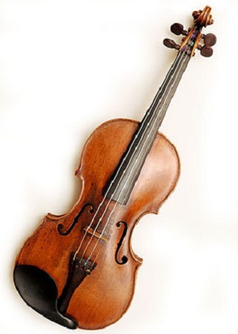

<!--
title: Thanh Nhạc (tiếp theo)
author: Nguyễn Tích Kỳ
status: completed
-->

# Thanh Nhạc 
*(tiếp theo và hết)*

  
*Võ Duy*

*Và bây giờ chúng ta sẽ tìm hiểu chi tiết về các loại giọng nam.*  
*Như đã đề cập ở phần trước, trong thanh nhạc, chúng ta có 2 nhóm giọng của phụ nữ và trẻ em:*
***Soprano, mezzo;***

*Và 4 nhóm giọng của đàn ông :* ***contre-ténor, ténor, baryton và basse.***  
*Tương tự như soprano, ténor là loại giọng có khả năng “kích động” khán giả với những nốt nhạc cao vút đầy ấn tượng:*

**Haute-contre:** Đây là loại giọng ténor đặc biệt xuất hiện trong kho tàng âm nhạc Pháp thế kỷ XVII và XVIII, tiêu biểu như nhạc của Lylly, Rameau và Charpentier. Jean-Paul Fouchécourt là một ví dụ điển hình cho loại giọng này.  

**Ténor léger** (ténor di grazia trong tiếng Ý): Đây là loại giọng hát có âm sắc nhẹ với khả năng xướng nguyên âm dễ dàng những nốt cao vút. Vai trò của loại giọng hát này được tìm thấy trong những vở opera của Mozart như vai Belmonte trong “L’enlèvement au sérail”, Tamino trong “Cây sáo thần” hoặc Ottavio trong “Don Giovanni”. Những nam ca sĩ tiêu biểu cho loại giọng này có thể nhắc đến: John Osborn, Paul Groves hoặc Alfredo Kraus.
    
**Ténor lyrique:** Tương ứng với giọng soprano lyrique, đây là loại giọng có khả năng làm “lung lay” những nữ soprano hoặc “tái mặt” những nam baryton. Những nam ténor này thường thực hiện những vai diễn với tính lãng mạn trữ tình cao, có thể làm tan chảy lòng khán giả như Don José trong “Carmen” của Bizet, Rodolfo trong “La Bohème” của Puccini. Luciano Pavarotti,  Ramon Vargas hoặc  Roberto Alagna là những ví dụ tiêu biểu cho loại giọng này

**Ténor dramatique:** Đây là loại giọng dành cho những người yêu thích những tác phẩm có tính trữ tình cao với những vai diễn có chiều sâu tâm lý và tình cảm. Trong nền âm nhạc Đức, loại giọng này được gọi là Heldentenor. Loại giọng này được sử dụng cho những vai diễn như Samson trong “Samson và Dalula” của Saint-Saens. Lauritz Melchior và Jon Vickers là một trong ít người sở hữu giọng hát này.

Baryton là loại giọng nam phổ biến nhất. Trong một dàn hợp xướng không chuyên, 50-60% của giọng ténor là loại giọng baryton này. Nhưng dĩ nhiên, trong thanh nhạc opera, baryton có những đặc tính hết sức riêng biệt của nó

**Baryton martin:** Tương tự như giọng Dugazon (mezzo-soprano) trong nhóm mezzo của nữ, loại giọng này được đặt tên theo nam danh ca Jean-Blaise Martin (1790-1820) với một sắc thái nhẹ và những đặc điểm âm sắc của ténor, nhưng không sáng bằng. Chúng ta có thể tìm thấy loại giọng này trong kho tàng opéra và opéra hài của Pháp hoặc những vở opérette thành Viên (Áo) như vai Danil trong vở “La veuve joyeuse” của Lehár. Camille Maurane là nam ca sĩ sở hữu những kỹ thuật điêu luyện cho loại giọng này.

**Baryton Verdi:** Chính nhà soạn nhạc Verdi đã sáng tạo ra loại giọng hát này, với âm sáng sáng, có khả năng đạt đến những nốt cao đáng kinh ngạc mặc dù loại giọng này có vẻ mềm mại, nhẹ nhàng. Những vai diễn điển hình cho loại giọng này là Germont trong “La Traviata” hoặc Le Comte de Luna trong “Le trouvère”. Piero Cappuccilli, Carlos Alvarez là những ví dụ điển hình cho loại giọng này.

**Baryton lyrique :** Đây là loại giọng phổ biến nhất trong kho tàng opera. Bên cạnh những nhân vật có diễn biến tâm lý phức tạp, những baryton lyrique còn có thể thể hiện vai diễn những người trẻ tuổi, tự do, phóng khoáng và vô tư lự. Ví dụ vai Figaro trong vở « Le Barbier de Séville » của Rossini, Mercutio trong « Roméo và Juliette » của Gounod. Nhắc đến loại giọng này, chúng ta có thể kể đến Jean-Luc Chaignaud, Franck Rerrari hoặc Thomas Hampson.

**Baryton-basse :** Đây là loại giọng baryton đặc biệt với những nốt thấp và âm sắc gần với giọng basse. Một vài vai diễn tiêu biểu cho loại giọng này như Figaro trong « Les Noces de Figaro » của Mozart. Ngoài ra, baryton-basse có thể đảm nhận vai trò basse trong kho tàng opera Pháp như Méphisto trong vở « Faust » của Gounod. Chúng ta có thể nhắc đến Ruggero Raimondi, José van Dam hoặc Bryn Terfel.

Giọng basse là một loại giọng thấp nhất trong các loại giọng, dành cho những người cha, những vị vua, những vị linh mục, những người lớn tuổi, thông minh và tràn đầy kinh nghiệm. Thật khó để có được giọng basse hoàn hảo ở lứa tuổi 20 !

**Basse chantante :** Đây là loại giọng basse phổ biến nhất. Thỉnh thoảng loại giọng này đảm nhiệm vai trò của baryton-basse khi người ta muốn âm sắc trầm hơn. Basse chantante có thể thực hiện hoàn hỏa những nốt cao, với tính chất trầm, ấm và đầy màu sắc. Những ví dụ tiêu biểu cho loại giọng này là vai Philippe II trong vở « Don Carlo » của Verdi, hoặc Colline trong « La Bohème » của Puccini. Chúng ta có thể nhắc đến Nicolai Ghiaurov hoặc Ferruccio Furlanetto là những nam danh ca điển hình.

**Basse profonde :** Giọng basse này có thể thể hiện những giai điệu của đại dương sâu thẳm ! Từ Sarastro trong vở « Cây sáo thần » của Mozart đến Ramfis trong « Aida » của Verdi là những vai diễn ấn tượng nhất dành cho basse profonde. Kurt Moll hoặc Robert Lloyd là những ví dụ điển hình nhất cho giọng hát này.

**Basse bouffe :** Sau những vai diễn mang tính chất kịch tính, nghiêm túc, chúng ta cũng cần những người hài hước, có khả năng cười nhạo ! Đó có thể là là Osmin trong « l’Enlèvement au sérail » và Leporello trong « Don Giovanni » của Mozart. Để thể hiện tính chất hài, người hát không chỉ có những kỹ năng điêu luyện, mà còn phải có khả năng điều khiển giọng hát của mình thực hiện những nốt nhanh, thấp và những câu nhạc dài có thể làm « đứt hơi » người hát. Chúng ta có thể kể đến Carlos Feller, Carlos Chausson và Ambrogio Maestri.

**Contre-ténor :** Đây là loại giọng hát cao hơn cả ténor, sử dụng một kỹ thuật đặc biệt gọi là fausset : Người hát sẽ hạn chế tối đa sự co cơ thanh quản, và kết quả tạo ra một loại giọng hát cao vút, nhẹ và có phần kim loại. Loại giọng này được tìm thấy ở trẻ em trước khi vỡ giọng. Vì thế ở những người hát trưởng thành, contre-ténor có thể được xem là hậu duệ của giọng castrat (giọng « thiến », là một hình thức bảo tồn giọng hát trước khi vỡ giọng để đạt được những nốt cao và thanh nhất có thể). Trước khi contre-ténor ra đời (và ngay cả bây giờ), những mezzo sẽ đảm nhận vai trò của giọng hát này. Contre-ténor có những nét giống với giọng alto. Chúng ta có thể tìm thấy loại giọng này trong kho tàng âm nhạc thế kỷ XVII và XVIII của Anh như Pucell, của Ý như Haendel hoặc Vivaldi. Ở thế kỷ XX chúng ta có vai Edgar trong « Lear » của Reimann. Những nam danh ca sỡ hữu giọng hát này có thể nhắc đến Robert Expert hoặc Philippe Jaroussky.

Và bây giờ, sau khi đã có cái nhìn tổng quát về các loại giọng, chúng ta sẽ quay trở lại với câu hỏi : Làm thế nào để xác định được giọng hát mình đang sở hữu ? Dĩ nhiên việc thẩm định này đòi hỏi những chuyên môn và kỹ thuật cao để có thể có được câu trả lời chính xác. Tuy nhiên, trong điều kiện không cho phép, chúng ta có thể tự tiến hành tìm câu trả lời bằng cách thực hiện những điều sau đây. Trước tiên, chúng ta hãy nghe những bản thu của các nghệ sĩ hoặc tìm kiếm các thông tin về những nghệ sĩ này. Nếu chúng ta đã biết những nghệ sĩ có loại giọng tương tự nhưng cái mình đang sở hữu, chúng ta hãy xem những vai diễn họ đang đóng. Khi chúng ta đã nắm được một vài thông tin trên và có thể dự đoán được loại giọng mình đang có, chúng ta hãy trả lời tiếp những câu hỏi sau :

Âm sắc của giọng hát là gì ? Khi hát, chất giọng của bạn có tính kim loại sắc bén hay ngọt ngào như chocolat ?

Giọng hát của bạn có nhẹ nhàng và bay vút như tiếng sáo ? Hay vang rền và nặng nề khi bạn hát một cách tự nhiên, không gượng ép ?

Giới hạn cao độ của bạn là ở đâu ? Thông thường, sự khác nhau giữa mezzo và soprano chỉ là ở cao độ. Mezzo có thể hát những nốt cao như soprano, nhưng không thích ngân dài, và soprano thì ngược lại.

Thông qua loạt bài này và những loạt bài sắp tới, chúng tôi mong muốn  giới thiệu đến các bạn những kiến thức cơ bản trong kỹ thuật thanh nhạc, với mục đích hệ thống hóa và giúp đỡ phát triển giọng hát các bạn đang sở hữu. Bên cạnh đó, chúng tôi cũng hy vọng sẽ đem lại cho các bạn những kiến thức văn hóa và nghệ thuật mà chúng tôi sưu tầm hoặc tích góp được.

*Paris 26.03.2014*

