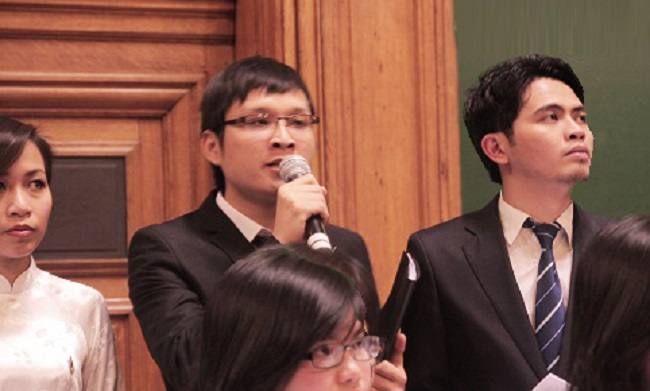
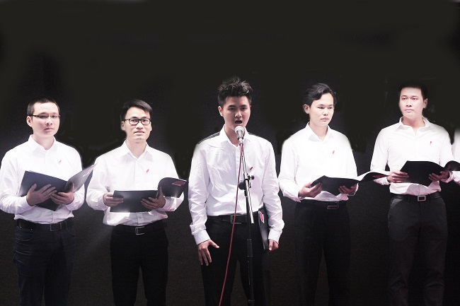

<!--
title: Cảm nghĩ về hai bản hùng ca: GIAI ĐIỆU TÔ QUỐC và TÔ QUỐC GOỊ TÊN MÌNH
author: Tich Ky
status: completed
-->

Cảm nghĩ về hai bản hùng ca :

« Giai điệu Tổ Quốc » của Trần Tiến
« Tổ Quốc gọi tên mình » nhạc Đinh Trung Cẩn thơ Nguyễn Phan Quế Mai

Tổ Quốc có lẽ là hai từ thiêng liêng và đẹp đẽ nhất trong lòng mỗi người Việt Nam. Dù ở bất cứ nơi đâu, trong bất cứ hoàn cảnh nào, khi nhắc đến “Tổ Quốc”, chúng ta đều trào dâng một niềm cảm xúc khó tả. Dãi đất hình chữ S trải dài bên bờ biển Đông với nét đẹp ngàn năm văn hiến đã trở thành đề tài bất tận cho biết bao thi sĩ, văn sĩ và nhạc sĩ. Tổ Quốc trong tiềm thức của mỗi chúng ta là quê hương nơi sinh ra ta, là gia đình nuôi nấng ta lớn khôn, là sự yên bình và ấm áp mà không nơi nào có được. Tổ Quốc là những dãy núi hùng vĩ, những “mặt biển xanh xa tít chân trời”, những “đồng xanh lúa rập rờn biển cả” hay những trang sử hào hùng của cha anh trong công cuộc chống giặc ngoại xâm,  xây dựng, bảo vệ và kiến thiến đất nước.

Thời gian vừa qua, Hợp ca Quê Hương đã có cơ hội trình bày hết sức thành công ca khúc “Giai điệu Tổ Quốc” (GDTQ) của nhạc sĩ Trần Tiến tại giảng đường Đại học Sorbone và trụ sở UNESCO.
 

Và gần đây nhất, tốp ca nam của Hợp ca Quê Hương cũng thể hiện tác phẩm “Tổ quốc gọi tên mình” (TQGTM) của nhạc sĩ Đinh Trung Cẩn phổ từ bài thơ “Tổ quốc gọi tên » của tác giả Nguyễn Phan Quế Mai tại Trung tâm Văn hóa Việt Nam tại Pháp.
 

Được sáng tác trong hai giai đoạn khác nhau của lịch sử đất nước, nhưng GDTQ và TQGTM có rất nhiều nét tương đồng nhau.
Cả hai tác phẩm này đều được viết ở giọng thứ tràn đầy tình cảm nhưng không kém phần mạnh mẽ và mãnh liệt. Cái giai điệu man mác ấy được mở đầu bằng một đoạn nam lĩnh xướng :“Tôi nghe…”. Câu mở đầu được ngắt nhẹ, một cách bỏ lững, gợi cho người nghe cảm giác tò mò, háo hức và chờ đợi điều gì đó mà chính người nghe cũng muốn đồng cảm với tác giả. Đó là câu kể, nhưng đúng hơn có vẻ là câu hỏi được chính tác giả đặt ra và tự trả lời: “…tổ quốc gọi tên mình” (TQGM) và “…giai điệu tổ quốc tôi” (GDTQ). Bằng cách vào đề trực tiếp, cả hai bản nhạc đều khiến người nghe phải tò mò và theo dõi diễn biến của bài hát. Tôi đang nghe tiếng Tổ Quốc tôi. Vì sao và như thế nào?

1-Tôi nghe giai điệu Tổ Quốc tôi dịu dàng trong tiếng ru hời
Tôi nghe giai điệu Tổ quốc tôi, trầm sâu như tiếng đất trời
Tôi nghe trong lời yêu nhau, tôi nghe trong lời tha thiết
Phút hành quân mẹ tiễn đưa con
Giai điệu nhớ, giai điệu thương theo suốt cuộc đời.
(ĐK)
Và tôi yêu, và tôi hát, lời yêu thương, lời bỏng cháy
Tháng ngày này đất nước ơi, Tổ quốc của chúng tôi…
Và tôi yêu, và tôi hát, lời yêu thương, lời bỏng cháy
Tháng ngày này đất nước ơi, Tổ quốc của chúng tôi…

2-Tôi nghe giai điệu Tổ quốc tôi, thầm mang bao nỗi vui buồn
Tôi nghe giai điệu Tổ quốc tôi, hùng thiêng trong tiếng chiêng đồng
Tôi nghe trong đoàn quân đi, tôi nghe trong lời bão tố
Bốn ngàn năm đất nước gian nan
Giai điệu cháy trong tình thương nước vô vàn

Được viết vào năm 1980, Tổ Quốc trong ca khúc GDTQ được nhạc sĩ Trần Tiến gợi lên bằng những “tiếng ru hời” hay những “lời tha thiết”. Tổ Quốc của Trần Tiến là cả bầu trời tuổi thơ, là những “giai điệu nhớ, giai điệu thương”, chắc chắn sẽ  “theo suốt cuộc đời” của mỗi đứa con Việt Nam.

Lịch sử của dân tộc Việt Nam đã trải qua “bốn ngàn năm đất nước gian nan” với những cuộc chiến đấu bất khuất vì độc lập, tự do và vì một đất nước “hùng thiêng trong tiếng chiêng đồng”.  Đó là lý do “Tổ Quốc” của Trần Tiến chứa đựng những hình ảnh hào hùng của “đoàn quân đi” nơi chiến trường và cảnh “phút hành quân mẹ tiễn đưa con” nơi hậu phương. Dù trong thời bình hay trong thời chiến, dù trong những lúc “thầm mang bao nỗi vui buồn”, những giai điệu đẹp của Tổ Quốc vẫn luôn luôn hiện hữu trong tình thương nước vô vàn”.

TỔ QUỐC GỌI TÊN thơ Nguyễn Phan Quế Mai

Đêm qua tôi nghe Tổ Quốc gọi tên mình
Bằng tiếng sóng Trường Sa, Hoàng Sa dội vào ghềnh đá
Tiếng Tổ Quốc vọng về từ biển cả
Nơi bão tố dập dồn, chăng lưới, bủa vây
Tổ Quốc của tôi, Tổ Quốc của tôi
Bốn nghìn năm chưa bao giờ ngơi nghỉ
Thắp lên ngọn đuốc hòa bình, bao người đã ngã
Máu của người nhuộm mặn sóng biển Đông
Ngày hôm nay kẻ lạ mặt rập rình
Chúng ngang nhiên chia cắt tôi và Tổ Quốc
Chúng dẫm đạp lên dáng hình đất nước
Một tấc biển cắt rời, vạn tấc đất đớn đau
Sóng chẳng còn bình yên dẫn lối những con tàu
Sóng quặn đỏ máu những người đã mất
Sóng cuồn cuộn từ Nam chí Bắc
Chín mươi triệu môi người thao thức tiếng “Việt Nam”
Chín mươi triệu người lấy thân mình chở che Tổ Quốc linh thiêng
Để giấc ngủ trẻ thơ bình yên trong bão tố
Ngọn đuốc hòa bình trên tay rực lửa
Tôi lắng nghe Tổ Quốc gọi tên mình
 
Ra đời trong cuộc vận động sáng tác ca khúc về chủ đề biển đảo của Hội Nhạc sĩ Việt Nam, “Tổ Quốc gọi tên mình” do nhạc sĩ Đinh Trung Cẩn phổ thơ Nguyễn Phan Quế Mai là một cái nhìn khác về Tổ Quốc. Đó là cái nhìn mang tính “thời sự”, cái nhìn của một đứa con đang ở phương xa nhưng trái tim luôn hướng về quê hương Việt Nam. Bài thơ được tác giả Nguyễn Phan Quế Mai sáng tác khi đang công tác tại Bỉ và khi tình hình “biển Đông” trở nên căng thẳng tại quê nhà.
Nếu “Tổ Quốc” của Trần Tiến là những giai điệp đẹp đẽ, nhẹ nhàng của tuổi thơ, là nét đẹp trầm hùng trong những giai đoạn thăng trầm của lịch sử, thì “Tổ Quốc” của nhà thơ Nguyễn Phan Quế Mai hiện lên là lời kêu gọi tha thiết của đất nước tới mỗi người con Việt Nam trong hoàn cảnh mới. Với trái tim thao thức và tấm lòng luôn hướng về quê nhà, nhà thơ luôn theo dõi tình hình Việt Nam và trải lòng “nghe Tổ Quốc gọi tên mình”. Trong tình hình căng thẳng về vấn đề biển Đông, tình yêu quê hương đất nước tiềm ẩn trong mỗi đứa con Việt Nam được đánh thức mạnh mẽ “bằng tiếng sóng Trường Sa, Hoàng Sa dội vào ghềnh đá”. Và rồi “Tiếng Tổ quốc vọng về từ biển cả”, từ nơi xa xôi ấy, “nơi bão tố dập dồn, chăng lưới, bủa vây”. Tương tự như hình ảnh Tổ Quốc « bốn ngàn năm đất nước gian nan »  của Trần Tiến, Tổ Quốc của Nguyễn Phan Quế Mai là một đất nước “bốn nghìn năm chưa bao giờ ngơi nghỉ”. Trải qua bao thăng trầm, bao cuộc chiến đẫm máu, hàng triệu con người đã nằm xuống để đem lại tự do, độc lập, và để “thắp lên ngọn đuốc hòa bình”. Đứng trước nguy cơ rình rập của quân thù với mưu đồ “một tấc biển cắt rời”, cả thiên nhiên, đất nước và con người Việt Nam đều phẫn nộ, “sóng cuồn cuộn lên dáng hình đất nước”,“biết bao triệu mỗi người thao thức tiếng Việt Nam”.

Tổ Quốc của nhà thơ Nguyễn Phan Quế Mai là những hình ảnh hào hùng, thiêng liêng nhất về một đất nước “mấy ngàn năm chưa bao giờ ngơi nghỉ”, một đất nước luôn chiến đấu vì “ngọn đuốc hòa bình”. Mỗi khi đất nước lâm nguy, hàng “triệu người lấy thân mình che chở”, hàng triệu người sẵn sàng đứng lên, quyết tử cho Tổ Quốc quyết sinh.

Ở phần điệp khúc, cả hai tác phẩm đều đưa người nghe đến một cao trào, khơi gợi mạnh mẽ tình yêu quê hương đất nước. “Và tôi yêu, và tôi hát, lời yêu thương, lời bỏng cháy…”. Có lẽ, những giai điệu Tổ Quốc đẹp đẽ ấy đã ăn sâu vào tiềm thức của mỗi người con đất Việt. Chúng ta luôn tự hào về những trang sử hào hùng của Tổ Quốc và những điều đẹp đẽ nhất của dân tộc Việt Nam. Lòng yêu nước luôn ngự trị trong mỗi mỗi tâm hồn Việt. Và, nó sẽ được đánh thức một cách mãnh liệt khi Tổ Quốc lâm nguy. Là những đứa con của đất nước Việt Nam anh hùng, thế hệ được sưởi ấm bằng ngọn đuốc hòa bình từ máu thịt của cha anh, liệu chúng ta có thể đáp lại tiếng gọi của Tổ Quốc ? Liệu chúng ta có thể sẵn sàng đem hết khả năng mình để bảo vệ và kiến thiết Tổ Quốc để rồi ngọn lửa hòa bình sẽ tiếp tục soi sáng cho dân tộc Việt Nam từ thế hệ này sang thế hệ khác ? Tổ Quốc của tôi ! Tổ Quốc của tôi ơi !…

Duy Tâm
Paris 2014
 