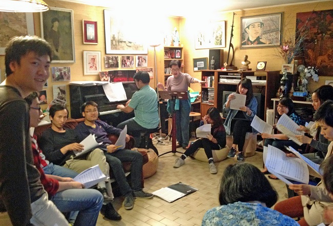
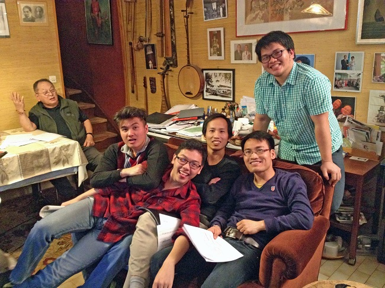
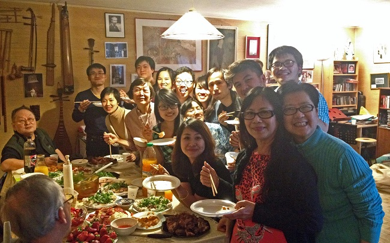
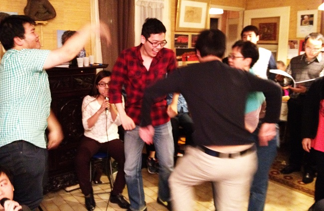

<!--
title: Chuẩn bị tiếp đón Bộ trưởng Bộ thông tin và truyền thông Nguyễn Bắc Son
author: Tich Ky
status: completed
-->
**Chuẩn bị đón Bộ trưởng Bộ thông tin và truyền thông Nguyễn Bắc Son**

 Thứ bảy vừa qua, chúng ta đã có một buổi tập thật sự đặc biệt ở nhà cô chú.
 

 
Nhà cô chú tuy không lớn nhưng vẫn đủ cho tất cả mọi người khi mà không ai ngại ngồi ngay ở sàn nếu thiếu chỗ.

Sau khoảng hai tiếng ôn bài, một bữa tươm tất với những món ăn do các đầu bếp tài ba của Hợp Ca chúng ta chuẩn bị trước và mang tới. Với châm ngôn “nhà đông con, …”, sau một vài phút ngắn ngủi cho vài photos, bàn ăn đầy ắp chả mấy chốc đã còn lại những cái đĩa trống trơn, không khí thật là vui.
 

Và, càng vui vẻ hơn với màn karaoke ngay sau đó.
 

Thứ bảy tuần này, chúng ta sẽ có buổi biểu diễn ở Trung Tâm Văn Hóa, tiếp đón Bộ trưởng Bộ thông tin và truyền thông Nguyễn Bắc Son, nhằm khai mạc triển lãm ảnh, báo chí và tuần phim “40 năm quan hệ Việt-Pháp và Việt Nam, điểm hẹn Thế giới” năm 2014 tại Paris.
Một lần nữa, chúng ta lại cùng hát vang “Giai điệu Tổ Quốc” giữa Paris, cùng lắng nghe “Tổ Quốc gọi tên mình“, và cùng nhau về với văn hóa Bắc Bộ với bài dân ca “Trống Cơm“.
 
Sau dịp này, Hợp Ca chúng ta sẽ còn tham gia nhiều sự kiện nữa cũng quan trọng không kém.
Năm nay, năm văn hóa Việt Nam tại Pháp, sẽ là một năm Hợp Ca chúng ta sẽ có nhiều cơ hội đóng góp xứng đáng trong việc làm nổi bật thêm văn hóa của đất nước thông qua hoạt động âm nhạc.
Mong rằng tất cả các thành viên Hợp Ca Quê Hương sẽ cùng chung tay góp sức để hoàn thành tốt những công việc sắp tới.

NTK 
 