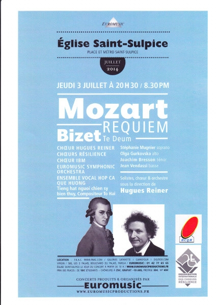
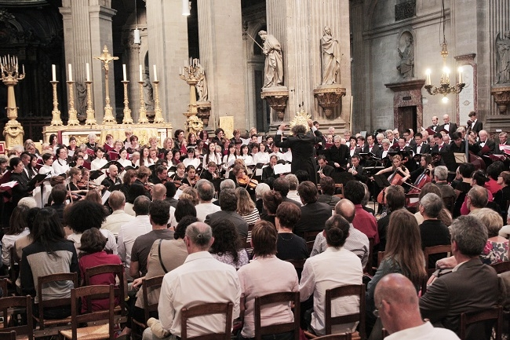

<!--
title: Sân chơi mới của Hợp Ca Quê Hương
author: Nguyễn Tích Kỳ
-->

**Hợp ca Quê Hương bước sang một giai đoạn mới**

  
*Trình diễn tại nhà thờ St Sulpice với Nhạc Trưởng Hugues Reiner . Áphich Euromusic*

Hợp ca Quê Hương ra đời năm 2009 tại Đại Sứ quán VN tại Pháp, đúng vào dịp lễ Quốc khánh Việt Nam.

Năm năm qua, Hợp ca Quê Hương đã có nhiều gắn bó với khối cộng đồng người Việt đang sinh sống và học tập tại Pháp, đã tiếp cận và giới thiệu với bạn bè quốc tế một khía cạnh văn hóa đặc sắc của Việt Nam.

**2014 năm giao lưu văn hóa Pháp/Việt**

Euromusic đứng ra tổ chức Hợp ca Quê Hương đồng diễn với Choeures Résilience bằng tiếng việt tại nhà thờ St Sulpice tác phẩm ” Người chiến sỹ biên thùy ” của Tô Hải dưới sự điều khiển của Nhạc Trưởng Hugues Reiner.
Sự kiện này, đánh dấu một bước ngoặc đáng kể trên con đường trưởng thành của Hợp ca Quê Hương.

  

Chúc Hợp ca Quê Hương tiếp tục gặt hái nhiều thành quả mới.

NTK

***Tham khảo thêm - Autres articles à consulter*** 

* [Hợp ca Quê Hương tham gia](/#post/2016-03-25%20Concert_Bach_NTD)

* [Nguyên Đại sứ Việt Nam tại Paris gửi từ Hà Nội](/#post/2012-10-12%20%20Dai%20Su%20VN%20Tai%20Paris%20gui%20tu%20HN)

* [Nghệ Thuật hợp xướng](/#post/2010-04-26%20Nghe%20thuat%20HX)

* [Thanh Nhac bai 01](/#post/2014-03-20%20%20Thanh%20Nhac%20bai%2001)
  
* [Invalide 2010-11-18](/#post/2010-11-18%20Invalide%202010-11-18)

* [Tết Nhâm Thìn - UNESSCO](/#post/2012-01-01%20tet%20nham%20thin%20unesco)

* [Tản mạn về cái hay của Tiếng Việt](/#post/2012-03-18%20%20Tan%20Man%20Ve%20Cai%20Hay%20Cua%20TV)

* [Chia sẻ](/#post/2012-03-22%20%20CHIA%20SE)

* [NguoiHaNoi](/#post/2016-09-01%20NguoiHaNoi)

  

 
 

