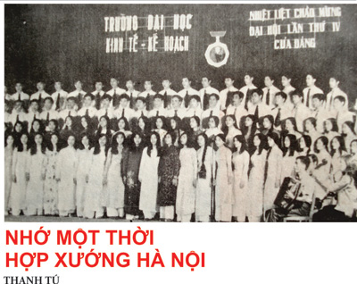

<!--
title: NHỚ MỘT THỜI HỢP XƯỚNG HÀ NỘI
author: Nga
status: completed
-->

Vừa qua, một Liên hoan hợp xướng quốc tế diễn ra tại Việt Nam đã làm ấm lòng nhiều thế hệ Hà Nội, nơi có thể nói là từng tồn tại phong trào ca hát tập thể và hát hợp xướng mạnh mẽ  hàng đầu của cả nước.Đã có người hào hứng nhắc đến một thời mà người Hà Nội và các tỉnh thành bạn yêu thích loại hình ca hát tập thể đến thế nào, phong trào “Tiếng hát át tiếng bom” hồi đó sôi nổi và hào hùng ra sao mà hễ nghĩ lại điều ấy, cùng với phong trào “Hát cho đồng bào tôi nghe” ở phía Nam trong những ngày lịch sử ta càng thấy sức mạnh lôi cuốn của thể loại ca nhạc tập thể. Tuy nhiên sau khi kết thúc Liên hoan hợp xướng quốc tế, nhiều người yêu ca hát lại nhắc đến Thủ đô ta giữa một thời hợp xướng, nếu có thể nói thế.

  Nửa thế kỷ trước, nghe hát hợp xướng là niềm vui lớn của mỗi người Hà Nội, bởi ai cũng hào hứng trước hình ảnh Bác Hồ bắt nhịp dàn hợp xướng Việt Nam hát bài ca Kết đoàn, ai cũng hào hứng thưởng thức những tiết mục hợp xướng, tuy thế, nét đẹp ấy còn được bắt nguồn từ thực tế là sự xuất hiện thường xuyên của thể loại hợp xướng trong đời sống ca nhạc của đất nước.Trải  dài theo thời gian là những dàn hợp xướng gây ấn tượng trên sân khấu ở trong nhà hay ngoài trời và ở đó âm lượng lớn của binh chủng này làm náo nức lòng người.

  Hợp xướng là loại hình thanh nhạc hết sức đặc biệt, có những yếu tố mang tính quy phạm rất cao, nhất là ở châu Âu. Hợp xướng cũng có tính đa dạng, ngoài loại hình mang nét kinh điển thì vẫn có nhiều cơ cấu khác, chẳng hạn các dàn hợp xướng giọng nam của quân đội Liên Xô, Trung Quốc rất nổi tiếng hay các hợp xướng giọng nữ, hợp xướng thiếu niên và thấp hơn là các dàn đồng ca nam nữ. Hình thức đã vậy, cách diễn xướng của loại hình hợp xướng cũng có nhiều cấp độ, có các tác phẩm dành cho hợp xướng song cũng không ít tác phẩm không phải viết cho hợp xướng song đã được trình bày bằng hợp xướng hoặc do dàn hợp xướng minh họa và điều này thường thấy ở ta.

  Hãy nói các đoàn nghệ thuật chuyên nghiệp. Trên đài, hay qua những đĩa hát bằng than từ hồi ấy, người yêu nhạc đã được nghe những hợp xướng xuất sắc cuả Liên Xô, Trung Quốc, Triều Tiên…trình diễn nhiều tác phẩm hay như “Cuộc chiến tranh thần thánh, Nơi xa xăm, Lên đường” (Liên Xô), “Vượt sông Đại Độ, Giải phóng quân tiến hành khúc, Tổ quốc ta” (Trung Quốc),  “Sông Ô-ka” (Ba Lan)…Còn trong chương trình biểu diễn của các đoàn văn công từ nhiều nước bạn đến Việt Nam, bao giờ cũng ra mắt  tại Hà Nội, thường được mở đầu bằng những màn hợp xướng  đa chủng loại, trong đó xuất sắc nhất phải kể hợp xướng Quân giải phóng Trung Quốc với “Hoàng Hà đại hợp xướng”, dàn hợp xướng “Sao đỏ” của Tổng cục chính trị quân đội Xô viết với “Ca ngợi Tổ quốc” và “Lê Nin sống mãi”, đoàn hợp xướng Triều Tiên với “Tướng quân Kim Nhật Thành” và “Hò kéo pháo” (Hoàng Vân)…Trong đó, nghệ thuật hát đông người đã được những nghệ sỹ khách đẩy lên rất cao, đáng nói là ở “Vượt sông Đại Độ” bạn trình diễn một lĩnh xướng giọng “Nam cao hoa xoang” (dịch sang tiếng Việt là “Nam cao giọng óc”) và bài ấy, sau đó Đài Tiếng nói Việt Nam đã dựng bằng giọng ca Trần Khánh. Năm 1961, Đoàn ca múa quân đội Anbani sang Việt Nam biếu diễn, trong tiết mục mở đầu 1 đơn nam đã “chào sân” bằng nốt Sib ở quãng tám thứ 2 làm ngỡ ngàng tất cả! Cũng từ các hiện tượng này mà các giọng hát có âm khu cao ở ta như Trung Kiên, Gia Hội, Ngọc Dậu, Kim Đính rất được yêu thích khi lần lượt thể hiện  tài năng tại các hợp xướng của tác giả Việt Nam.

  Đó là thời kỳ hoàng kim của hợp xướng, nếu có thể nói như thế. Các đoàn văn công trong nước cũng nỗ lực chẳng kém, Đoàn Tổng cục chính trị với các hợp xướng “Du kích sông Thao” (Đỗ Nhuận), “Trường chinh ca, Lô giang” (Lương Ngọc Trác), “Tiến bước dưới quân kỳ, Sóng cửa Tùng” (Doãn Nho), “Vì tương lai, tiến lên” (Nguyễn Đức Toàn),  “Cờ ba nhất phấp phới bay”  (Nguyên Nhung), Đài Tiếng nói Việt Nam với  “Sông Lô”  (Văn Cao), “Tiếng chuông nhà thờ” (Nguyễn Xuân Khoát), “Ca ngợi Tổ quốc” (Hồ Bắc), “Hồi tưởng” (Hoàng Vân), “Ba Đình nắng” (Bùi Công Kỳ-Nguyễn Địch Dũng)…, Nhà hát Giao hưởng nhạc vũ kịch Việt Nam với  “Nhân dân ta rất anh hùng” (Văn Chung-Đỗ Dũng), “Tiếng hát giữa rừng Pác Bó” (Nguyễn Tài Tuệ-hình thức accapella), “Bác Hồ đời đời sống mãi”  (Trần Quý), CLB  Thanh niên với “Tiếng hát người chiến sỹ biên thùy” (Tô Hải). Còn nữa, là những hợp xướng “Miền Nam anh dũng và bất khuất” (Phạm Tuyên), “Chiều trên bản Mèo”  (Lư Nhất Vũ), kể cả hợp xướng thiếu nhi sau này như Xe chú vô đúng ngày tựu trường của Hoàng Nguyễn… và tất cả đều là những tiết mục nghệ thuật kiểu mẫu, có giá trị cao về tư tưởng và về nghệ thuật. Một thời gian sau, thể loại hợp xướng vẫn được duy trì và lại có thêm những tác phẩm như “Đêm lửa Trường Sơn” (Hồng Đăng),  “Thanh Hóa anh hùng”  (Hoàng Đạm), “Bài ca đất nước anh hùng” (Lưu Cầu), “Quê hương vang lên tiếng hát tự hào” (Trọng Bằng)…, bên cạnh đó cần đề cập những tác phẩm do một giọng ca trình bày với sự hỗ trợ của dàn hợp xướng, đó là “Lá cờ Đảng” (Văn An), “Tôi là người thợ mỏ, Vượt núi” (Hoàng Vân), “Tiếng hát từ thành phố mang tên Bác” (Cao Việt Bách)…Đặc biệt, sau ngày Bác mất, một số nhạc sĩ đã cho ra đời những hợp xướng mà khá tiêu biểu về bút pháp là “Lời thề sắt son” (Nguyễn Đình Tấn).

  Về nghệ thuật, thời kỳ đầu đa số các dàn hợp xướng có thể chí hát 2 bè khá đơn giản, đôi khi cấu trúc và hiệu quả không khác là bao so với một hợp ca nam nữ, diễn viên có thể hát bè này chuyển qua bè khác, sau đó đã dần dần hình thành những đơn vị chính quy hơn. Rõ nhất là Dàn hợp xướng của Nhà hát Giao hưởng hợp xướng Việt Nam, ngay từ khi thành lập đã tuyển người để biên chế đủ 4 bè: soprano, alto, tenor, bass và mang tính cố định. Dàn hợp xướng nói trên cũng thử nghiệm thành công hình thức accapella với “Tiếng hát giữa rừng Pác Bó” (Nguyễn Tài Tuệ). Bên cạnh đó, đoàn hợp xướng Đài Tiếng nói Việt Nam đã dàn dựng thành công đại hợp xướng “Hồi tưởng” (Hoàng Vân) với 2 dàn hợp xướng (người lớn và thiếu nhi), ghi nhận tên tuổi các nhà chỉ huy, được đi học lứa đầu ở Liên Xô là 3 nhạc sĩ Trần Quý, Quang Hải và  Trọng Bằng. Sân khấu còn ghi nhớ bóng dáng các nhà chỉ huy kỳ cựu như Lê Đóa, Trọng Mai (Tổng cục Chính trị), Hoàng Vân, Cao Việt Bách (Vietnam Radio), Trần Quý, Đỗ Dũng (Nhà hát Giao hưởng hợp xướng Việt Nam)…Và những người yêu ca hát cũng không thể nào quên thời kỳ các chuyên gia Triều Tiên là Triệu Đại Nguyên, Thôi Long Lân, Lý Anh Vân sang giúp chúng ta dàn dựng các hợp xướng Việt Nam, trong đó đáng nhớ là đại hợp xướng 3 dòng sông Hắc Long Giang- Áp Lục Giang-Hiền Lương rất ấn tượng. Nhiều tác giả bắt đầu chú ý đến kỹ thuật viết phần đệm cho dàn nhạc phục vụ hợp xướng, công phu và nhiều ấn tượng là “Hồi tưởng” của Hoàng Vân hay “Nhân dân ta rất anh hùng” (Văn Chung – Đỗ Dũng), “Bác Hồ sống mãi” (Trần Quý). Cũng từ đấy, có những thế hệ nghệ sỹ được tôi luyện theo phong cách nghệ thuật hát hợp xướng ngay khi bước chân vào giới chuyên nghiệp, chẳng hạn Huyền Mi, Gia Hội, Thanh Nga ngày nào. Hợp xướng quân đội có những giọng ca vàng như Trần Bảng, Văn Sính (tenor), Huy Dơn, Xuân Giao, Đoàn Thiều, Trí Hiếu (bariton), Nhà hát Giao hưởng hợp xướng là Trung Kiên, Gia Hội, Hoàng Tín, Quang Hưng, Huyền Mi…còn những giọng ca ở âm khu cao tại Vietnam Radio là Trần Khánh, Tuyết Thanh, Ngọc Tân, Hữu Nội, Tiến Thành…trong khi ấy, những giọng ca bariton thời kì đó là Quý Dương, Quang Huy, Quang Thọ còn các giọng hát trầm lại rất hiếm hoi và người ta chỉ nhớ được vài người như Trần Hiếu, Y Zơn, Hoàng Ban, Quốc Trụ và Tâm Trừng, Kim Oanh, Viễn Lữ, Vũ Dậu…

  Thời kì này, những giọng hát lĩnh xướng ở các hợp xướng được người yêu ca nhạc biết đến rất nhiều, thậm chí còn hơn những người đơn ca (!), chẳng hạn Thương Huyền,  Trần Khánh, Văn Hanh, Đoàn Thiều, Lô Thanh, Trần Thụ, Kim Oanh…Cũng phải nhắc lại là tại các hội diễn ca múa nhạc chuyên nghiệp luôn có các dàn hợp xướng đua tài, người xem rất say mê thưởng thức nét chững chạc đồ sộ đầy sức mạnh của loại hình hợp xướng. Năm 1960, chào mừng Đại hội Đảng toàn quốc lần thứ III, một mình nghệ sỹ Trần Khánh của Vietnam Radio lấy hai huy chương vàng, một là đơn ca “Đảng đã cho tôi sáng mắt sáng lòng” (Phạm Tuyên), một là phần lĩnh xướng ở hợp xướng “Ca ngợi Tổ quốc” (Hồ Bắc) và cũng vào năm ấy, nhạc sỹ Hoàng Vân cho ra đời hợp xướng Hồi tưởng…Một điều cần ghi nhận là khi “đổ bộ” vào Việt Nam, loại hình ca hát này đã được Việt hóa một cách sáng tạo, kể cả việc sử dụng dàn hợp xướng đi cùng dàn nhạc dân tộc, trong đó có đóng góp đáng kể của nhạc sĩ, nhà chỉ huy Trần Quý.

  “Nước lên thuyền lên”, chính từ những dàn hợp xướng chuyên nghiệp mạnh mẽ và có lịch diễn phổ biến ở Hà Nội mà đã kích thích và ra đời một loạt các dàn hợp xướng không chuyên, đa số thuộc các trường Đại học và cả phổ thông ở nội thành, phát triển mạnh mẽ và cũng như khối chuyên nghiệp, những tiết mục mở màn hội diễn không chuyên bao giờ cũng là hợp xướng. Đó là những bản hợp xướng Sóng cuộn  (Cấp III Việt Đức), Bên bờ sông Công (ĐH Mỏ địa chất),  Mái trường xưa (ĐH Kinh tế Kế hoạch), Hàng em ngược núi (ĐH Thương nghiệp) mang tính tự biên tự diễn cùng những đơn vị có phong trào hợp xướng mạnh mẽ như ĐH Tổng hợp, ĐH Kinh tế kế hoạch, ĐH Xây dựng, ĐH Thương nghiệp…và những người xây dựng phong trào ca nhạc quần chúng hồi ấy sau đó đều là các nhạc sỹ như Nguyễn Cường, Nhất Mai, Nguyễn Lưu, Lân Cường…

  Hình thức hợp xướng từng mang tính quyết định đến chất lượng của các chương trình ca múa nhạc khi các Ban giám khảo sẵn sàng trừ điểm cho đơn vị nào tham dự hội diễn thành phố mà không có nổi một dàn hợp xướng. Cho nên trên sân khấu hội diễn ngày ấy bao giờ cũng có những tổ hợp bục bệ để các đoàn hợp xướng đứng hát, lớp trên lớp dưới. Những chiếc micro chân cao hay loại “hoa sen”, được thả từ trần xuống là để phục vụ cho hợp xướng, còn dàn nhạc đệm thì lại được sự hỗ trợ của các đoàn chuyên nghiệp, chẳng hạn dàn nhạc Đài TNVN giúp hợp xướng ĐH Kinh tế kế hoạch, dàn nhạc xưởng phim truyện Việt Nam giúp đỡ hợp xướng ĐH Tổng hợp, thậm chí có lần dàn hợp xướng ĐH Kinh tế kế hoạch được mời tham gia bộ phim tài liệu Việt Nam, sau đó lại được biểu diễn phục vụ Hội nghị TW và người lĩnh xướng hôm đó chính là ca sĩ Trần Khánh lừng danh! Lại có trường hợp hợp xướng trường Việt Đức xuất hiện mà dàn nhạc là 6 tay đàn accordeon làm sửng sốt người xem.

  Năm tháng cứ trôi qua, chỉ từ sau ngày miền Nam giải phóng, thể loại hát tập thể và hình thức hát hợp xướng trong các hội diễn chuyên và không chuyên bắt đầu bị quên lãng, để đến bây giờ nếu nhìn vào những hội diễn, hình thức hợp xướng đã trở nên thứ xa xỉ, thay bằng sự tràn lan những tiết mục đơn ca , nơi mà diễn từ nghệ thuật mang cái TÔI nghệ thuật nhiều hơn cái TA đậm đà chất cộng đồng. Phải chăng đổi mới là như thế? Câu trả lời được thắp lên ngay sau thành công của Liên hoan hợp xướng quốc tế năm nay, hy vọng nó góp phần thắp sáng những ý niệm đẹp đẽ của một trường phái nghệ thuật chân chính mà nhiều thế hệ Hà Nội từng say sưa tham dự trong tư thế là người sáng tạo tích cực.

(Nguồn: Songnhac.vn)
