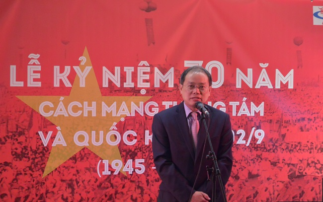
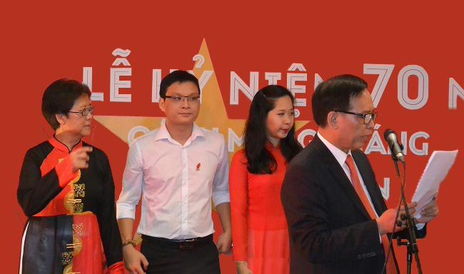
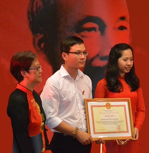
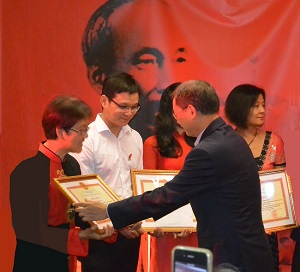

<!--
title: Kỷ niệm lần thứ 70 Cách mạng tháng Tám và Quốc khánh nước Cộng hòa Xã hội Chủ nghĩa Việt Nam 29. 08. 2015
author: Tich Ky
-->

**Kỷ niệm lần thứ 70 Cách mạng tháng Tám và Quốc khánh nước Cộng hòa Xã hội Chủ nghĩa Việt Nam 29. 08. 2015**

  

*Nhân dịp kỷ niệm lần thứ 70 Cách mạng tháng Tám và Quốc khánh nước Cộng hòa Xã hội Chủ nghĩa Việt Nam, ngày 29 tháng 8 năm 2015 vừa qua Bộ trưởng Bộ Văn hóa, Thể thao và Du lịch Hoàng Tuấn Anh đã tặng bằng khen cho Hợp ca Quê hương và Chỉ huy Hợp xướng Nguyễn Ngân Hà, tuyên dương những thành tích xuất sắc của Dàn hợp xướng và Nhạc trưởng trong việc duy trì và phát triển văn hóa Việt Nam trên địa bàn Pháp. Lễ trao tặng đã diễn ra trang trọng tại Trung tâm Văn hóa Việt Nam tại Paris, Cộng hòa Pháp do Đại Sứ Đặc Mệnh Toàn Quyền Nguyễn Ngọc Sơn trao tặng . Trước đó, vào tháng 4 năm 2015, Phó thủ tướng kiêm Bộ trưởng Ngoại giao Phạm Bình Minh cũng đã tặng Bằng khen cho Hợp ca Quê hương, ghi nhận những thành tích nổi bật của Dàn hợp xướng này trong việc quảng bá văn hóa Việt Nam trong cộng đồng Việt Nam cũng như bạn bè quốc tế tại Pháp.*

*Được thành lập từ tháng 4 năm 2009, Hợp ca Quê hương được biết đến rộng rãi trong cộng đồng người Việt tại Pháp, bạn bè quốc tế tại Pháp cũng như nhiều cơ quan và công chúng trong nước như một dàn hợp xướng điển hình của cộng đồng Việt Nam tại Pháp. Với các thành viên là các thế hệ người Việt Nam sống, học tập và làm việc tại Pháp, có cùng niềm đam mê với hình thức hát hợp xướng và tình yêu với âm nhạc Việt Nam, trong thời gian qua Hợp ca Quê hương đã sưu tập, dàn dựng, phục dựng, biểu diễn và phổ biến hàng loạt các tác phẩm âm nhạc nổi tiếng của Việt Nam, từ các làn điệu dân ca cho đến các ca khúc cách mạng truyền thống của các tác giả nổi tiếng như Văn Cao, Đỗ Nhuận, Hoàng Vân, Hồ Bắc, Nguyễn Đình Thi, Phan Nhân, Tô Hải, Đặng Hữu Phúc…*

*Hợp ca Quê hương thường xuyên tham gia biểu diễn trong khuôn khổ các hoạt động văn hóa, đối ngoại do Đại sứ quán Việt Nam tại Pháp và Trung tâm Văn hóa Việt Nam tại Pháp tổ chức, tiêu biểu là các hoạt động văn nghệ chào mừng các ngày lễ lớn của đất nước, các hoạt động kỷ niệm 40 năm thiết lập quan hệ ngoại giao Việt Nam- Pháp, chào mừng các đoàn đại biểu của Nhà nước sang thăm và làm việc tại Pháp. Ngay từ khi mới thành lập, vào năm 2010, Hợp ca Quê hương đã phối hợp thành công với VTV4 và dàn nhạc giao hưởng, dàn hợp xướng đa quốc tịch của UNESCO dàn dựng thành công tác phẩm hợp xướng Người Hà Nội, phát sóng nhiều lần trên Đài truyền hình Việt Nam vào dịp kỷ niệm 1000 năm Thăng Long Hà Nội, được dư luận khen ngợi.*
 

*Hợp ca Quê hương luôn là lực lượng nòng cốt, đi đầu trong các hoạt động văn hóa, văn nghệ do Hội người Việt Nam tại Pháp tổ chức, điển hình là việc tổ chức các chương trình đại nhạc hội đón Tết Nguyên Đán hàng năm cho cộng đồng người Việt tại Paris và các vùng phụ cận. Trong dịp Tết Nguyên Đán 2015 vừa qua, cùng với việc dàn dựng các tiết mục văn nghệ có nội dung hướng về Trường Sa, Hoàng Sa, Hợp ca Quê hương đã được Đài truyền hình Việt Nam giới thiệu một cách trang trọng trong chương trình Ngày trở về- Tiếng gọi của Tổ quốc như một điển hình tập thể độc đáo về một thế hệ mới của người Việt tại nước ngoài đang tích cực hướng về Tổ quốc trong một bối cảnh lịch sử mới.*

*Hợp ca Quê hương đã và đang dành được nhiều tình cảm và sự ủng hộ của bạn bè Pháp và quốc tế thông qua các hoạt động giao lưu văn hóa, nghệ thuật vừa nhằm mục đích quảng bá các giá trị âm nhạc Việt Nam, hình ảnh đất nước và con người Việt Nam, vừa tích cực tham gia các hoạt động từ thiện, xã hội. Tiêu biểu cho hướng hoạt động này là các buổi biểu diễn kết hợp với các dàn nhạc, dàn hợp xướng, các hội đoàn và tổ chức từ thiện của Pháp nhằm gây quỹ ủng hộ các nạn nhân chất độc màu da cam tại Việt Nam, đồng bào bị ảnh hưởng bão, lũ, trẻ em nghèo vùng sâu, vùng xa ở trong nước. Hợp ca Quê hương đã và đang hợp tác với hai đối tác nổi tiếng của Pháp là Dàn nhạc Giao hưởng Nhạc viện Rouen và Dàn hợp xướng của Thị xã kết nghĩa Choisy-le-Roi nhằm thực hiện các dự án âm nhạc vừa mang tầm cao mới về chất lượng nghệ thuật, vừa hướng tới mục đích quảng bá sâu rộng hơn âm nhạc và văn hóa Việt Nam.*
 
Ban biên tập Hợp Ca Quê Hương  
Paris 02.09.2015
 
***Vào đây tham khảo thêm - Les autres articles***  
 