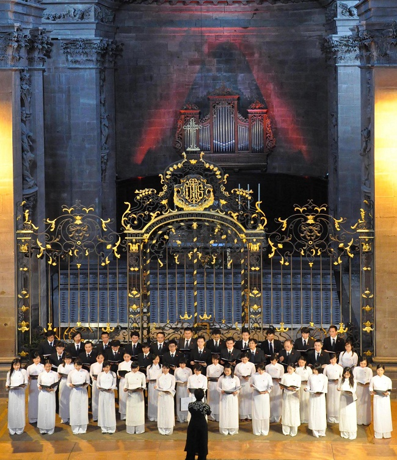
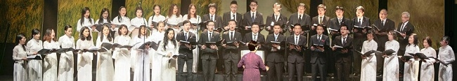

<!--
title: Ensemble Vocal Que-Huong introduction
author: Ngân Hà
-->

L’Ensemble vocal Quê Hương est composé de Vietnamiens venant d’horizons divers : étudiants en majorité, jeunes diplômés universitaires, chercheurs, ingénieurs et fonctionnaires internationaux. Ce groupe d’une quarantaine de choristes présente un répertoire varié, alliant œuvres classiques et modernes, chante en diverses langues, mais principalement en vietnamien.

L’Ensemble vocal  Quê Huong a  présenté, en juin 2010, pour la télévision vietnamienne VTV 4, le chant Người Hà nội, du compositeur Nguyễn Đình Thi, en coopération avec  l’Orchestre et le Chœur de l’UNESCO, lors de la commémoration du millénaire de la fondation de la cité Thăng Long – Hanoi, célébré par l’UNESCO et le Việt Nam.

 
Nguyễn Ngân Hà  
L’Ensemble vocal Quê Hương  
Paris 2011