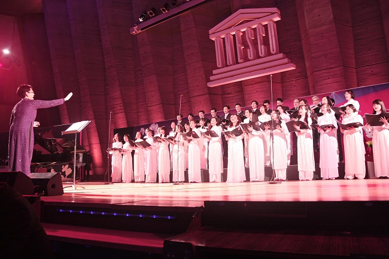
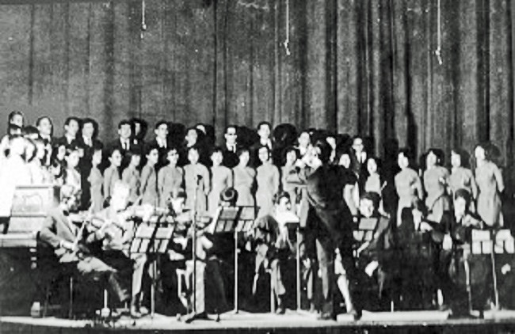

<!--
title: Sự ra đời của Hợp Ca Quê Hương
author: Tích Kỳ
-->

Nói đến mối duyên đưa đến sự ra đời của dàn hợp xướng  Hợp Ca Quê Hương  trên đất Pháp, trước tiên phải nói đến sự gặp gỡ của những người Việt say mê dòng nhạc kinh điển Việt Nam. Cho phép chúng tôi được dùng chữ kinh điển trong nghĩa rộng của từ này để gọi tên những tác phẩm âm nhạc với chất lượng nghệ thuật và nội dung truyền tải đã đạt tới những chuẩn mực cao về văn hóa, khiến chúng luôn trường tồn cùng với thời gian, luôn đi cùng năm tháng, bất chấp những thăng trầm của lịch sử và sự thâm nhập của các luồng văn hóa phổ thông.

Kế tiếp đó, không thể nào quên nhắc đến một truyền thống mang trong tâm hồn người Việt đang sinh sống, lao động và học tập ở nước ngoài. Một truyền thống được khởi nguồn từ những giọng hát «mộc» đã vang lên trong những cuộc họp mặt, sum vầy của các bác «lính thợ», của lớp người phải xa quê hương, xa gia đình đi tìm kế sinh nhai dưới ách thuộc địa. Chính ở nơi mà ý thức phải ngẩng cao đầu, đấu tranh đòi quyền lợi cho cuộc sống và đi theo xu hướng chung của toàn dân tộc được hình thành cũng là nơi ươm mầm cho những tiếng hát quê hương trên đất khách.           

Ngày ấy, khi ở trong nước, cả dân tộc đang dồn hết sức mình cho cuộc kháng chiến vệ quốc thần thánh, giành độc lập và thống nhất cho Tổ quốc, thì trên khắp thế giới, trong đó có Pháp, bà con Việt kiều cũng biểu thị tinh thần yêu nước sục sôi, ngày đêm ngóng trông về nơi quê hương còn đang chìm trong khói lửa.Tinh thần ái quốc, lòng khát khao hòa bình và tự do cho đất nước được bà con hiện thực hóa bằng vô vàn hình thức đóng góp khác nhau, trong đó có phong trào văn nghệ đúng với tinh thần “tiếng hát át tiếng bom”.

      
Những năm tháng đó, cứ mỗi độ xuân về, tại hội trường Maubert-Mutualité, lại vang lên tiếng hát của một dàn hợp xướng không dưới 80 người với những « Ca ngợi Tổ quốc » Hồ Bắc, « Sóng cửa Tùng »  Doãn Nho,  « Tiếng hát biên thùy » của Tô Hải,  « Trường ca Sông Lô » của Văn Cao , « Hồi Tưởng » của Hoàng Vân, « Du kích Sông Thao » của Đỗ Nhuận.

Họ đã hát. Chúng tôi đã hát. Tất cả đã hát bằng ngọn lửa đang cháy hừng hực trong tim, như để tiếp thêm sức mạnh cho đồng bào ruột thịt nơi quê nhà.  Tất cả đã hát với một tình yêu tha thiết dành cho quê hương đất nước, với một niềm tin mãnh liệt vào sự trường tồn của dân tộc.

Hôm nay, quá khứ chiến tranh đã lùi xa nhiều thập kỷ. Còn lại trong mỗi chúng ta, thế hệ hôm nay và cả mai sau là những ký ức về một thời hoa lửa. Ký ức còn lại ấy chính là các tế bào văn hóa được kết tinh từ máu thịt, từ cốt cách của cả dân tộc trong suốt chiều dài lịch sử. Khi đã là văn hóa, ký ức ấy sẽ luôn sống động, thăng hoa và lan tỏa mạnh mẽ. Sức lan tỏa mạnh mẽ và giá trị nghệ thuật không thể phủ nhận của dòng nhạc cách mạng Việt Nam đã trở thành yếu tố bản lề hình thành nên định hướng của Hợp ca Quê Hương. Đó là một dòng nhạc từ Nhân dân mà ra, vì Nhân dân mà phục vụ. Đó là một dòng nhạc chuyên chở tiếng nói, tiếng lòng của Tổ quốc, của dân tộc trong suốt một giai đoạn lịch sử oai hùng và bi tráng. Đó là một dòng nhạc có thể làm cho tiếng hát át tiếng bom, nhưng đồng thời cũng là dòng nhạc của những « đầu súng trăng treo ». Dòng nhạc ấy đã góp phần làm nên chiến thắng chung của cả dân tộc. Và chính dòng nhạc ấy cũng đã trở thành một phần của bản sắc Việt Nam.

Giá trị của dòng nhạc cách mạng cũng trở thành sức mạnh tập hợp để Hợp ca quê hương, ngay từ khi ra đời, đã quy tụ được lớp lớp thành viên kỳ cựu của phong trào Việt kiều,  những sinh viên, nghiên cứu sinh, công chức quốc tế là người Việt Nam đang sống, học tập và làm việc tại Pháp có chung niềm say mê với nghệ thuật hát hợp xướng và có chung tình yêu với quê hương Việt Nam. Họ đã kề vai sát cánh bên nhau để cùng kế thừa, nâng niu và bảo tồn một giá trị tinh thần độc đáo của cộng đồng người Việt tại Pháp nói riêng và của Việt Nam nói chung.

Với mong muốn tôn vinh và phát huy những giá trị cao đẹp ấy, cho phép chúng tôi được tự hào giới thiệu đến các bạn dàn hợp xướng  Hợp Ca Quê Hương .

Hợp Ca quê Hương  
Paris 2012

***Vào đây tham khảo thêm - Les autres articles*** 

* [HCQH toa sang tai FIMU 2010](/#post/2010-05-25%20HCQH%20toa%20sang%20tai%20FIMU%202010)

* [Hop ca Que Huong - Tieng long](/#post/2014-01-29%20Hop%20ca%20Que%20Huong%20-%20Tieng%20long)

* [UBNVNONN](/#post/2012-10-18%20%20%20UBNVNONN)

* [Dai Su VN Tai Paris gui tu HN](/#post/2012-10-12%20%20Dai%20Su%20VN%20Tai%20Paris%20gui%20tu%20HN)

* [2015-05-05 Duoc khen thuong](/#post/2015-05-05%20Duoc%20khen%20thuong)

* [2010-11-18 Invalide 2010-11-18](/#post/2010-11-18%20Invalide%202010-11-18)

* [2013-04-10 1000 nam Thang Long](/#post/2013-04-10%201000%20nam%20Thang%20Long)

* [Hop ca Que Huong tai Sorbonne](/#post/2014-01-20%20Hop%20ca%20Que%20Huong%20tai%20Sorbonne) 

* [2014-01-30 Co mot dan hop ca Que Huong tai Paris](/#post/2014-01-30%20Co%20mot%20dan%20hop%20ca%20Que%20Huong%20tai%20Paris)

