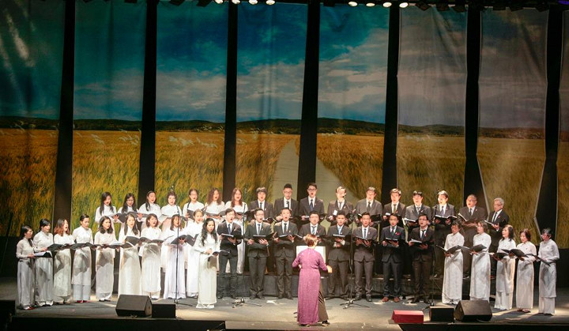

<!--
title: Hợp Ca Quê Hương với năm 2015 thành công và thử thách trong năm Bính Thân
author: QuỳnhNga Nguyễn
status: completed
-->
Năm 2015 đã qua, để lại nhiều dấu ấn tốt đẹp về các hoạt động của Hợp Ca Quê Hương trong việc bảo tồn và quảng bá văn hóa Việt Nam. Vẫn luôn trung thành với các bản hợp xướng, trong năm qua, HCQH từng bước hoàn thiện mình về chất lượng biểu diễn nhằm chuyên chở một cách tốt nhất tiếng lòng của giòng nhạc kinh điển Việt Nam qua từng tác phẩm.         
Buổi biểu diễn đầu năm 2015 với bản hợp xướng « Tổ Quốc gọi tên mình », HCQH đã mang đến cho chương trình tết của Hội người Việt Nam tại Pháp ở Pavillon Baltard một tiếng nói mạnh mẽ về lòng tự hào dân tộc và tinh thần khẳng định chủ quyền biển đảo thiêng liêng. Trong suốt năm 2015, HCQH cũng đã tham gia vào các chương trình nghệ thuật kỷ niệm các ngày lễ lớn của đất nước như kỷ niệm 70 năm ngày quốc khánh 2/9, kỷ niệm 40 năm ngày giải phóng miền nam thống nhất đất nước… Những giai điệu hào hùng của các bản hợp xướng mà HCQH đã thể hiện là tiếng lòng của người Việt Nam về tình yêu quê hương xứ sở và ý chí quyết tâm bảo vệ toàn vẹn tổ quốc.

Ghi nhận những đóng góp trong suốt chặng đường 6 năm bền bỉ với tôn chỉ giữ gìn và phát huy văn hóa Việt Nam thông qua âm nhạc, Bộ văn hóa thể thao và du lịch và Bộ ngoại giao đã tặng 2 tấm bằng khen cao quý cho tập thể HCQH và một tấm bằng khen cho nhạc trưởng Ngân Hà. Đây thực sự là những nguồn động viên khích lệ tinh thần to lớn với tập thể HCQH để ngày càng vững bước trên con đường đã chọn. Cũng trong năm 2015 này, đài truyền hình kỹ thuật số VTC và truyền hình báo nhân dân cũng đã chọn HCQH là một đơn vị tiêu biểu trong phong trào văn nghệ của kiều bào nước ngoài, để làm phóng sự về các hoạt động hướng về quê hương của người Việt năm châu.

Năm mới Bính Thân 2016 đã đến. HCQH còn những dự án âm nhạc dang dở sẽ thực hiện trong năm này. Với việc hợp tác cùng dàn nhạc giao hưởng nhạc viện Rouen, HCQH dự kiến sẽ cho ra đời một CD gồm 10 bài hợp xướng và tốp ca vào tháng 7 năm nay. Hai chủ đề chính của CD này sẽ là tình yêu với đất nước Việt Nam và biển đảo quê hương. Cũng trong năm 2016, HCQH sẽ hợp tác với dàn hợp xướng Ensemble Polyphonique Choisy Le Roi với kiệt tác Magnificat của Jean Sébastien Bach và tác phẩm cuối đời Linh Giác của nhạc sĩ tài năng người Việt, Nguyễn Thiện Đạo. 
Những dự án âm nhạc trong năm 2016 sẽ ghi dấu chặng đường 7 năm thành lập HCQH với những tác phẩm hợp xướng bất hủ của Việt Nam, đồng thời sẽ là thử thách cho HCQH trong việc giao lưu, hợp tác với các đơn vị âm nhạc của Pháp.

*Paris Xuân Bính Thân*  
*Đậu Xuân Tuấn*

***Tham khảo thêm - Les autres articles***
