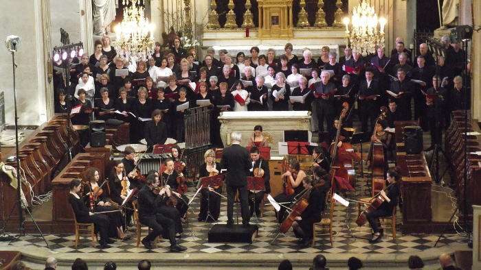

<!--
title: Création musicale au VietNam
author: Ngan Ha Nguyen
status: completed
-->

  

Après la création de Linh giac en Avril, l’Ensemble Polyphonique de Choisy-le-Roi et le Chœur Hop Ca Quê Huong partiront au Vietnam pour y recréer l'oeuvre de Nguyen Thien Dao toujours associée au Magnificat de Bach.
Deux concerts programmés à Hanoï et à l'Opéra de HoChiMinh-Ville !
Il s'agit d'un retour dans son pays d’une œuvre qui lui est dédiée et d'un beau projet de coopération et d'amitié !!!

Une grande partie du financement a été trouvé (subventions, mécénat et participants) mais nous avons besoin aussi de votre aide pour finaliser le financement du déplacement et l’hébergement des 60 choristes...

Le projet est sur le site de financement participatif KissKissBankBank,
cliquez ci-dessous pour le découvrir...Vous pourrez contribuer comme vous le voulez !
et ainsi vous participerez à cette belle création au Vietnam, d'une oeuvre qui a bien conquis le public

[http://www.kisskissbankbank.com/une-musique-pour-unir-creation-musicale-au-vietnam?ref=category](http://www.kisskissbankbank.com/une-musique-pour-unir-creation-musicale-au-vietnam?ref=category)