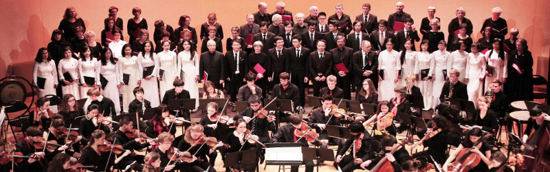

<!--
title: Dự án CD đầu tay, HCQH đã sẵn sàng
author: Xuân Tuấn
status: completed
-->
 

 **Mỗi một thành viên có một cách thể hiện riêng những suy nghĩ của mình về dàn hợp xướng Hợp Ca Quê Hương. BBT xin giới thiệu đến các bạn bài viết sau đây của một bạn trong bè Tenor, nói lên những tình cảm của bạn ấy dành cho Hợp Ca.**

---------------------------------------

 Năm 2016 đã đi qua được 1/3 chặng đường, trời đất Paris dẫu còn những ngày gió lạnh, mưa rét nhưng tiết trời cũng dần chuyển dịch từ đông, xuân qua hè cùng với nhịp sống hối hả hơn. Sinh hoạt dưới vòm trời Paris, dàn hợp xướng HCQH, đơn vị hoạt động nghệ thuật tiêu biểu nhất của những người Việt Nam tại châu Âu, cũng đang khẩn trương, hăng say chuẩn bị cho một dự án âm nhạc lớn nhất trong năm 2016. Vào 3 ngày 7, 8, 9 tháng 7 tới, gia đình HCQH sẽ khởi hành xuống thành phố Rouen xinh đẹp nằm trên vùng Normandie phía Bắc nước Pháp và tại đây dàn hợp xướng sẽ kết hợp với dàn nhạc của nhạc viện Rouen để thu âm, cho ra đời một CD với 11 bản hợp xướng kinh điển của dòng nhạc chính thống Việt Nam. Những tác phẩm ấy, xuyên suốt từ cách mạng tháng 8 đến nay, thể hiện hai chủ đề lớn là ca ngợi tổ quốc và chủ quyền biển đảo quê hương, bao gồm:
1. Tình em biển cả
2. Đất nước bên bờ sóng
3. Tiếng hát người chiến sĩ biên thùy
4. Tổ quốc gọi tên mình
5. Lướt sóng ra khơi
6. Hồi tưởng
7. Thành phố 1000 năm văn hiến
8. Du kích sông Thao
9. Tổ quốc yêu thương
10. Việt Nam quê hương tôi
11. Ca ngợi tổ quốc 

 Tham gia sinh hoạt trong HCQH từ mùa đông 2015, tôi luôn được cảm nhận chân thực tinh thần chuẩn bị hăng say của tất cả các thành viên cho dự án ghi đĩa CD đầu tiên đầy phấn khởi, tự hào của dàn hợp xướng. Với mục đích thỏa đam mê ca hát, chuyên chở tình cảm dành cho quê hương, đất nước, biển đảo, cũng như để trao gửi niềm tin, trao tặng một món quà tinh thần từ những người con xa xứ tới triệu triệu người dân trên đất nước Việt Nam, ở hải ngoại và bạn bè quốc tế, niềm tự hào và phấn khởi đó càng được nhân lên gấp bội, là động lực thôi thúc HCQH tích cực chuẩn bị cho chuyển đi Rouen sắp tới. 

Nhìn lại chặng đường nghệ thuật của HCQH trong 6 năm qua với biết bao biểu diễn tại đại sứ quán, Pavillon Baltard,… trong những dịp đặc biệt như 30/04, tết nguyên đán, … cùng với những thành tích bộ ngoại giao, bộ văn hóa trao tặng và niềm tin yêu nơi khán thính giả khiến những thành viên mới như tôi càng thêm hạnh phúc, tự hào khi được đứng trong hàng ngũ của dàn hợp xướng. Sáu năm qua, con tàu HCQH luôn được dẫn dắt và chỉ đạo nhiệt tình, khéo léo bởi chú Nguyễn Tích Kỳ và cô Nguyễn Ngân Hà – 2 người bạn đời và cũng là đồng phụ trách HCQH. Cô, chú dù đã ở tuổi hưu trí nhưng niềm đam mê ca hát, tình yêu quê hương đất nước, tinh thần và nhiệt huyết vẫn mạnh mẽ. Chính điều đó là tiền đề cho ý tưởng thu CD đầu tay năm 2016 của dàn hợp xướng và gia đình HCQH vẫn luôn vững tin dưới sự dẫn dắt của cô chú trong những chặng đường đã qua, chuyến đi Rouen tới đây và nhiều chuyến đi khác trong tương lai. Chú Tích Kỳ luôn giữ trong mình tính kỉ luật, quyết đoán, nghiêm túc trong công việc. Dù không còn khỏe và nhanh mạnh như thế hệ trẻ chúng tôi nhưng trong mỗi buổi tập hàng tuần vào mỗi thứ 7 của HCQH, chúng tôi chưa bao giờ đến trước được chú và đúng giờ như chú, chú vẫn luôn vững vàng lái chiếc ôtô cùng người vợ thân yêu, vẫn hát trong bè bass bằng đam mê và nghị lực, ngay cả khi sức khỏe, tuổi già đã cướp đi của chú một lá phổi, ngay cả khi còn nhiều vấn đề sức khỏe khác. Những lúc khi đang tập, chú bị ho, bị ốm, cả HCQH lại thương chú hơn, quí chú hơn. Chú đã sống qua 2 cuộc kháng chiến gian khổ, vĩ đại của dân tộc, hơn ai hết, chú thấu hiểu những đau thương, mất mát và càng thêm yêu con người, đất nước Việt Nam, xót xa cho chuyện biển đảo. Chính vì vậy, ngay từ sau tết nguyên đán không những gửi thư, gửi mail động viên, khen và nhắc nhở cả HCQH, chú còn gửi cả những bài viết về lịch sử đấu tranh dân tộc, thổi vào thế hệ trẻ chúng tôi niềm tự hào đồng thời thúc đẩy động lực tập luyện cho dự án CD vì chủ đề của dự án xoay quanh lịch sử đấu tranh của dân tộc và chủ quyền biển đảo của đất nước. Tôi có cơ hội tiếp xúc, hiểu chú Kỳ nhiều hơn qua những lần nói chuyện thân mật, những lần HCQH đi ăn tối trong quận 13 và những lần đến nhà cô, chú sinh hoạt. Ở chú, không chỉ là một người chỉ huy mạnh mẽ, kỉ luật mà ngoài đời chú là một người con quê hương giản dị, dễ gần và là người giàu tình cảm. Những lúc HCQH đang tập căng thẳng, chú lại nói những câu pha trò vui vẻ, những câu chỉnh chuẩn, vui tai xua tan đi không khí mệt mỏi khiến HCQH thêm tinh thần tập luyện.  

Đồng hành với chú Nguyễn Tích Kỳ là cô Nguyễn Ngân Hà, người chỉ huy dàn hợp xướng xuyên suốt từ từng nốt trầm bổng, từng bè từ bass, tenor, soprano qua alto. Cô Hà luôn dành nhiều tình cảm và hướng về Việt Nam. Cô mang trong mình những nét đặc trưng của người phụ nữ Việt Nam truyền thống. Mỗi tối, sau khi chăm sóc cho chồng, cô lại ngồi viết mail lên kế hoạch tập luyện cho HCQH. Đặc biệt cô bận rộn hơn với dự án thu CD đang đến gần: việc tập luyện, liên lạc với dàn nhạc, việc đi lại, thu âm, … Mỗi dòng mail cô gửi đi đều được viết rõ ràng bằng cả tiếng Việt và tiếng Pháp. Trong những dòng mail đó, mọi thành viên của dàn hợp xướng đều có tất cả từ bản nhạc cho đến những file thu âm cho từng bè hay nhưng bài hát chuẩn để có thể tự chuẩn bị hoặc tự tập riêng. Trong những dòng mail đó còn cả những lời cảm ơn, động viên, nhắc nhở, tình cảm dành cho gia đình HCQH. Ngồi đọc và nhận mail cô Ngân Hà, tôi nhận ra rằng nếu như tất cả thành viên của HCQH đều nhận và đọc mail đều đặn thì tổng thời gian cũng vẫn chưa bằng thời gian cô chuẩn bị và soạn mail gửi đi. Đôi khi cô Hà cũng ho, cũng ốm nhưng mọi thứ 7 cô vẫn đều đặn đến nhà văn hóa Việt Nam, trực tiếp hướng dẫn, uốn nắn từng bè và khớp lại với nhau, ngồi dưới nghe và nhìn cô hướng dẫn với giọng nói rõ ràng, mạnh mẽ, với 1 nguồn năng lượng dồi dào, với những yêu cầu nghiêm túc, chính xác, dàn hợp xướng luôn được cô hâm nóng và hăng say tập luyện. Chính cô Ngân Hà đã đưa ra ý tưởng khuyến khích các cá nhân đến nhà cô tập riêng cho vững, phân công các thành viên hát tốt hướng dẫn thêm cho các em mới hoặc hát chưa vững. Chỉ sau mấy tháng, nhiều thành viên trong HCQH đã tiến bộ hơn. Dù không nói ra nhưng ai ai trong dàn hợp xướng đều thấy may mắn, tự hào khi HCQH có một nhạc trưởng tâm huyết như cô. Hơn bao giờ hết, mọi thành viên trong HCQH đang khẩn trương, chăm chỉ tập luyện để xứng đáng với tâm huyết của cô, để niềm đam mê ca hát, tình cảm của HCQH đến với từng người con đất Việt và bạn bè quôc tế.  

Tinh thần tập luyện khẩn trương, hăng say được thể hiện rõ ràng ngay cả với những bè ít thành viên trong HCQH như bè bass. Chú Tích Kỳ, chú Pierre, chú Mỹ và anh Trần Mạnh Hà vẫn hát lên nhẹ nhàng, xuống thấp tới từng nốt trong từng bản nhạc của 11 ca khúc kinh điển. Chú Pierre vẫn đều đặn mọi thứ 7 đến HCQH cùng người vợ gốc Việt, cô Catherine trong bè alto. Với sự nhiệt tình, niềm đam mê chú Pierre dần dần đã vượt qua được rào cản ngôn ngữ. Chú Mỹ dù bận chuyện gia đình nhưng vẫn luôn sát cánh cùng anh em. Anh Trần Mạnh Hà cũng đều đặn đến tập với gia đình HCQH kể từ khi dự án thu CD bắt đầu, dù thường xuyên anh phải chuẩn bị, hoàn chỉnh cho công việc trong một tổ chức quốc tế. Ở anh, 1 giọng hát nhẹ nhàng, đúng đến từng nốt, 1 lối nói chuyện khiêm nhường, điềm đạm, 1 thái độ làm việc nghiêm túc, trách nhiệm ẩn bên trong là 1 con người học rộng, hiểu sâu nhiều lĩnh vực. Không những hát trong bè bass, anh còn tìm hiểu và gửi bài viết về hợp xướng, về cách mạng qua từng thời kì mà chính anh là tác giả cho các thành viên trẻ khiến các em càng thêm hứng thú với con đường mà HCQH đã chọn trong 6 năm qua. 4 thành viên chính trong bè bass như 4 người lính luôn sát cánh và hát âm thầm bên các bè khác của HCQH, làm điểm tựa để các bè khác nổi lên.  

Một trong những bè được nhiều đất diễn, được ưu ái trong các bản nhạc chính là bè tenor. Tình cờ quen anh Trần Minh Quân – 1 trong những solist và cũng là thành viên chính trong bè tenor của HCQH trong buổi tối đón giao thừa do hội sinh viên Việt Nam tại Paris tổ chức. Anh đã để lại cho tôi ấn tượng đầu tiên là 1 người anh Nam bộ vô tư, dễ gần và thẳng thắn với nụ cười vui tươi cùng cái bắt tay thân tình. Biết tôi yêu thích ca hát, anh đã không ngần ngại đề nghị tôi đến HCQH tập cùng. Và từ đó, tôi như 1 cậu bé chập chững bước vào bè tenor gồm nhiều anh em hát hay, hát tốt và hát vững. Sinh ra trong một gia đình nghệ thuật với người cha đàn hay, hát giỏi, những nốt nhạc đã thấm trong anh từ nhỏ, rồi lớn lên với sự siêng năng tập luyện, anh Quân không khó, không mất nhiều thời gian để hát chuẩn từng bài trong dự án. Cũng chính vì vậy, anh luôn nhận được sự tin tưởng, quý mến nơi chú Tích Kỳ, cô Ngân Hà. Xa hơn, cô, chú đề nghị anh trở thành cầu nối để giúp đỡ các anh em khác trong bè tenor. Dưới sự gợi ý của cô Ngân Hà, chính anh Quân đã đề nghị tôi đến nhà anh tập riêng, tập thêm vào mỗi tuần. Lần đầu tiên tôi được chỉ bảo cách hát cho đúng các nốt Đô, Rê, Mí, … và dần dần tập sang bài Lướt sóng ra khơi, Đất nước bên bờ sóng. Biết dự án CD đang đến gần nên mặc dù còn những nỗi lo về phỏng vấn xin việc sau khi vừa bảo vệ luận án tiến sĩ, về chuyện thuê nhà, anh Quân vẫn luôn dành thời gian hướng dẫn tôi và thậm chí nhiệt tình hơn trước. Nhiều lần chính anh đã khuyên tôi nên ở lại tập thêm cho trọn bài mỗi khi tôi nản chí, có ý xin về sớm sau 1 ngày đi làm mệt mỏi. Như bao thành viên khác, anh vẫn luôn đến nhà văn hóa thứ 7 hàng tuần, anh hát chuẩn nên đôi khi anh dừng lại nghe các anh em khác hát và thẳng thắn góp ý nếu như có lỗi về nhịp, về cao độ, đôi khi anh cũng chuyển qua bè bass để chung tay, góp sức. Tiếp xúc và nói chuyện với anh, tôi không những biết thêm nhiều về âm nhạc mà còn được giao lưu văn thơ, đối đáp, biết thêm nhiều điều trong cuộc sống qua kinh nghiệm, góp ý của người anh ở độ tuổi 29, 30. Kể từ sau tết Baltard khi dự án thu CD đang dần rõ ràng, bè tenor luôn đông đủ mỗi khi HCQH tập luyện đặc biệt trong tháng 4 trở lại đây, bên cạnh hướng dẫn chi tiết của anh Quân, tôi còn được nghe anh Hiệp, anh Tuấn, anh Dũng, anh Chiến, em Đạt hát để làm chuẩn. Anh Dương Phú Hiệp – người anh mà chúng tôi gọi thân mật “trưởng bè tenor” để lại trong tôi hình ảnh người anh chân chất, ít nói mới lần đầu gặp mặt. Nhưng khi tiếp xúc nhiều, ai cũng thấy anh rất dễ gần, tốt bụng và rất giỏi trong lĩnh vực nghề nghiệp. Mỗi khi ngồi cạnh, anh luôn hát to cho tôi nghe và chỉ tôi cách đếm nhịp khi hát. Anh Đậu Xuân Tuấn – một người anh Hà Tĩnh, chưa bao giờ qua trường lớp về âm nhạc nhưng luôn hát hay, hát chuẩn, thường xuyên hát solist và hát trong nhiều buổi biễu diễn của HCQH. Anh hát như sở thích, như một niềm đam mê và khi có thời gian, cơ hội là anh hát dù đang trong nhà văn hóa hay trên phố phường, bằng chất giọng trong và cao, mỗi khi nghe anh hát về quê hương, hơn bao giờ hết tôi muốn trở về Việt Nam thăm gia đình, bè bạn. Nhờ anh Tuấn tôi đã dần dần biết cách đếm phách trong một ô nhịp, … Anh Cù Đức Dũng để lại trong tôi ấn tượng sâu sắc với hình ảnh bộ đồng phục bóng đá và chiếc bánh mì anh bỏ ra ăn khi bè tenor đang nghỉ giải lao. Một ngày tháng 4, anh bận đi chơi bóng buổi sáng, trưa không kịp về nhà tắm rửa, anh mua vội chiếc bánh mì và đến tập cùng HCQH buổi chiều. Chỉ hình ảnh đó thôi, nếu như ai bắt gặp cũng thấy được tinh thần và nhiệt huyết của anh dành cho HCQH, dành cho dự án thu CD sắp tới. Trong anh, một con người Hà Nội hiền lành, trung thực, tài hoa với khả năng đàn, hát, thơ ca. Không những hát tốt bè tenor cao, hát tốt đoạn solo trong “Ca ngợi tổ quốc”, anh còn tranh thủ tập thêm bè tenor thấp để góp sức với anh Hiệp và em Đạt. Phạm Đạt, người em sinh năm 1992 trong bè tenor, người em với năng khiếu âm nhạc từ nhỏ, với đôi tai nhạy cảm, nghe chuẩn từng nốt nhạc, từng đoạn nhịp. Từ trước khi dự án thu CD bắt đầu, Đạt vẫn luôn có mặt để sát cánh cùng anh em tenor, chính em đã hướng dẫn tôi và anh Dũng hát chương 4 bài “Tiếng hát người chiến sĩ biên thùy” – chương với nhịp hát nhanh và khó. Nghe em hát, tôi cùng anh Dũng không kịp dõi theo lời nhạc. Với khả năng nhớ lời nhanh cùng đôi tai nhạy cảm về âm nhạc, Đạt chính là sự kết hợp hài hòa giữa lý thuyết và thực hành, là ví dụ điển hình cho câu nói “trăm hay không bằng tay quen”. Anh Chiến - người anh xứ Quảng tốt tính, dễ gần và trung thực đã từng tham gia HCQH và mới quay trở lại sau tết nguyên đán để sát cánh cùng anh em tenor cho dự án thu CD. Ở anh, tôi bắt gặp tinh thần luyện tập chăm chỉ cùng tinh thần ham học hỏi. Anh hát to, rõ ràng bằng giọng hát hào sảng và sẵn sàng lắng nghe mọi lời góp ý của các anh em tenor. Anh, dù trong ngày vui mừng sinh nhật bạn Hồng Nhung bên bè altor vẫn không quên nhờ anh Dũng, anh Tuấn, anh Quân tập cùng ca khúc “Lướt sóng ra khơi”. Mỗi anh em trong bè tenor, mỗi người một vẻ tài hoa khác nhau, nhưng khi hòa lại tạo nên giọng tenor khỏe khắn, hừng hực khí thế như những bước chân chiến sĩ khoét núi, băng rừng Việt Bắc hay xẻ dọc Trường Sơn đi cứu nước trong “Hồi tưởng”, hay nhẹ nhàng, dạt dào yêu thương trong “Ca ngợi tổ quốc”.  

Hát hợp xướng luôn luôn là sự kết hợp của các bè giọng nam, giọng nữ, giống như cuộc sống, tình yêu vậy, đũa bao giờ cũng cần có đôi, ở một thời điểm nào đó của tuổi trẻ, chúng ta tạm xa nhau vì cuộc sống mưu sinh nhưng cuối cùng chúng ta lại về bên nhau, hòa hợp làm một vì suy cho cùng đích đến của mỗi cuộc đời đều là tình yêu thương, tình người. Nhắc đến bè tenor – giọng nam cao, ko thể ko nhắc đến bè soprano – giọng nữ cao của HCQH với các cô, các chị, các bạn, các em xinh đẹp, hát hay. Nếu như nói về kiến thức nền âm nhạc, bên tenor có anh Trần Minh Quân thì bên soprano có Bảo Linh – cô em út của HCQH. Là con gái của nữ ca sĩ nổi tiếng – NSUT Ánh Tuyết, Bảo Linh hiện đang theo học piano tại Pháp. Em hát hay, hát chuẩn rất nhiều ca khúc. Được sự tin yêu của cô chú Ngân Hà, Tích Kỳ và dự án CD trước mắt đang đến gần, Bảo Linh dù đôi khi ốm hay đau họng vẫn đến hát cùng bè soprano và hướng dẫn các anh chị trong HCQH tập luyện, chung tay góp sức cùng cô Ngân Hà. Với nụ cười xinh tươi cùng ánh mắt một mí dễ thương, hai má ửng hồng khi các anh tenor đùa vui, Bảo Linh thu hút mọi thành viên theo nhịp đàn, giọng hát của em. Bên cạnh đó cô giáo trẻ của HCQH cũng rất nghiêm túc, đưa ra những yêu cầu nghiêm khắc, chính xác cho từng nốt, từng đoạn nhạc. Từ sự kết hợp giữa dễ thương và nghiêm túc ấy, Bảo Linh giúp mọi thành viên tập luyện và vào bài rất nhanh. Bè Soprano hăng say, nghiêm túc trong tập luyện và cũng rất thân mật trong giờ nghỉ giải lao. Sau mỗi buổi tập, một không khí chị em giữa Bảo Linh, Caroline, Quỳnh Nga, Diệp Minh, … qua những câu chuyện đời thường, chuyện thủ thỉ của các cô gái mà tôi đoán già, đoán non khi tình cờ thấy vả cảm nhận từ xa. Caroline, cô gái người Tây Ban Nha, sống ở Pháp và yêu thích tiếng Việt qua giọng ca, lời hát của HCQH ko những chăm chỉ tập luyện mỗi thứ 7, hát chuẩn, hát tốt mà còn ko ngừng học thêm tiếng Việt, và còn làm bánh chia sẻ cùng mọi người trong những giờ giải lao. Ở Caroline, một cô gái Tây Ban Nha dễ gần với nụ cười thay cho câu nói “Bon courage” mỗi khi bắt gặp tôi tập cùng các anh em tenor. Giữa một gia đình của những người con đất Việt, những thành viên nước ngoài ca những ca khúc cách mạng như Caroline hay chú Pierre thật đáng quí, đáng trân trọng. Những thành viên đó khiến dự án CD của HCQH độc đáo hơn, phong phú hơn và riêng hơn. Cũng thường xuyên có mặt tập luyện cho dự án thu CD là Quỳnh Nga – cô gái có nụ cười vui tươi, yêu đời hay Diệp Minh – cô bạn gái xinh xắn, dễ thương của anh Dũng trong bè tenor. Chính sự trẻ trung, dễ thương của những cô gái bè soprano cùng với mối quan hệ anh, chị, em thân thiết, gắn bó với bè tenor khiến những buổi tập của HCQH sinh động hơn, hứng khởi hơn. Để ý những ánh mắt, nụ cười động viên lẫn nhau giữa bè tenor và soprano hay niềm tin yêu mỗi khi Diệp Minh quay xuống thủ thỉ cùng anh Dũng, những vần thơ trong tôi nhảy nhót và thêm nhiều tình cảm, hứng khởi qua từng ca khúc. Trong cảm nhận của riêng tôi, HCQH không chỉ là một dàn hợp xướng mà như một xóm, làng thu nhỏ. Ở đây chúng tôi có tình anh em và cả tình yêu đôi lứa từ giai đoạn chớm nở cho đến thân thiết, gắn bó. Bè soprano không chỉ có các em, các chị mà còn có những cô với bề dày kinh nghiệm như cô Bạch Mai, một người cô tài, sắc một thời mà tôi được nghe kể. Cô hát với nguồn năng lượng dồi dào, cô lên cao những nốt mà không ai có thể lên tới trong HCQH và chính cô cũng là người hướng dẫn cách lên cao, cách giữ giọng, đẩy hơi từ bụng, cách các anh em tenor có thể hát các nốt cao như của nữ bằng giọng óc. Bên cạnh sự hướng dẫn của cô Bạch Mai, gần đây HCQH cũng mời anh Ronan – một giọng ca chuyên nghiệp mà cô Ngân Hà có dịp hợp tác cùng trong buổi hòa nhạc Việt – Pháp tưởng nhớ nhạc sĩ lừng danh Nguyễn Thiện Đạo. Anh Ronan đã đến với HCQH vào một ngày của tháng 4, lắng nghe, quan sát và chia sẻ kinh nghiệm với mọi thành viên rồi với từng bè trong HCQH qua các kĩ thuật hát khó và chi tiết như cách chuẩn bị, khởi động miệng, lưỡi trước khi hát, kĩ thuật nghỉ và hát với từng phần trong khoang miệng. Qua 2 buổi tiếp xúc với anh, mọi thành viên hiểu rằng mình cần phải hăng say tập luyện hơn nữa. Với những sự hướng dẫn bổ ích từ Bảo Linh, anh Ronan hay cô Bạch Mai, … HCQH cho thấy mình không chỉ hát bằng trái tim, bằng niêm đam mê, bằng sự rung động nghệ thuật mà còn hát trên nền kiến thức âm nhạc nhất định.  

Nói đến giọng nữ trong HCQH, không thể không nhắc tới bè alto gồm các cô: Xuân Oanh, Diệu Khánh, Anh Hoa, Hồng Xuân, Kim Hoàng, các chị, các bạn: Hồng Nhung, … cũng luôn hát âm thầm và sẵn sàng nhường đất diễn cho soprano và tenor nổi lên. Các cô với nụ cười dịu dàng mỗi khi trò chuyện, động viên bè bass, mỗi khi được bè bass nói đùa chính là hiện thân tiêu biểu cho những người phụ nữ Việt Nam của thế kỷ 20 trong HCQH. Là những cựu thành viên của hội người Việt Nam tại Pháp, các cô có bề dày kinh nghiệm trên lĩnh vực văn hóa, văn nghệ cùng nhiều lĩnh vực khác. Có các cô, những ca khúc của HCQH trong dự án CD tình cảm hơn, dịu dàng hơn. Cũng chính các cô đã đồng hành cùng HCQH trong suốt những chặng đường đã qua, từ những ngày đầu thành lập, từ từng gánh nặng qua những niềm vui. Dù ở tuổi trung niên, các cô vẫn đều đặn tập cùng HCQH mỗi thứ 7 bằng tinh thần, nhiệt huyết như lứa tuổi thanh xuân, chính tinh thần đó khiến các thành viên trẻ như Hồng Nhung vững tin phấn đấu. Hồng Nhung – một người bạn, một người chị dễ gần, tốt tính, một cô gái Huế đảm đang, nghị lực khi sống xa mẹ, sống tự lập giữa Paris hào nhoáng và đắt đỏ. Dù bận học ngành y hay công việc buôn bán riêng, Hồng Nhung vẫn luôn hát cùng HCQH mỗi thứ 7, đi ăn rồi mời mọi thành viên đến nhà chơi để gắn bó thêm tình cảm trong gia đình HCQH. Có lẽ tinh thần, nghị lực trong cuộc sống đã được Nhung phần nào phản chiếu trong ca hát nên ngay cả khi bè altor thiếu người, Hồng Nhung vẫn một mình hát tốt và hát chuẩn ngay cả trong một ca khúc khó như “Du kích sông Thao”. Còn rất nhiều các cô, các chị hay rộng hơn là các thành viên nữ trong HCQH mà tôi chưa có dịp được trò chuyện, tìm hiểu vì trong HCQH tôi như một cậu bé mới 4 tháng tuổi và cũng một phần vì trong giờ giải lao tôi tập trung uống chè, ăn bánh do các cô, các chị chuẩn bị nhưng cậu bé tò mò ấy trong khi tập cũng đã quan sát và có dịp bắt gặp ánh mắt, nụ cười đầy hứng khởi, quyết tâm cho dự án CD đầu tay của mọi thành viên trong HCQH.  

Mặc cho không khí cuối tuần nghỉ ngơi, bình yên và thong thả của người dân Paris, HCQH vẫn luôn bận rộn chuẩn bị cho dự án đang đến gần, để thực hiện tốt nhất có thể phần hát trong từng ca khúc. Còn về phần nhạc, tại nhạc viện Rouen, sâu trong lòng thành phố Rouen tươi đẹp phía Tây Bắc nước Pháp, nhạc trưởng Claude Brendel cùng các nhạc công đã sẵn sàng chờ đón HCQH để kết hợp cùng nhau trong 11 tác phẩm hợp xướng. Tình cờ biết đến HCQH qua sự kiện 1000 năm Thăng Long Hà Nội, nhạc trưởng Claude Brendel quý mến, ngưỡng mộ tinh thần tập luyện của dàn hợp xướng không chuyên nên đã nhận lời giúp đỡ về phần nhạc trong dự án CD sắp tới. Với sự chuyên nghiệp, danh tiếng của dàn nhạc nhạc viện Rouen qua những lần biểu diễn quốc tế tại Hungary, Italia, Thượng Hải, Hà Nội, chắc chắn HCQH sẽ được hát dưới sự chỉ đạo của một nhạc trưởng tuyệt vời, chuẩn đến từng nốt, từng nhịp. Điều đó khiến cô chú Ngân Hà, Tích Kỳ tin tưởng 100% về phần nhạc trong dự án âm nhạc lần này. Hơn nữa dàn nhạc Rouen sẽ biểu diễn trong trang phục áo phông cờ đỏ sao vàng của Việt Nam. Đây sẽ là một hình ảnh đẹp thể hiện tình cảm của dàn nhạc dành cho con người, đất nước Việt Nam. Tinh thần ấy thật quí giá, đáng trân trọng và không thể có được hay đánh đổi bằng tiền bạc. Nó chỉ có được bằng sự chân thành và niềm đam mê mà HCQH theo đuổi trong 6 năm qua. Động thái tích cực đó như một cú híc tinh thần cho mọi thành viên trong HCQH thêm tự tin, phấn khởi cho chuyến đi Rouen sắp tới, khiến ánh mắt, nụ cười của chú Tích Kỳ, cô Ngân Hà đầy niêm vui và tự hào.  
       
Thành phố Rouen 4 mùa tươi đẹp cùng 3 tầng địa hình đan xen: núi cao xanh mướt trùng điệp ngó trông thành phố cổ kính. Những nhà thờ, khu dân cư tựa trên sông nước uốn lượn rồi sông nước xanh trong lại ngóng lên ngắm núi mây, trời đất khi ánh hoàng hôn đỏ hồng lách qua từng đám mây, chiếu nghiêng qua những nhành cây và lấp lánh trên mặt sông. Phong cảnh hữu tình, thơ mộng đó cùng với dàn nhạc của nhạc viện Rouen đã sẵn sàng cho dự án CD của HCQH. Nhưng đó là chuyện trong 2 tháng tới, còn hiện tại gia đình HCQH ở Paris vẫn miệt mài tập luyện dựa trên cây đàn piano ở trung tâm văn hóa, đã gắn bó với HCQH trong nhiều năm qua. Người mang lại không gian phối âm tuyệt vời qua những lần biểu diễn hay những buổi tập, đó chính là Võ Châu Duy Tâm cùng cây đàn piano quen thuộc ấy. Duy Tâm - cậu em mà chúng tôi gọi thân mật là “pianist” của gia đình HCQH đang theo học ngành Dược tại Paris. Với đôi tai nhạy bén và đôi tay khéo léo, Duy Tâm luôn tạo ra những bản phối âm ấn tượng giúp HCQH chuyên chở thành công cái hồn của từng tác phẩm. Bên cạnh vai trò pianist chính của HCQH, Duy Tâm với khả năng nghe nốt và nhịp tuyệt vời cũng luôn hướng dẫn, đệm đàn tập riêng cho bè tenor, bè bass, hỗ trợ cô Ngân Hà, Bảo Linh trong việc phát hiện lỗi về cao độ và trường độ của các thành viên.  

Lại một ngày thứ 7 trôi qua khi dự án thu CD của HCQH đang đến rất gần, chia tay gia đình HCQH trong tình anh, chị, em thân mật, tôi rảo bước tìm đến bến Tramway 3a, hướng thẳng Cité Universitaire, men theo con đường nhỏ, uốn quanh công viên Monsouris khi Paris về đêm đang chìm vào giấc ngủ. Dọc theo con phố nhỏ dưới ánh đèn lờ mờ, sương đêm và mưa nhẹ rớt xuống đậu dần trên những nhành cây hoa lá, thách thức những chồi non, rồi thấm dần trên vai và 2 cánh tay của anh thanh tiên ở cái tuổi 26. Tôi nhận ra cái lạnh da thịt quen thuộc qua từng lớp áo phủ, cái lạnh Paris không buốt như lạnh Hà Nội nhưng nhẹ nhàng rồi từ từ xâm lấn. Cái lạnh đó không đáng sợ bằng cái lạnh bên trong, lạnh vì nỗi nhớ quê hương, lạnh vì cảnh cô đơn nơi đất khách quê người, cái lạnh mà tôi thấm thía hơn 2 năm qua, cái lạnh đã thử thách, rèn luyện tuổi trẻ của tôi trong ngần ấy tháng ngày tại nước Pháp tươi đẹp, hiếu khách. Bước đi trong màn đêm tối mờ cùng lạnh buốt bủa vây cả trong và ngoài, trong tôi lại bừng lên hình ảnh anh em, bè bạn trong gia đình HCQH, tôi bật môi, say sưa hát khi mường tượng những động tác chỉ đạo của cô Ngân Hà, những lời chỉ bảo của anh Quân hay Bảo Linh, … Tôi ngỡ mình như anh Kim Đồng ở cái tuổi 12, 13 vô tư, yêu đời và đam mê ca hát để hòa cùng không khí, tinh thần của HCQH trước dự án CD đầu tay, một cột mốc quan trọng đánh dấu con đường ca hát của HCQH. Dù con đường đó còn kéo dài với những chuyến đi khác trong tương lai thì gia đình HCQH vẫn luôn hát bằng đam mê, hát bằng tình yêu tha thiết dành cho quê hương Việt Nam.  

**HH - Paris 03/05/2016**

***Vào đây tham khảo thêm - Les autres articles*** 

* [Hanh trinh 5 nam](/#post/2014-07-04%20Hanh%20trinh%205%20nam)

* [san-choi-moi-cua-hcqh](/#post/2014-06-07%20san-choi-moi-cua-hcqh)

 

